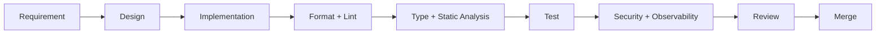
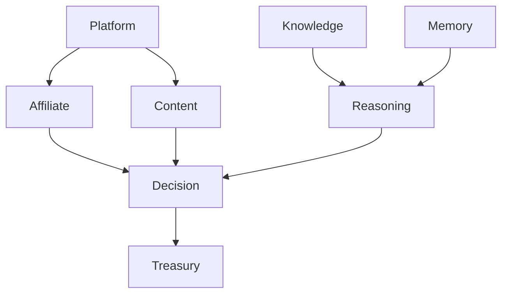
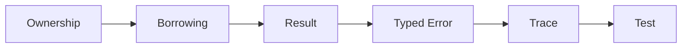
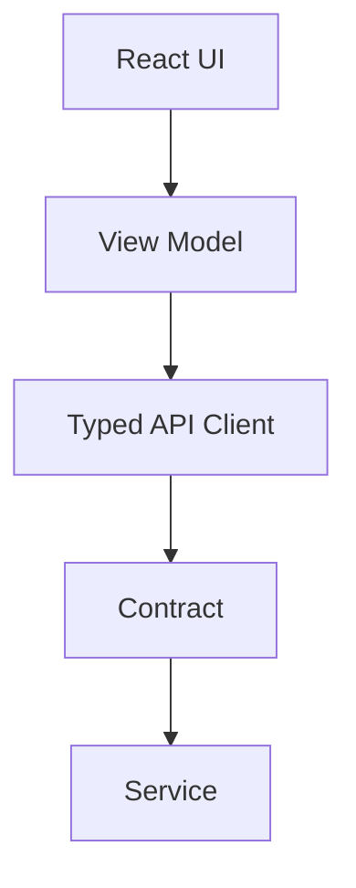
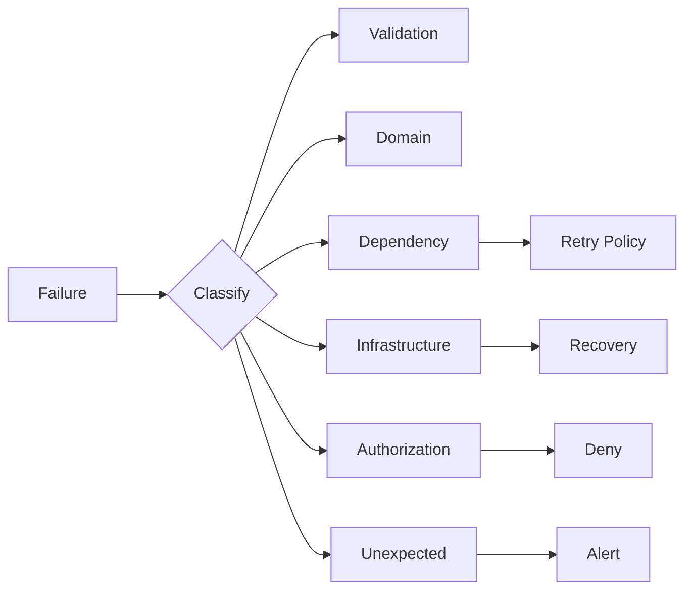
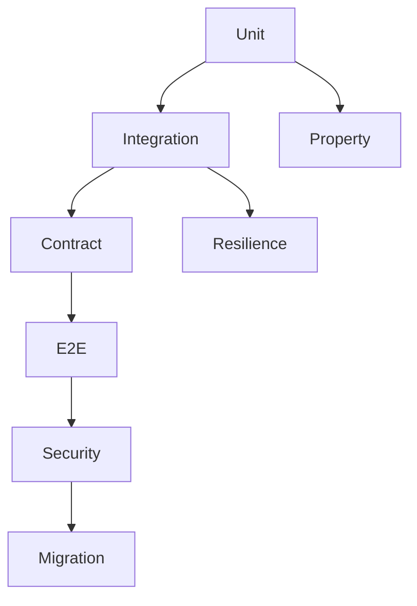

# CAT OMNISYSTEM — Coding Standard Bible V1

> Canonical engineering language for CAT OMNISYSTEM. This document defines enforceable coding standards across Rust, Go, Python, TypeScript/React, tests, Git, APIs, events, schemas, observability, security, AI-generated code, and multi-core integration.

**Status:** Part 1 Completed — 25%  
**Version:** 1.0.0  
**Project:** CAT (Commerce AI Trinity)  
**Company:** Omni System  
**Repository:** `https://github.com/afshin0095-lang/CAT`  
**Governing Documents:** `context/04_ARCHITECTURE.md`, `context/13_TERMINOLOGY.md`, `context/12_DECISIONS.md`

---

## 1. Coding Standard Identity

CAT coding standards are system contracts, not personal preferences. Code must remain readable, deterministic, testable, observable, secure, evolvable, and compatible with the multi-core architecture.

The standard applies to human-written code, AI-generated code, generated code, migrations, scripts, tests, infrastructure definitions, schemas, and repository automation.



**Invariant:** code that cannot be understood, tested, observed, or safely changed is not production-ready merely because it runs.

---

## 2. Constitutional Principles

CAT follows twelve principles: correctness, clarity, simplicity, explicit ownership, deterministic behavior, immutability by default, typed boundaries, fail-closed errors, testability, observability, security-by-default, and continuous maintainability.

KISS, DRY, and YAGNI are defaults, but simplicity never overrides domain ownership or safety requirements.

```text
Correctness > Cleverness
Explicitness > Magic
Domain Boundaries > Convenience
Typed Contracts > Implicit Coupling
Evidence > Confidence
```

---

## 3. Language Matrix

CAT uses specialized languages rather than forcing one language across every workload.

| Domain | Primary | Mandatory baseline |
|---|---|---|
| Performance-critical core | Rust | `cargo fmt`, `cargo clippy`, tests |
| Services/orchestration | Go | `gofmt`, `go vet`, tests |
| AI/data/automation | Python | PEP 8, typing, format, lint, tests |
| Web/UI | TypeScript + React | strict TS, format, lint, tests |
| Contracts | Protobuf/JSON Schema/YAML | validation + compatibility |
| Infrastructure | Terraform/YAML | format + static validation |

Language-specific rules override generic rules only where the language idiom requires it.

---

## 4. Repository and Module Boundaries

Every module has one primary responsibility and one explicit owner. Cross-domain access must pass through an approved contract rather than importing internal implementation details.

Forbidden patterns include circular dependencies, domain-to-domain database writes, hidden global state, untracked side effects, and unowned utility dumping grounds.



**Invariant:** an import is not permission to mutate another engine’s truth.

---

## 5. Naming Standard

Names must communicate role and domain meaning. Avoid ambiguous names such as `data`, `thing`, `manager`, `helper`, `utils`, `misc`, and `tmp` when a semantic name exists.

| Element | Convention |
|---|---|
| Python variables/functions | `snake_case` |
| Python classes | `PascalCase` |
| Go exported identifiers | `MixedCaps` |
| Go packages | short lowercase |
| Rust functions/modules | `snake_case` |
| Rust types | `PascalCase` |
| TypeScript variables/functions | `camelCase` |
| TypeScript types/components | `PascalCase` |
| Constants | semantic, language-idiomatic |
| Events | canonical name + version |
| IDs | stable machine-readable prefix |

Names must agree with `context/13_TERMINOLOGY.md`.

---

## 6. Formatting and Tooling

Formatting is automated. CAT does not spend review time debating whitespace that a formatter can enforce.

Required baseline: `cargo fmt`; `gofmt`; Python formatter/linter/type checker; TypeScript formatter/linter/type checker. CI rejects unformatted code.

```text
format → lint → typecheck → unit tests → integration tests → security checks
```

---

## 7. Rust Standard

Rust is preferred for correctness-sensitive, high-throughput, low-latency, concurrency-heavy, and infrastructure-critical components.

Rules: prefer ownership/borrowing over unnecessary cloning; avoid production-path `unwrap()` and `expect()` unless the invariant is structurally guaranteed; return typed `Result`; isolate unsafe code; use structured tracing; document public APIs and safety invariants; run `cargo fmt`, `cargo clippy --all-targets --all-features`, and tests.



---

## 8. Go Standard

Go is preferred for network services, orchestrators, workers, adapters, and control-plane components.

Rules: `gofmt` is mandatory; errors are explicit return values; error is the final return value; use `context.Context` for cancellation and deadlines; prevent goroutine leaks; avoid panic for normal control flow; use race detection; document exported APIs; use idiomatic initialisms and receiver names.

---

## 9. Python Standard

Python is preferred for AI orchestration, research tooling, data workflows, model adapters, automation, and non-latency-critical services.

Rules: follow PEP 8; use production type hints; isolate side effects; avoid mutable defaults; avoid broad exception swallowing; use dependency injection where needed; separate domain logic from framework adapters; use deterministic seeds where reproducibility matters; validate model-generated and external data before domain use.

```python
from dataclasses import dataclass

@dataclass(frozen=True)
class DecisionInput:
    request_id: str
    evidence_ids: tuple[str, ...]
```

---

## 10. TypeScript and React Standard

TypeScript is mandatory for CAT web UI. `any` is prohibited in domain code except isolated adapter boundaries.

Rules: strict TypeScript; discriminated unions for state machines; explicit state ownership; components focused on rendering and interaction; domain decisions outside presentation; derived state should not be duplicated; stable keys; accessibility semantics; behavior-oriented tests.



---

## 11. Error Handling and Failure Semantics

Errors are classified as domain, validation, infrastructure, dependency, authorization, concurrency, or unexpected.

Every externally visible failure requires stable identity, safe message, machine metadata where needed, trace context, retryability classification, ownership, and recovery/escalation policy.



**Invariant:** an error handler must never convert an unsafe state into apparent success.

---

## 12. Concurrency and Async Safety

Every concurrent task needs an owner, cancellation path, bounded lifetime, and observable failure behavior.

Forbidden: detached tasks without ownership, unbounded worker pools, shared mutable state without synchronization, retry loops without limits, background tasks accidentally outliving request scope, and network calls without deadlines.

Concurrency correctness is functional correctness, not merely optimization.

---

## 13. API, Event, and Schema Coding

APIs and events are contracts. Handler implementation must never become the implicit schema.

Every public contract requires versioning, validation, compatibility policy, ownership, error semantics, and observability fields.

```json
{
  "contract_id": "CAT-CODE-CONTRACT-001",
  "version": "v1",
  "owner": "platform",
  "compatibility": "backward_compatible",
  "validation": "mandatory",
  "trace_context": "required"
}
```

Schema changes require compatibility review before deployment.

---

## 14. Database and Persistence Code

Persistence code must respect truth ownership. Domain code must not bypass approved repositories merely for convenience.

Rules: migrations are forward-tested and rollback-aware; transactions have explicit boundaries; retried writes are idempotent; monetary values never use binary floating point; timestamps are explicit and timezone-safe; canonical records remain audit-aware; derived data is reconstructible or explicitly classified.

---

## 15. Testing Standard

Every production behavior requires evidence proportional to failure impact: unit, integration, contract, end-to-end, property, concurrency, security, migration, or resilience tests as appropriate.

Tests must be deterministic, isolated, meaningful, and capable of detecting the defect they claim to protect against.



---

## 16. Security, Secrets, and Untrusted Input

Security-sensitive code defaults to deny. Secrets never belong in source, logs, fixtures, documentation, or committed configuration.

External input includes users, merchants, affiliates, web content, model output, tool output, files, events, and third-party responses. AI output is untrusted until validated against a typed contract.

Required controls: input validation, authorization, output encoding, secret isolation, dependency scanning, audit logging, least privilege, and safe failure.

---

## 17. Observability and Production Diagnostics

Production code emits structured telemetry appropriate to its responsibility.

Required concepts include trace/span identity, correlation, component identity, latency, outcome, error class, retry count, relevant resource metrics, and security/audit events.

Never log secrets, credentials, authorization tokens, private keys, or unnecessary personal data.

---

## 18. AI-Generated and Agent-Written Code

AI-generated code is treated exactly like human-written code after generation. It must pass formatting, typing, linting, tests, security checks, review, and ownership verification.

AI must not silently invent APIs, bypass domain ownership, weaken validators, remove tests to hide failures, introduce credentials, mutate canonical truth without an approved contract, or generate irreversible infrastructure changes without explicit approval.

```text
AI Generation → Static Validation → Tests → Security → Human Review → Approved Merge
```

---

## 19. Git, Review, and Change Management

Commits must be coherent and understandable. Pull requests must state purpose, scope, risk, tests, migration impact, and observability impact when relevant.

Review optimizes for continuous improvement and preservation of code health. Style rules are enforced by tooling; design issues are judged against architecture and maintainability principles.

Generated files must be regenerated from their source specification rather than hand-edited when a generator owns them.

---

## 20. Part 1 Completion Contract

Part 1 closes the foundational coding contract and defines the append-only handoff for Parts 2–4.

### Constitutional Rule Registry

| ID | Rule | Owner | Severity | Enforcement |
|---|---|---|---|---|
| CAT-CS-CONST-001 | Preserve domain ownership boundaries. | Architecture | Critical | CI + Review |
| CAT-CS-CONST-002 | Never mutate canonical truth through convenience paths. | Domain | Critical | Contract tests |
| CAT-CS-CONST-003 | Production code must be automatically formatted. | Engineering | High | CI |
| CAT-CS-CONST-004 | Public contracts require explicit versioning. | API | High | Schema CI |
| CAT-CS-CONST-005 | Validate untrusted input before domain use. | Security | Critical | Tests + Review |
| CAT-CS-CONST-006 | AI-generated code receives the same quality gates. | Engineering | Critical | CI |
| CAT-CS-CONST-007 | Secrets must never enter source or logs. | Security | Critical | Secret scan |
| CAT-CS-CONST-008 | Concurrent work requires ownership and cancellation. | Runtime | High | Review + Tests |
| CAT-CS-CONST-009 | Monetary computation uses exact representations. | Treasury | Critical | Static + Tests |
| CAT-CS-CONST-010 | Production behavior requires proportional test evidence. | QA | High | CI |

### Acceptance Tests

- `CAT-CS-AT-S01-001`: formatting/lint gates reject malformed code.
- `CAT-CS-AT-S01-002`: type checking rejects an invalid public contract.
- `CAT-CS-AT-S01-003`: CI rejects a committed secret fixture.
- `CAT-CS-AT-S02-001`: domain-boundary tests reject unauthorized cross-engine mutation.
- `CAT-CS-AT-S02-002`: AI-generated code cannot bypass required quality gates.
- `CAT-CS-AT-S02-003`: retryable and non-retryable failures remain distinguishable.

### Memory Anchor

`CAT-CS-MEM-S01-001` — Coding standards are executable architecture constraints, not stylistic decoration.

### JSON Registry

```json
{
  "record_type": "coding_standard_contract",
  "record_version": "1.0",
  "contract_id": "CAT-CS-CONTRACT-001",
  "languages": ["rust", "go", "python", "typescript"],
  "quality_gates": ["format", "lint", "typecheck", "test", "security", "review"],
  "ai_code_policy": "same_as_human_code"
}
```

### YAML Registry

```yaml
schema_name: cat_coding_standard_contract_v1
version: "1.0"
owners:
  architecture: architecture
  security: security
  runtime: runtime
  qa: quality_assurance
required_gates:
  - format
  - lint
  - typecheck
  - test
  - security
  - review
```

### Completion Invariant

No Part 2 content is valid unless this Part 1 prefix remains byte-identical and all continuation content preserves the terminology contracts of `context/13_TERMINOLOGY.md`.

**Part 1 Status:** COMPLETE — 25%  
**Next:** Coding Standard Part 2 — language-specific deep standards, architecture patterns, testing, CI/CD, Git, database, API/event contracts, AI-agent development, and enforcement automation.
