# CAT OMNISYSTEM — Coding Standard Bible V1 — Part 3

> Continuation of `context/14_CODING_STANDARD.md`. This part is designed to be appended after the frozen Part 2 boundary without changing Parts 1–2.

**Status:** Part 3 — 75% target after integration
**Project:** CAT (Commerce AI Trinity)
**Repository:** `https://github.com/afshin0095-lang/CAT`
**Frozen predecessor:** `context/14_CODING_STANDARD.md` Parts 1–2

---

# PART 3 — ADVANCED ENGINEERING SYSTEM

## 51. Advanced Rust Ownership and Lifetime Design

Rust code must model ownership explicitly rather than fighting the borrow checker through cloning, shared mutable state, or lifetime erasure. Lifetimes are part of the API contract when they communicate validity relationships; otherwise owned values should be preferred for clarity at service boundaries.

Borrowing is preferred for short-lived computation, ownership for durable state transfer, and `Arc`/synchronization primitives only when shared ownership is genuinely required. `unsafe` code is isolated behind small audited boundaries and must document the invariant that makes it sound.

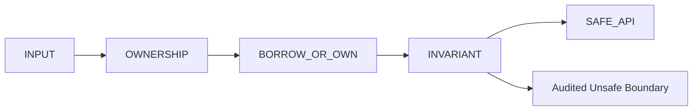

```json
{"record_type":"rust_ownership_policy","section":51,"cloning":"justified_only","unsafe":"isolated_and_audited","lifetimes":"semantic","shared_ownership":"explicit"}
```

```yaml
schema_name: cat_rust_ownership_policy_v1
required: [ownership_model, lifetime_relation, unsafe_invariant, synchronization, review]
```

**Tests:** clippy, Miri where applicable, race/concurrency tests, and invariant-focused unit tests are required for sensitive Rust components.

---

## 52. Advanced Rust API and Error Design

Rust public APIs should make invalid states difficult to construct. Constructors validate domain constraints, conversions use semantic `From`/`TryFrom` patterns, and errors preserve machine-readable categories without leaking implementation details.

API naming follows Rust idioms: types and traits use `UpperCamelCase`, values use `snake_case`, and conversions use `as_`, `to_`, and `into_` according to cost and ownership semantics. These conventions align with the Rust API Guidelines. citeturn0search2turn0search3

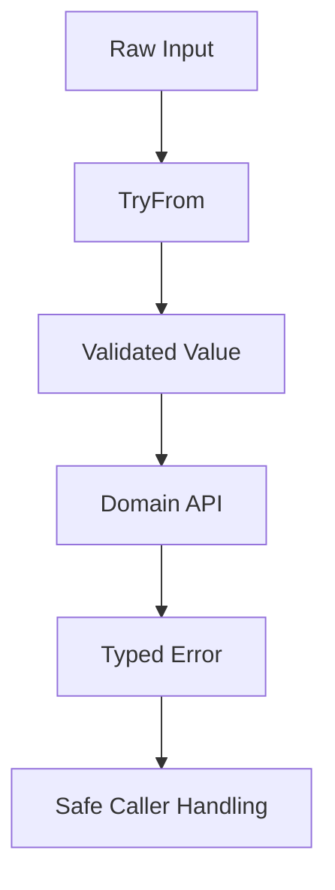

```json
{"record_type":"rust_api_policy","section":52,"invalid_states":"discouraged","conversion":"idiomatic","errors":"typed","panic":"exceptional_only"}
```

```yaml
schema_name: cat_rust_api_policy_v1
required: [constructor_validation, conversion_rules, error_model, panic_policy, documentation]
```

**Tests:** public APIs include executable examples where appropriate, invalid constructors are negative-tested, and error categories remain stable.

---

## 53. Advanced Go Concurrency and Goroutine Lifecycle

Go concurrency must make ownership and shutdown visible. Every goroutine has a reason to exist, a cancellation path, a bounded lifetime, and an owner responsible for handling terminal errors.

Use `context.Context` for cancellation and deadlines, structured worker ownership, bounded channels, and explicit shutdown ordering. Do not use goroutines as an invisible escape hatch from request scope.

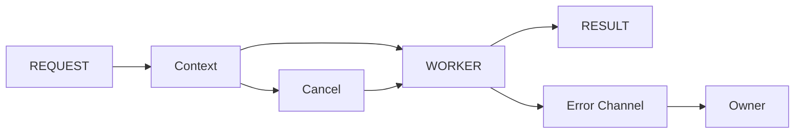

```json
{"record_type":"go_concurrency_policy","section":53,"context":"required","goroutine_owner":"required","shutdown":"bounded","channels":"purposeful"}
```

```yaml
schema_name: cat_go_concurrency_policy_v1
required: [owner, context, cancellation, shutdown, error_path, resource_bound]
```

**Tests:** race detection, cancellation, worker shutdown, blocked-channel, and leak-oriented tests are required for long-lived workers. Go guidance explicitly warns about goroutine lifetimes and normal-flow panic usage. citeturn0search0turn0search6

---

## 54. Advanced Go Service Boundaries

Go services must separate transport, application orchestration, domain behavior, and infrastructure adapters. Packages remain short and semantic; generic `util`, `common`, or `misc` packages are prohibited unless their responsibility is genuinely coherent.

Errors remain explicit return values, and exported declarations receive documentation. Formatting is delegated to `gofmt` rather than manually negotiated in review. citeturn0search0turn0search6

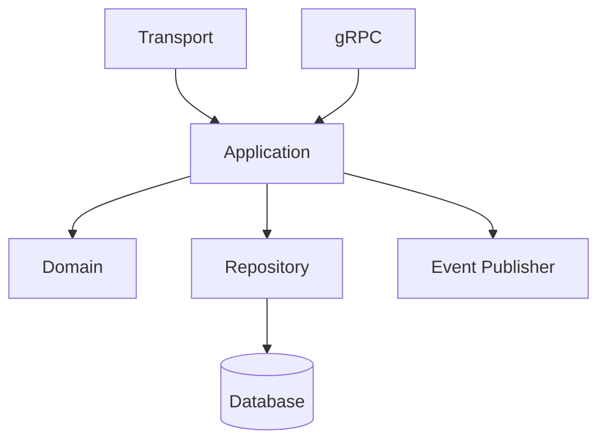

```json
{"record_type":"go_service_boundary","section":54,"transport":"thin","domain":"isolated","repositories":"explicit","errors":"returned","format":"gofmt"}
```

```yaml
schema_name: cat_go_service_boundary_v1
required: [transport, application, domain, infrastructure, error_policy]
```

**Tests:** package dependency direction, exported API behavior, HTTP/gRPC contracts, and graceful shutdown are verified.

---

## 55. Advanced Python Typing and Runtime Contracts

Python type hints are production architecture metadata, not decoration. Public service boundaries use explicit types, protocols, constrained values, and typed result/error contracts. Dynamic behavior is isolated at adapters.

PEP 8 emphasizes consistency, readability, explicit imports, naming conventions, and project-specific rules taking precedence where required. CAT adopts these principles while applying stricter project-level rules. citeturn0search1

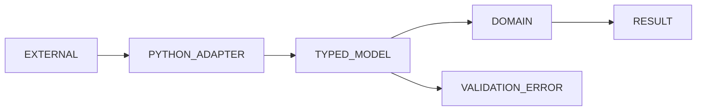

```json
{"record_type":"python_typing_policy","section":55,"public_boundaries":"typed","dynamic_adapter":"isolated","runtime_validation":"required","casts":"justified"}
```

```yaml
schema_name: cat_python_typing_policy_v1
required: [public_types, runtime_validation, adapter_boundary, cast_policy, checker]
```

**Tests:** static type checking, runtime validation, serialization round trips, and invalid-input tests are mandatory for external boundaries.

---

## 56. Advanced TypeScript Type-System Discipline

TypeScript domain code uses the type system to represent legal states and ownership. Prefer discriminated unions, branded identifiers, exhaustive switches, readonly structures, explicit result types, and narrow adapter interfaces.

`any` remains forbidden in domain code. `unknown` is the preferred boundary type when the producer cannot guarantee a shape; validation must narrow it before use.

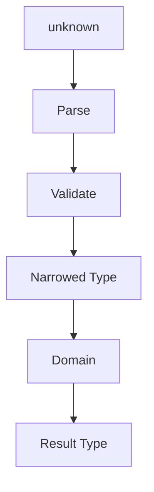

```json
{"record_type":"typescript_type_policy","section":56,"any":"forbidden_in_domain","unknown":"boundary_only","unions":"preferred","exhaustiveness":"required"}
```

```yaml
schema_name: cat_typescript_type_policy_v1
required: [strict_mode, boundary_validation, discriminated_unions, exhaustiveness, readonly_policy]
```

**Tests:** compiler strictness, exhaustive-state tests, schema validation, and adapter failure tests are required.

---

## 57. React State Architecture and UI Engineering

React components own presentation state only when the state is genuinely local. Domain state, server state, workflow state, and decision state must have explicit owners outside visual components.

Avoid duplicated derived state, effect-driven state synchronization, hidden global stores, and components that silently contain business policy.

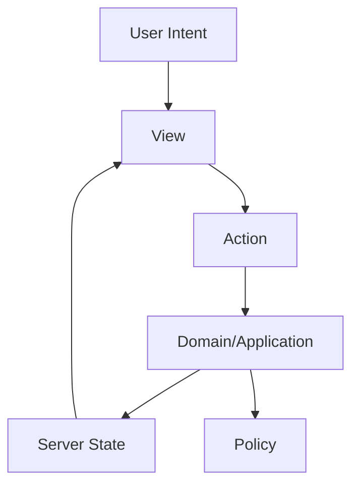

```json
{"record_type":"react_state_policy","section":57,"presentation_state":"local_when_possible","domain_logic":"outside_components","derived_state":"computed","effects":"minimal"}
```

```yaml
schema_name: cat_react_state_policy_v1
required: [state_owner, source_of_truth, derivation, side_effect_owner, accessibility]
```

**Tests:** behavior-oriented component tests, accessibility checks, state-transition tests, and network failure states are required.

---

## 58. API Evolution and Compatibility Windows

Public APIs evolve through explicit compatibility windows. Additive changes are preferred; removals require migration evidence and a documented deprecation interval.

Semantic compatibility matters as much as structural compatibility: a field that remains present but changes meaning is a breaking change.

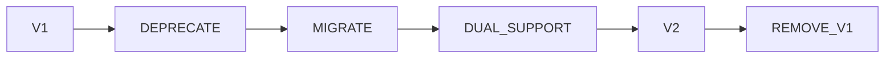

```json
{"record_type":"api_evolution_policy","section":58,"additive":"preferred","semantic_break":"breaking","deprecation":"required","migration":"evidence_based"}
```

```yaml
schema_name: cat_api_evolution_policy_v1
required: [version, compatibility, deprecation, migration, removal_gate]
```

**Tests:** compatibility matrices cover previous/current/future contract combinations where required.

---

## 59. Distributed-System Time and Ordering

Distributed code must never assume wall-clock time is a globally ordered sequence. Use monotonic measurements for durations and explicit event timestamps for business time. Ordering requirements must be represented by sequence, version, causal metadata, or domain-specific ordering keys.

Clock skew, delayed delivery, duplicate delivery, and out-of-order events are normal distributed conditions.

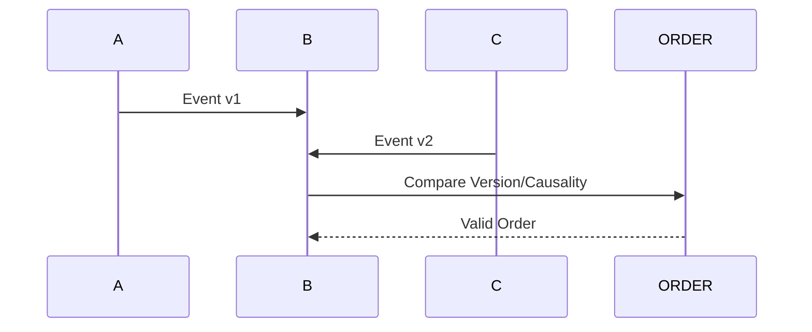

```json
{"record_type":"distributed_time_policy","section":59,"duration_clock":"monotonic","business_time":"explicit","ordering":"declared","clock_skew":"expected"}
```

```yaml
schema_name: cat_distributed_time_policy_v1
required: [clock_type, timestamp_semantics, ordering_key, skew_policy, replay_policy]
```

**Tests:** skew simulation, out-of-order events, duplicate events, and replay tests protect critical workflows.

---

## 60. Distributed Consistency and Idempotent Workflows

Distributed workflows must define which state is strongly consistent, which state is eventually consistent, and how reconciliation works. Eventual consistency is not permission to hide ambiguity.

Every workflow identifies authoritative state, derived state, reconciliation owner, convergence criteria, and terminal failure handling.

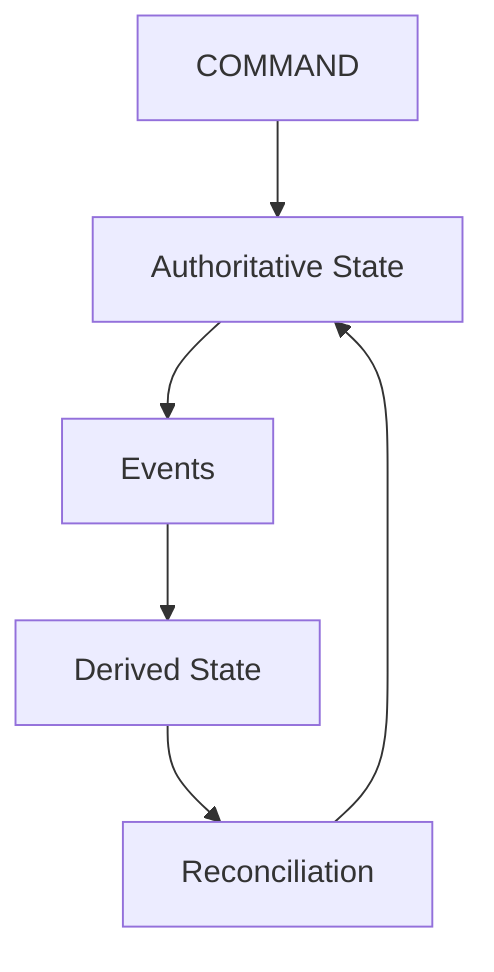

```json
{"record_type":"distributed_consistency_policy","section":60,"authority":"explicit","eventual_consistency":"declared","reconciliation":"required","convergence":"measurable"}
```

```yaml
schema_name: cat_distributed_consistency_policy_v1
required: [authority, consistency_model, derived_state, reconciliation, convergence]
```

**Tests:** duplicate, missing, delayed, and reordered events are used to verify convergence.

---

## 61. Queue, Worker, and Backpressure Engineering

Queues are bounded resource systems. Producers must tolerate backpressure, workers must expose capacity, and retry queues must not become infinite failure sinks.

Every worker defines concurrency, queue capacity, visibility timeout, retry budget, dead-letter behavior, and shutdown semantics.

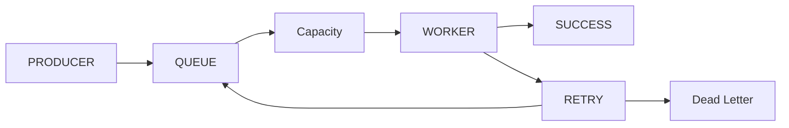

```json
{"record_type":"queue_policy","section":61,"capacity":"bounded","retry":"budgeted","dlq":"defined","shutdown":"graceful"}
```

```yaml
schema_name: cat_queue_policy_v1
required: [capacity, concurrency, retry_budget, visibility, dead_letter, shutdown]
```

**Tests:** load, saturation, retry storms, poison messages, and graceful shutdown are required.

---

## 62. Caching and Invalidation

Caching is a derived optimization, never canonical truth. Every cache defines key semantics, freshness, invalidation, maximum staleness, ownership, and behavior during cache failure.

Cache correctness is measured against the authoritative source, not against internal expectations.

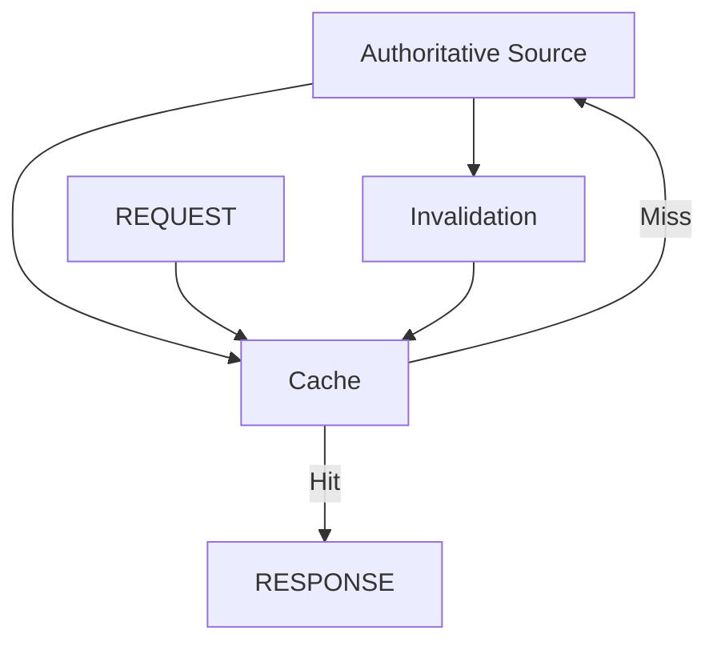

```json
{"record_type":"cache_policy","section":62,"canonicality":"never","freshness":"declared","invalidation":"defined","failure":"safe_bypass"}
```

```yaml
schema_name: cat_cache_policy_v1
required: [source, key, ttl, invalidation, stale_policy, failure_policy]
```

**Tests:** stale-read, invalidation race, cold-cache, and cache-outage scenarios are verified.

---

## 63. Resource Limits and Admission Control

Every production component must have defensible limits for request size, concurrency, memory, CPU, queue depth, database connections, and external calls where applicable.

Admission control protects the whole system from local overload and cascading failure.

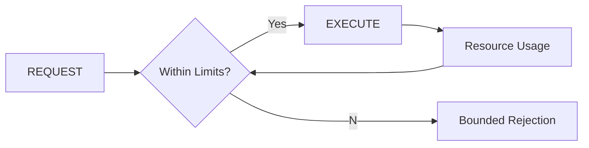

```json
{"record_type":"admission_control","section":63,"request_limits":"required","concurrency":"bounded","overload":"explicit","rejection":"safe"}
```

```yaml
schema_name: cat_admission_control_v1
required: [request_limit, concurrency_limit, memory_limit, queue_limit, rejection_policy]
```

**Tests:** overload, burst traffic, dependency saturation, and memory pressure are exercised.

---

## 64. Performance Regression Engineering

Performance claims must be reproducible. Benchmarks identify workload, dataset shape, environment, compiler/runtime version, baseline, confidence expectations, and regression threshold.

Do not optimize based on intuition when measurement can answer the question.

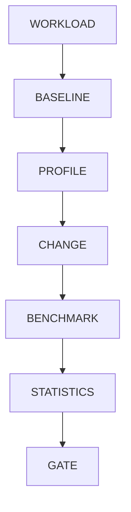

```json
{"record_type":"performance_regression","section":64,"benchmark":"reproducible","baseline":"required","threshold":"declared","statistics":"reported"}
```

```yaml
schema_name: cat_performance_regression_v1
required: [workload, environment, baseline, metric, threshold, result]
```

**Tests:** performance-critical modules maintain benchmark coverage and regression detection.

---

## 65. Memory and Allocation Discipline

Memory behavior must be considered explicitly in high-throughput components. Avoid accidental copies, unbounded buffers, redundant serialization, and allocation-heavy hot loops.

Rust ownership, Go allocation profiles, Python object pressure, and JavaScript heap behavior are different mechanisms; standards must respect language-specific runtime models.

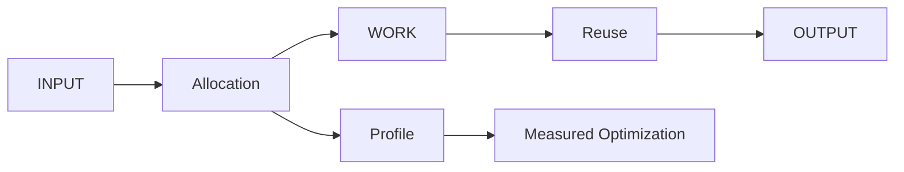

```json
{"record_type":"memory_discipline","section":65,"copies":"minimize","buffers":"bounded","serialization":"reuse","optimization":"profile_first"}
```

```yaml
schema_name: cat_memory_discipline_v1
required: [allocation_model, bounds, profiling, reuse_policy, regression_threshold]
```

**Tests:** memory profiles, load tests, leak-oriented checks, and heap regression checks are used where appropriate.

---

## 66. Security Hardening and Supply-Chain Controls

Dependencies, build tools, generated artifacts, containers, and CI actions are part of the software supply chain. Critical builds require provenance, dependency visibility, vulnerability policy, secret scanning, and controlled upgrade paths.

Do not treat a successful package installation as evidence of trust.

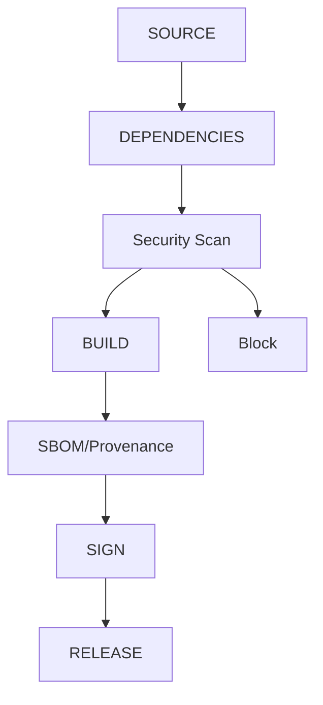

```json
{"record_type":"supply_chain_policy","section":66,"dependency_scan":"required","provenance":"required_for_critical_artifacts","secret_scan":"required","signing":"policy_driven"}
```

```yaml
schema_name: cat_supply_chain_policy_v1
required: [dependency_inventory, vulnerability_policy, provenance, secrets, artifact_identity]
```

**Tests:** vulnerable dependency fixtures, malicious artifact scenarios, and provenance verification are exercised.

---

## 67. Secure Coding for Untrusted Content and Model Output

Web content, files, third-party payloads, retrieved documents, LLM responses, tool output, and generated code are untrusted inputs. Parsing, normalization, validation, sanitization, authorization, and output encoding occur before sensitive use.

Never allow a model to turn text instructions into implicit executable authority.

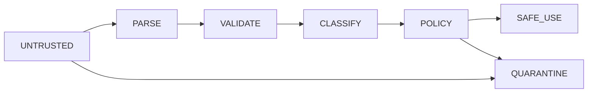

```json
{"record_type":"untrusted_content_policy","section":67,"model_output":"untrusted","validation":"mandatory","execution":"explicit_authority_only","quarantine":"supported"}
```

```yaml
schema_name: cat_untrusted_content_policy_v1
required: [source_class, parser, validator, policy, authorization, quarantine]
```

**Tests:** prompt injection, malformed documents, unsafe tool arguments, and executable-content attempts are negative-tested.

---

## 68. AI Agent Tooling and Permission Boundaries

An AI agent receives only the tools and repository paths necessary for its assigned task. Tool permissions are capabilities, not conveniences. Read, write, execute, merge, deploy, and secret-access permissions are distinct.

High-risk actions require an explicit human or policy gate and a durable audit record.

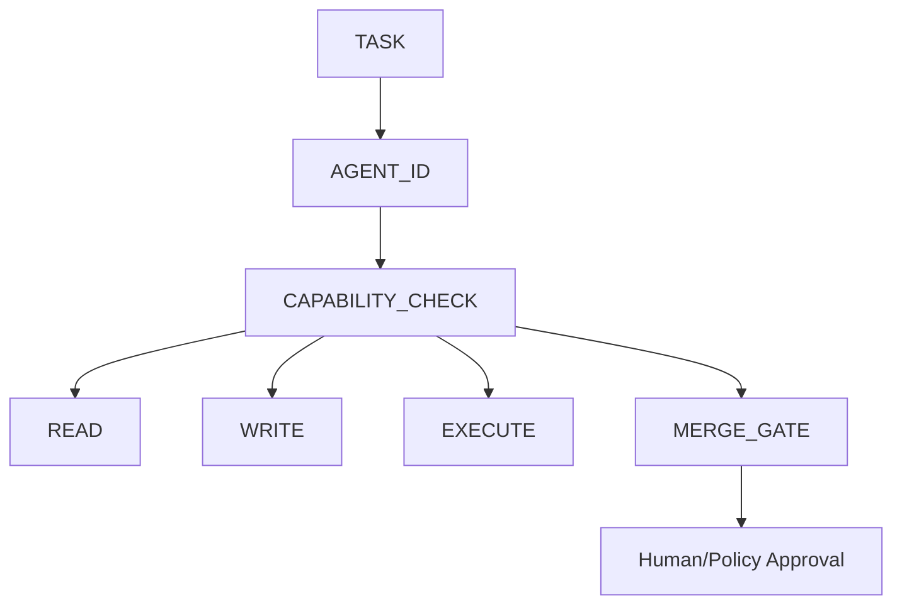

```json
{"record_type":"agent_capability_policy","section":68,"least_privilege":true,"capabilities":["read","write","execute","merge","deploy"],"high_risk_gate":"required","audit":"required"}
```

```yaml
schema_name: cat_agent_capability_policy_v1
required: [agent_id, task_id, capability, scope, expiry, approval, audit]
```

**Tests:** agents are denied out-of-scope paths, destructive commands, secret access, and merge operations without approval.

---

## 69. AI Patch Verification and Generated-Code Trust

AI-generated patches are proposals until independently verified. The verification pipeline checks scope, diff size, touched paths, architectural boundaries, tests, security, provenance, and semantic intent.

An agent must not validate its own high-risk change using a validator it modified in the same change without an independent verification path.

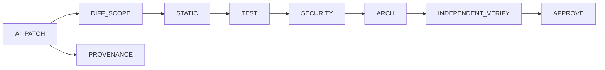

```json
{"record_type":"ai_patch_verification","section":69,"self_validation":"insufficient_for_high_risk","independent_verify":"required","scope":"checked","provenance":"required"}
```

```yaml
schema_name: cat_ai_patch_verification_v1
required: [patch_id, agent_id, scope, tests, security, architecture, independent_verification]
```

**Tests:** validators modified by an agent cannot alone authorize the same patch; tampered receipts are rejected.

---

## 70. Repository-Scale Refactoring

Large refactors must be staged. Each stage preserves buildability, testability, and architectural observability unless an explicitly approved migration window permits otherwise.

Refactors separate mechanical movement from semantic change whenever possible.

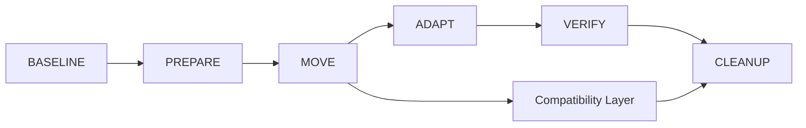

```json
{"record_type":"refactor_policy","section":70,"staged":"required_for_large_changes","buildability":"preserved","mechanical_before_semantic":"preferred","rollback":"declared"}
```

```yaml
schema_name: cat_refactor_policy_v1
required: [baseline, stages, compatibility, verification, cleanup, rollback]
```

**Tests:** each migration stage has a build/test checkpoint and an explicit rollback point.

---

## 71. Architecture Fitness Functions

Architecture rules must become executable checks. Fitness functions measure dependency direction, forbidden coupling, module size, public-surface growth, latency budgets, resource bounds, and contract compatibility.

The goal is to make architectural decay observable before it becomes expensive.

```mermaid
flowchart TB
REPO-->MEASURE[Fitness Functions]
MEASURE-->DEPENDENCY
MEASURE-->API_SURFACE
MEASURE-->PERFORMANCE
MEASURE-->SECURITY
MEASURE-->COMPLEXITY
MEASURE-->GATE
```

```json
{"record_type":"architecture_fitness","section":71,"dependency_direction":"measured","api_surface":"measured","performance":"budgeted","security":"measured","complexity":"bounded"}
```

```yaml
schema_name: cat_architecture_fitness_v1
required: [fitness_id, metric, threshold, measurement, owner, gate]
```

**Tests:** architecture regressions fail a representative CI fitness suite.

---

## 72. Engineering Decision Records in Code Changes

Non-trivial implementation decisions must be traceable to an ADR, decision record, governing document, or documented issue. Code should not silently encode a major architectural decision.

The reference must identify why the choice exists, alternatives considered, constraints, consequences, and review status.

```mermaid
flowchart LR
PROBLEM-->OPTIONS-->DECISION-->ADR-->IMPLEMENTATION-->VERIFY
IMPLEMENTATION-->TELEMETRY
```

```json
{"record_type":"decision_traceability","section":72,"major_decisions":"traceable","alternatives":"recorded","consequences":"recorded","implementation_link":"required"}
```

```yaml
schema_name: cat_decision_traceability_v1
required: [decision_id, problem, options, decision, consequences, implementation_refs]
```

**Tests:** architecture-sensitive pull requests fail when required decision references are absent.

---

## 73. Engineering Knowledge and Documentation as Code

Documentation for APIs, schemas, operational contracts, examples, and architectural invariants must remain synchronized with implementation. When documentation is generated, the source specification is authoritative.

Examples should be executable or mechanically checked when practical. Rust documentation supports executable examples, and project standards should use that capability for public APIs. citeturn0search5turn0search4

```mermaid
flowchart TB
SPEC[Source Specification]-->CODE
SPEC-->DOCS
SPEC-->SCHEMA
CODE-->VERIFY
DOCS-->VERIFY
SCHEMA-->VERIFY
```

```json
{"record_type":"documentation_as_code","section":73,"source_of_truth":"explicit","examples":"executable_when_practical","sync":"verified","generated_docs":"source_driven"}
```

```yaml
schema_name: cat_documentation_as_code_v1
required: [source, generated_outputs, verification, owner, update_trigger]
```

**Tests:** documentation examples compile/run where supported; schema and API docs are checked for drift.

---

## 74. Enterprise Engineering Governance and Continuous Evolution

Coding standards evolve through evidence, not fashion. A change to this standard requires a reason, impact analysis, compatibility assessment, owner, and migration plan when existing code is affected.

Language-specific rules may be stricter than the common floor when they are idiomatic and justified. Common rules remain the baseline; language rules provide deliberate overrides. This layered approach is consistent with established multi-language coding-rule systems. citeturn1search9

```mermaid
flowchart TB
OBS[Observed Problem]-->PROPOSAL-->IMPACT-->REVIEW-->DECISION-->STANDARD_CHANGE-->MIGRATION-->VERIFY
```

```json
{"record_type":"coding_standard_governance","section":74,"change_control":"evidence_based","language_overrides":"explicit","migration":"required_when_affected","verification":"required"}
```

```yaml
schema_name: cat_coding_standard_governance_v1
required: [problem, proposal, impact, owner, approval, migration, verification]
```

**Tests:** standard changes include at least one regression test or automated enforcement change where applicable.

---

## 75. Part 3 Completion Contract

Part 3 closes the advanced engineering layer. It does not replace the common coding floor; it extends it with language-specific depth, distributed-system discipline, resilience, performance engineering, supply-chain security, AI-agent capability controls, architecture fitness functions, decision traceability, and governance.

### Part 3 Constitutional Rule Registry

| ID | Rule | Owner | Severity | Enforcement |
|---|---|---|---|---|
| CAT-CS-CONST-101 | Rust ownership and unsafe boundaries must encode explicit invariants. | Rust Core | Critical | Clippy + Review + Tests |
| CAT-CS-CONST-102 | Go goroutines require ownership, cancellation, and bounded lifetime. | Runtime | Critical | Tests + Review |
| CAT-CS-CONST-103 | Python dynamic behavior must remain behind typed boundaries. | AI/Data | High | Typecheck + Tests |
| CAT-CS-CONST-104 | TypeScript domain code must not use `any`. | Frontend | High | Typecheck + Lint |
| CAT-CS-CONST-105 | Distributed workflows must declare authority and convergence. | Architecture | Critical | Contract Tests |
| CAT-CS-CONST-106 | Queue and worker capacity must be bounded. | Runtime | Critical | Load Tests |
| CAT-CS-CONST-107 | Caches are derived state and never canonical truth. | Platform | Critical | Review + Tests |
| CAT-CS-CONST-108 | Critical components require failure-injection evidence. | Reliability | Critical | Resilience CI |
| CAT-CS-CONST-109 | Security supply-chain controls protect dependencies and artifacts. | Security | Critical | Security CI |
| CAT-CS-CONST-110 | AI agents receive only explicit least-privilege capabilities. | AI Governance | Critical | Policy Gate |
| CAT-CS-CONST-111 | High-risk AI patches require independent verification. | AI Governance | Critical | Independent Validator |
| CAT-CS-CONST-112 | Architecture rules must become executable fitness functions where practical. | Architecture | High | CI |
| CAT-CS-CONST-113 | Major implementation decisions must be traceable to an approved record. | Governance | High | Review |
| CAT-CS-CONST-114 | Coding-standard changes require evidence and migration planning. | Engineering | High | Governance Review |

### Acceptance Test Registry

- `CAT-CS-AT-S51-001` — Rust ownership-sensitive code passes invariant-focused tests.
- `CAT-CS-AT-S53-001` — Go worker cancellation terminates all owned goroutines.
- `CAT-CS-AT-S55-001` — Python external payloads cannot bypass typed validation.
- `CAT-CS-AT-S56-001` — TypeScript domain compilation rejects `any` usage.
- `CAT-CS-AT-S60-001` — distributed state converges after duplicate and reordered events.
- `CAT-CS-AT-S61-001` — queue saturation triggers bounded backpressure.
- `CAT-CS-AT-S62-001` — cache failure safely falls back to authoritative state.
- `CAT-CS-AT-S66-001` — vulnerable supply-chain input blocks release.
- `CAT-CS-AT-S68-001` — an agent is denied an unauthorized repository capability.
- `CAT-CS-AT-S69-001` — an AI patch cannot self-authorize a high-risk validator change.
- `CAT-CS-AT-S71-001` — an architecture fitness regression blocks CI.
- `CAT-CS-AT-S72-001` — a major architecture-sensitive change requires a decision reference.
- `CAT-CS-AT-S73-001` — executable documentation drift is detected.
- `CAT-CS-AT-S74-001` — a proposed standard change cannot bypass governance evidence.
- `CAT-CS-AT-S75-001` — all Part 3 registries resolve and remain globally unique.

### Memory Anchor Registry

- `CAT-CS-MEM-S51-001` — ownership is an architectural invariant.
- `CAT-CS-MEM-S53-001` — every goroutine has an owner and an exit path.
- `CAT-CS-MEM-S60-001` — eventual consistency requires declared convergence.
- `CAT-CS-MEM-S61-001` — queues are bounded resources, not infinite buffers.
- `CAT-CS-MEM-S62-001` — caches are derived and disposable.
- `CAT-CS-MEM-S66-001` — the software supply chain is part of the trusted computing boundary.
- `CAT-CS-MEM-S68-001` — agent capability is explicit authority.
- `CAT-CS-MEM-S69-001` — generated patches are proposals until independently verified.
- `CAT-CS-MEM-S71-001` — architecture becomes stronger when rules are executable.
- `CAT-CS-MEM-S75-001` — Part 3 closes the advanced engineering layer.

### JSON Schema Registry

```json
{
  "record_type": "coding_standard_part3_completion",
  "version": "1.0",
  "section_range": [51,75],
  "rule_range": [101,114],
  "advanced_domains": ["rust","go","python","typescript","distributed_systems","queues","caching","performance","supply_chain","ai_agents","architecture_fitness","governance"],
  "required_controls": ["typed_boundaries","bounded_resources","failure_injection","least_privilege","independent_verification","decision_traceability"],
  "append_only_prefix_required": true,
  "next_part": "Part 4"
}
```

### YAML Schema Registry

```yaml
schema_name: cat_coding_standard_part3_completion_v1
version: "1.0"
section_range: "51-75"
required_registries:
  - constitutional_rules
  - acceptance_tests
  - memory_anchors
  - json_schemas
  - yaml_schemas
required_gates:
  - format
  - lint
  - typecheck
  - unit
  - contract
  - integration
  - security
  - resilience
  - architecture
  - independent_ai_verification
  - review
append_only: true
next_part: 4
```

### Completion Contract

Part 3 is complete only when the Part 1–2 prefix is byte-identical, Sections 51–75 are complete and ordered, all language-specific and distributed-system controls are represented, AI-agent permissions remain least-privilege, high-risk generated changes have independent verification, architecture fitness checks are executable where practical, and all registries are reproducible from repository contents.

**Part 3 Status:** COMPLETE — 75% target
**Next:** Coding Standard Part 4 — final enterprise engineering contract, long-horizon evolution, release engineering, platform-wide enforcement, and final completion receipt.
