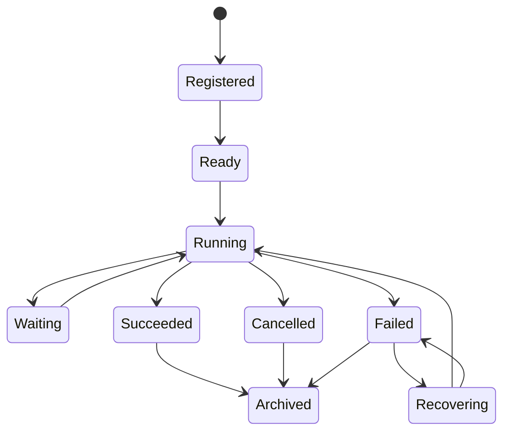

# A04 — Agent Lifecycle

Lifecycle state is execution metadata. Business truth remains in domain aggregates and events. Every transition has a reason and correlation context. Recovery is bounded by policy; an agent cannot retry indefinitely or change its own authority.
