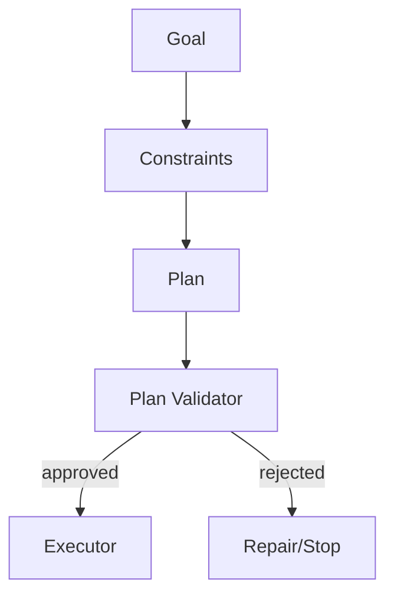

# A07 — Agent Planning

Planning converts a goal into a bounded plan. A plan is data, not authority.

```text
Goal → constraints → candidate steps → dependency graph → validation → approved plan
```

Each step declares capability, input references, expected output schema, cost/deadline estimate, and failure policy. The planner cannot silently introduce a capability absent from the invocation policy. Plans are versioned so an execution can be reproduced or inspected.


