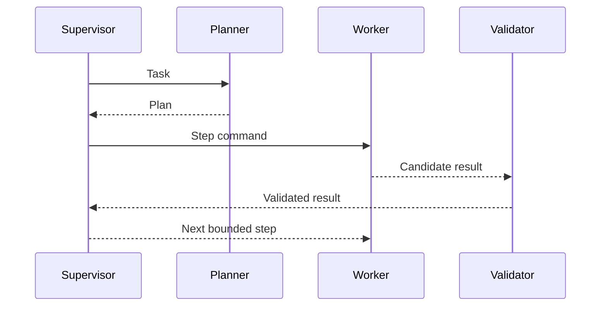

# A12 — Agent Communication

Agents communicate through typed commands, results, events, and task messages. Shared mutable state is prohibited.

Messages carry correlation ID, causation ID, sender/receiver identities, schema version, deadline, and idempotency information where applicable. Agent-to-agent communication cannot bypass the capability gateway or policy layer.
