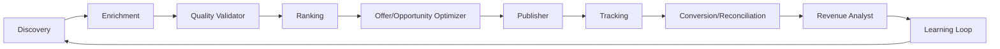

# A14 — Affiliate Agent Mesh

CAT's initial business agent mesh is:

### Responsibilities

- **Discovery:** identify candidate networks, merchants, offers, products, and sources.
- **Enrichment:** normalize missing metadata and provenance.
- **Quality:** reject malformed, contradictory, stale, or policy-invalid candidates.
- **Ranking:** apply documented deterministic ranking contracts.
- **Optimizer:** propose changes using measured outcomes.
- **Publisher:** execute only approved publication capabilities.
- **Reconciliation:** compare external observations with CAT facts.
- **Revenue Analyst:** analyze commissions, EPC, conversion, and cost using authoritative financial data.
- **Learning:** convert validated outcomes into governed knowledge, never directly into unrestricted policy.
