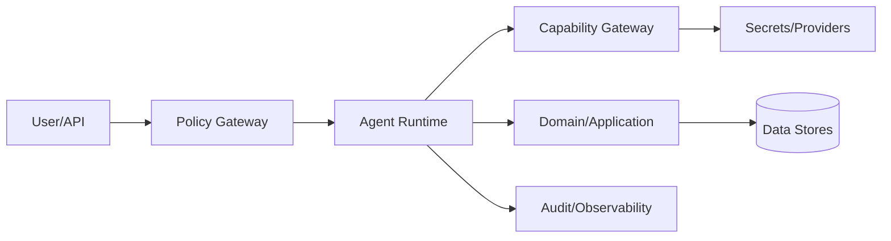

# A20 — Agent Security Model

The agent runtime is treated as an untrusted computation boundary.

## Security zones

Rules:

- secrets are retrieved only through approved secret capabilities;
- prompts cannot grant permissions;
- tool results are untrusted data;
- external content is sandboxed/validated before persistence;
- agent-to-agent messages do not inherit arbitrary privileges;
- financial and administrative capabilities require stronger policy controls;
- every privileged action is auditable;
- tenant isolation is enforced below the model layer as well as in policy;
- prompt injection is treated as hostile input and cannot override system policy.

Security design assumes a model can be manipulated by its context. The architecture therefore makes correct behavior depend on enforceable boundaries rather than model obedience.
