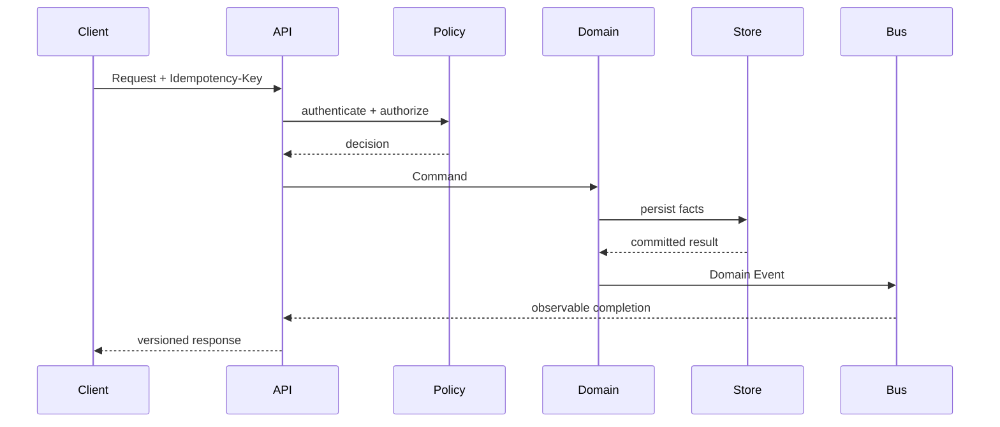

# CAT API & Contract Specification Pack

> Contract-first specification for CAT OMNISYSTEM APIs, commands, events, agents, providers, identity, errors, pagination, idempotency, webhooks, and versioning.

## Purpose

This pack is the executable-design boundary between the CAT domain model and implementation. It defines stable contracts before transport or framework code is written.

## Contract rules

1. Contracts are explicit and versioned.
2. JSON examples are illustrative unless marked normative.
3. Domain invariants remain authoritative over transport concerns.
4. API handlers never become the source of business truth.
5. Commands are intent; events are facts.
6. Idempotency is required for externally retried mutations.
7. Error responses are machine-readable and stable.
8. Secrets never appear in API payloads or logs.
9. Provider-specific schemas stay behind adapters.
10. Breaking changes require an explicit contract-version migration.

## Documents

| ID | Document | Scope |
|---|---|---|
| C01 | API Principles | contract philosophy |
| C02 | HTTP API | REST conventions |
| C03 | JSON Schema | schema conventions |
| C04 | Authentication | identity/auth contracts |
| C05 | Authorization | policy/RBAC/ABAC boundaries |
| C06 | Command Envelope | command contract |
| C07 | Event Envelope | event contract |
| C08 | Agent Contract | agent invocation contract |
| C09 | Provider Contract | external provider adapter contract |
| C10 | Error Contract | canonical error model |
| C11 | Pagination | pagination and ordering |
| C12 | Idempotency | retry and deduplication |
| C13 | Webhooks | inbound external callbacks |
| C14 | Rate Limits | quotas and backpressure |
| C15 | Versioning | compatibility policy |
| C16 | Audit Contract | security/audit evidence |
| C17 | Health Contract | health/readiness/dependency state |
| C18 | Search & Query | filtering/query semantics |
| C19 | Affiliate API | affiliate-facing resource contracts |
| C20 | Contract Test Strategy | validation and compatibility tests |

## Canonical flow

## Status

**Specification phase: complete for C01–C20.** Implementation status must be tracked separately; these documents do not imply that every endpoint or contract is already implemented in production.
