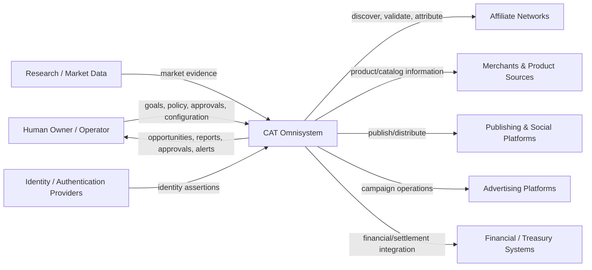

# A01 — C4 System Context

**Level:** C4 Context
**Status:** TARGET architecture with current boundaries marked separately.

## Intent

CAT sits between a human/operator control plane and an external commerce ecosystem. The system architecture defines CAT as an AI operating system whose intelligence, control, execution, truth, capabilities and operations are separated. fileciteturn1524file0L2-L2

## Context model

## External-system contract

CAT never treats an external provider as authoritative for CAT's internal domain model. Adapters translate provider-specific representations into stable CAT contracts. Provider failure is represented as an operational condition rather than allowed to redefine internal truth.

## Human boundary

The human owner supplies intent, constraints, policy and approvals. CAT may automate execution only inside explicitly granted authority. High-impact or ambiguous operations should be routed to approval/reconciliation rather than silently executed.

## Context-level responsibilities

| Context | CAT responsibility | Boundary |
|---|---|---|
| Human | Interpret goals; present evidence; request approval | Human authority remains outside autonomous execution |
| Affiliate networks | Discovery, links, commissions, network facts | Provider adapter |
| Merchants | Product/catalog facts | Provider adapter |
| Publishing | Distribution execution | Side-effect boundary |
| Advertising | Campaign execution and measurement | Side-effect + budget boundary |
| Research data | Evidence acquisition | Source-health boundary |
| Finance | Settlement/financial facts | Financial integration boundary |
| Identity | Authentication assertions | Security boundary |

## Context invariant

No external system may directly mutate CAT's durable business state. External observations enter through validated ingestion; external side effects leave through controlled execution boundaries.
