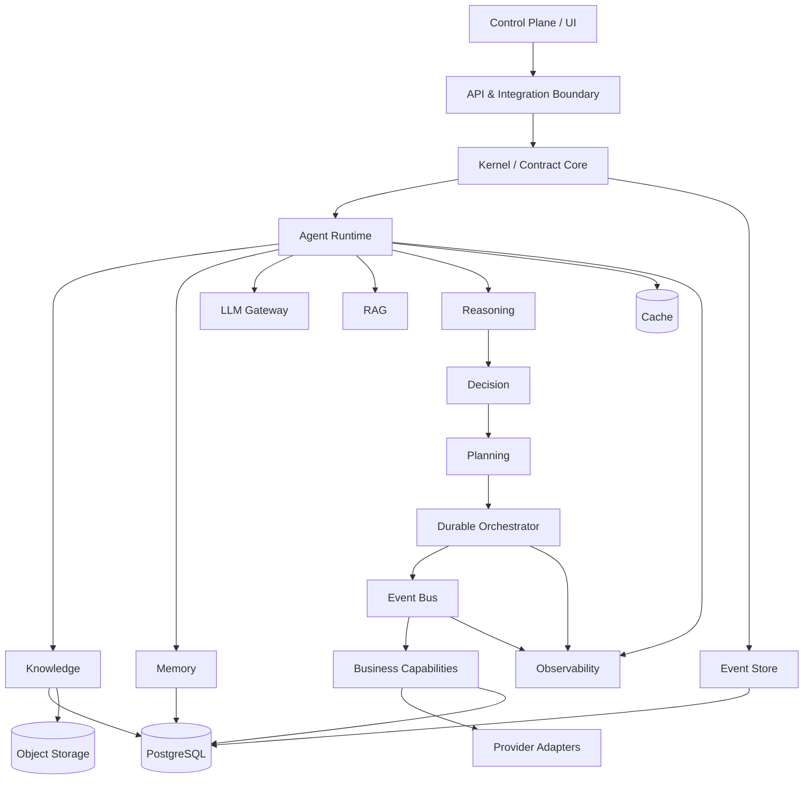

# A02 — C4 Container Model

**Level:** C4 Container
**Status:** TARGET model; implementation status must be checked against code.

## Container map

## Container contracts

| Container | Owns | Consumes | Produces |
|---|---|---|---|
| Control Plane | configuration/approval UX | API state | commands/approval decisions |
| API Boundary | transport/auth validation | external requests | validated commands |
| Kernel | stable primitives | commands/contracts | domain-safe operations |
| Agent Runtime | agent execution context | goals, tools, memory | proposals/requests |
| Knowledge | canonical knowledge | documents/evidence | facts/retrieval context |
| Memory | agent/system memory | events/outcomes | context/experience |
| LLM Gateway | model abstraction | prompts/context | model responses |
| Reasoning | evidence synthesis | context/model output | reasoning artifacts |
| Decision | policy-aware choice | evidence/proposals | decisions |
| Planning | decomposition/scheduling | decisions | plans/workflows |
| Orchestrator | durable execution | workflows | commands/results/events |
| Event Bus | asynchronous delivery | domain events | consumer deliveries |
| Event Store | durable event history | events | replay/audit source |
| Capability layer | commerce functions | workflows/events | domain facts/commands |
| Provider adapters | external translation | CAT contracts | provider calls/results |
| Persistence | durable state | facts/commands | committed truth |
| Observability | telemetry | runtime signals | metrics/logs/traces |

## Dependency rule

Dependencies point inward toward stable contracts. Volatile providers, models and UI components remain at the edges. The existing ADR set explicitly governs architecture style, event-driven design, durable execution, provider independence and runtime boundaries. fileciteturn1525file0L2-L2

## Critical distinction

A container can propose an action without possessing authority to execute it. Side effects require the execution boundary and its policy, idempotency and reconciliation rules.
