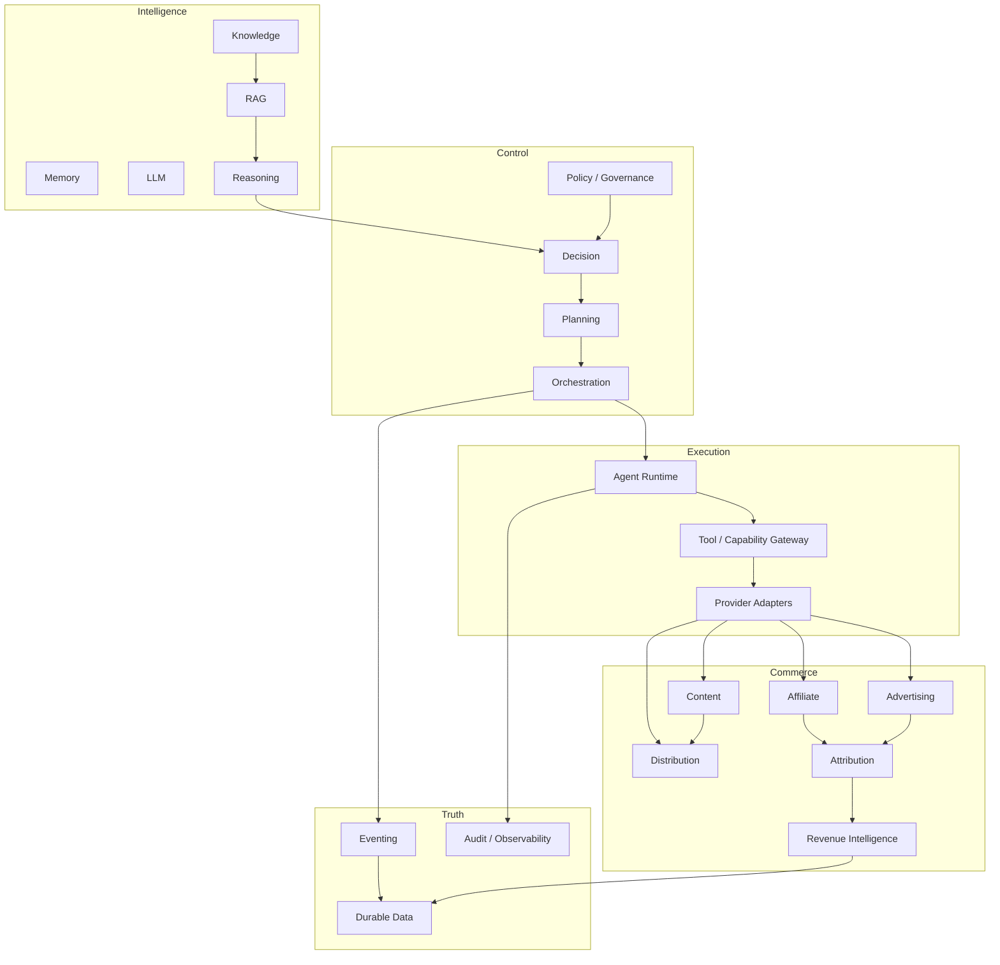

# A03 — CAT Domain Map

**Status:** TARGET canonical domain map; implementation evidence takes precedence.

## Bounded domains



## Domain ownership

| Domain | Primary ownership | Explicit non-ownership |
|---|---|---|
| Knowledge | canonical facts, sources, relationships | external provider state |
| Memory | contextual/experiential memory | durable financial truth |
| Reasoning | evidence synthesis and inference artifacts | execution authority |
| Decision | policy-aware action selection | provider transport |
| Planning | decomposition and scheduling | side effects |
| Orchestration | durable workflow lifecycle | agent persona/content style |
| Agent Runtime | agent context and tool invocation | unrestricted credentials |
| Affiliate | opportunities, offers, commissions | generic kernel state |
| Content | content artifacts and lifecycle | publishing credentials |
| Advertising | campaigns, budgets, performance | payment settlement authority |
| Distribution | publishing/distribution operations | business policy ownership |
| Attribution | clicks, conversions, attribution evidence | merchant settlement authority |
| Revenue Intelligence | economics, optimization signals | raw provider truth |
| Eventing | versioned domain communication | hidden business state |
| Durable Data | persistence of owned facts | transient UI state |
| Governance | policy, approval, audit | model-specific reasoning |

## Boundary rules

1. A domain owns its invariants and persistence facts.
2. Cross-domain interaction uses contracts/events rather than direct internal mutation.
3. Read models may compose multiple domains but do not acquire ownership of their facts.
4. Agents can consume domain capabilities; they do not bypass domain boundaries.
5. Provider-specific concepts terminate at adapters unless deliberately promoted into a canonical CAT concept.

## Commerce flow

```text
Discovery → Validation → Opportunity → Decision → Plan → Execution
        → Attribution → Outcome → Revenue → Learning → Optimization
```

This flow is an architectural target; individual stages may have different implementation maturity.
