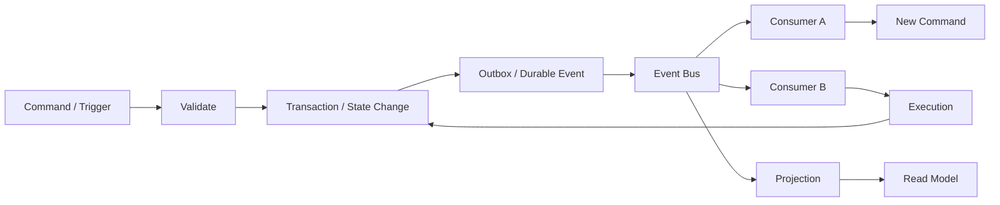

# A04 — Event Flow Architecture

**Status:** TARGET, grounded in the existing event-driven architecture and durable execution model.

## Canonical flow



## Event envelope

Every important event should carry, at minimum:

| Field | Purpose |
|---|---|
| event_id | global event identity |
| event_type | stable semantic type |
| schema_version | compatibility/version control |
| occurred_at | source occurrence time |
| producer | producing bounded context |
| subject_id | entity affected |
| correlation_id | end-to-end business trace |
| causation_id | immediate causal predecessor |
| payload | versioned domain data |
| metadata | tracing, tenant, actor and policy context where permitted |

## Delivery semantics

CAT should assume at-least-once delivery unless a contract explicitly proves otherwise. Consumers therefore need idempotency keys or durable deduplication. Failed consumers retry; permanently invalid messages move to a dead-letter/review path rather than disappearing.

## Event categories

```text
Domain Event       = a business fact that happened
Execution Event    = a workflow/provider execution fact
Integration Event  = a fact intended for another boundary
Projection Update  = derived read-model work
Audit Event        = security/governance evidence
```

## Forbidden event patterns

- emitting events from a speculative read;
- using an event as an undocumented command;
- publishing before durable state commit when the event represents committed truth;
- embedding provider-specific mutable credentials in payloads;
- consumers relying on delivery order unless ordering is part of the contract.

## Recovery

```text
failure → retry → deduplicate → reconcile → dead-letter/review
```

Unknown remote state is handled through reconciliation before replaying side-effecting work. This follows the core system architecture's explicit failure philosophy. fileciteturn1524file0L2-L2
