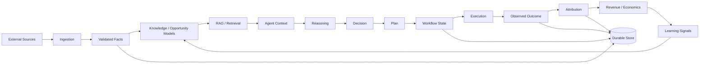

# A05 — Data Flow Architecture

**Status:** TARGET data-flow model.

## End-to-end information lifecycle



## Data classes

| Class | Examples | Source of truth | Mutability |
|---|---|---|---|
| Observation | fetched price, API response | ingestion evidence | append-oriented |
| Fact | normalized product, opportunity | domain store | controlled revision |
| Decision | selected action, policy result | decision record | append/audit |
| Workflow state | status, revision, lease | orchestrator store | transactional |
| Execution | provider request/result | execution store | append-oriented |
| Attribution | click/conversion evidence | attribution store | append/reconcile |
| Financial fact | commission/settlement | financial boundary | append/corrected by explicit event |
| Knowledge | document/entity/relationship | knowledge store | versioned |
| Memory | summary/experience/context | memory store | tier-specific |
| Telemetry | metric/log/trace | observability backend | retention-based |
| Cache | derived acceleration | cache | disposable |

## Data lineage

Every economically significant outcome should be traceable backwards:

```text
Revenue
  ← attribution
  ← execution outcome
  ← workflow
  ← decision
  ← evidence
  ← source observation
```

The inverse path must also be possible for impact analysis: a source change can identify decisions and outcomes that depended on it.

## Data ownership rule

A derived projection never becomes the authoritative owner of the source fact. Rebuilding a projection must be safe from durable facts/events.

## Privacy and secret handling

Credentials, access tokens and secrets are control-plane/security data, not business payloads. They must not enter event payloads, prompts, logs, embeddings or analytics unless an explicitly approved secret-management contract requires it.
