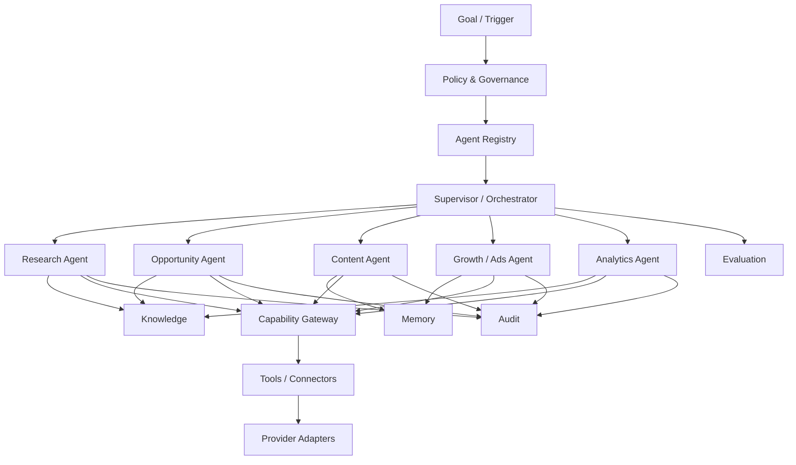

# A06 — Agent Mesh Architecture

**Status:** TARGET architecture.

## Mesh model



## Agent hierarchy

| Layer | Responsibility | Authority |
|---|---|---|
| Supervisor | decomposition, routing, lifecycle | workflow authority, not unrestricted provider authority |
| Specialist Agent | bounded reasoning/task work | only declared capabilities |
| Capability | deterministic business operation | domain-defined side effects |
| Tool/Connector | transport or external operation | scoped credentials |
| Provider Adapter | provider translation | external API boundary |
| Evaluator | quality/risk assessment | no implicit side effects |

## Agent contract

An agent should have explicit identity, version, declared capabilities, input/output schema, policy scope, model/provider configuration, resource limits, observability identity and termination rules.

## Agent loop

```text
Observe → Retrieve → Reason → Propose → Policy Check → Execute
   ↑                                           ↓
   └──────────── Evaluate ← Outcome ←─────────┘
```

The loop is not an authorization bypass. A model response can propose an action, but execution remains governed by capability contracts and policy.

## Mesh invariants

1. No unrestricted agent-to-agent credential sharing.
2. No direct agent-to-database mutation outside domain APIs.
3. Agent messages are typed and correlated.
4. Long-running work is durable.
5. Tool execution is observable.
6. Model/provider replacement does not change domain contracts.
7. A failed or quarantined agent cannot silently continue side effects.
8. Human approval is a first-class state where policy requires it.
