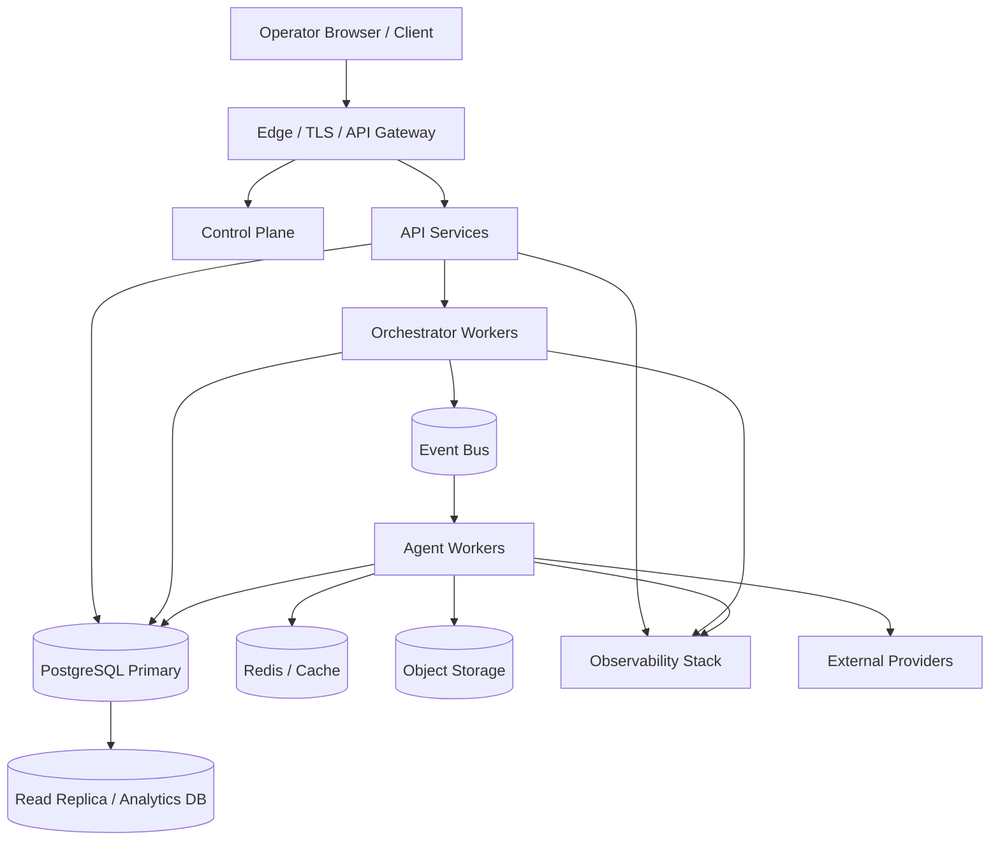

# A07 — Deployment Topology

**Status:** TARGET deployment model with a small-node starting profile.

## Logical topology



## Deployment profiles

### Profile S — single-node development/personal use

```text
Gateway + API + Orchestrator + Agent Workers + PostgreSQL
                    │
                 local cache
```

All contracts remain process-independent even if deployed together.

### Profile M — production small cluster

Separate API/control plane, orchestrator workers, agent workers and database. Scale workers horizontally based on queue depth and workload class.

### Profile L — distributed cluster

Multiple API instances, orchestrator shards, specialized worker pools, durable event infrastructure, database replicas, dedicated observability and isolated provider egress.

## Scaling dimensions

| Dimension | Scaling signal |
|---|---|
| API | request rate/latency |
| Agent workers | task queue depth |
| Orchestrator | active workflow count |
| Provider adapters | provider quota/latency |
| Event consumers | lag |
| Database | transaction rate/storage/IO |
| Retrieval | query latency/index size |
| Observability | telemetry volume |

## Reliability rules

- Durable state must survive worker restart.
- Work claiming must support leases/fencing where needed.
- Retries must respect provider idempotency/reconciliation.
- Database migrations must be backward-compatible during rolling deployment.
- Secrets are injected through deployment-time secret management, never committed.

## Network zones

```text
PUBLIC → EDGE → APPLICATION → WORKER → PROVIDER EGRESS
                         │
                         └────→ DATA / OBSERVABILITY
```

The database is not a public service. Worker/provider egress is explicitly controlled.
