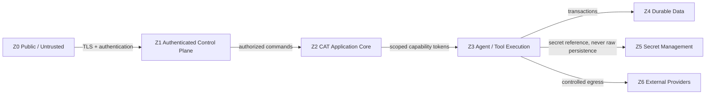

# A08 — Security Boundaries

**Status:** TARGET security architecture.

## Trust zones

## Boundary matrix

| Boundary | Required controls |
|---|---|
| Public → Control Plane | TLS, authentication, rate limiting, CSRF/session protection where applicable |
| Control Plane → Core | authorization, input validation, tenant/resource scoping |
| Core → Agent | capability allow-list, policy context, resource limits |
| Agent → Tool | typed arguments, authorization, audit, timeout |
| Tool → Provider | scoped credential, egress policy, idempotency/reconciliation |
| Application → Database | parameterized queries, least privilege, transaction boundaries |
| Application → Secrets | reference-based access, rotation, audit |
| Telemetry → Backend | secret redaction, tenant isolation, retention policy |

## Security principles

1. Authentication answers **who**; authorization answers **what they may do**.
2. Agent capability is not equivalent to user authority.
3. Credentials are never model context by default.
4. Secrets never belong in prompts, events, logs or analytics.
5. Every side-effecting capability is auditable.
6. Policy denial is a normal domain outcome, not an exceptional crash.
7. Sensitive data access is minimized and scoped.
8. Provider compromise must not imply unrestricted CAT compromise.

## Threat model focus

### Prompt injection
Treat retrieved external content as untrusted data. It can influence reasoning but cannot redefine system policy or grant capabilities.

### Tool abuse
Tools expose narrow operations, validate inputs and enforce policy before side effects.

### Credential exfiltration
Models do not receive raw credentials. Tool adapters resolve secrets outside model-visible payloads.

### Replay/duplicate execution
Execution identifiers, idempotency keys and reconciliation protect side-effecting operations.

### Data poisoning
Source provenance, validation, confidence and anomaly detection are required before evidence becomes high-trust knowledge.

## Security evidence

Security architecture is incomplete until each boundary has executable authorization tests, secret-redaction tests, audit coverage and failure-mode tests. This document defines the target; it does not claim those tests are already complete.
