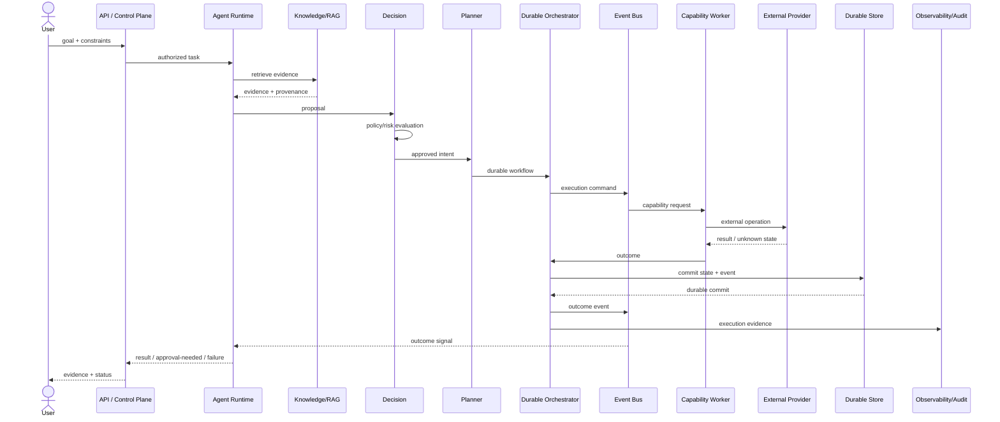

# A09 — Core Goal-to-Outcome Sequence

**Status:** TARGET sequence.

## Sequence

## Important transitions

| Transition | Durable? | Authorization |
|---|---:|---|
| Goal accepted | yes | authenticated actor |
| Evidence retrieval | normally no business mutation | read policy |
| Decision | yes/auditable when material | decision policy |
| Plan created | yes | workflow policy |
| Execution claimed | yes | capability policy |
| Provider call | external side effect | scoped credential |
| Outcome | yes | execution contract |
| Final response | derived | presentation policy |

## Failure branches

- Validation failure → terminal rejected state.
- Policy failure → denied state, no provider call.
- Worker crash → lease recovery/retry.
- Provider timeout → reconcile before replay.
- Duplicate delivery → idempotent consumer.
- Human approval required → durable waiting state.
