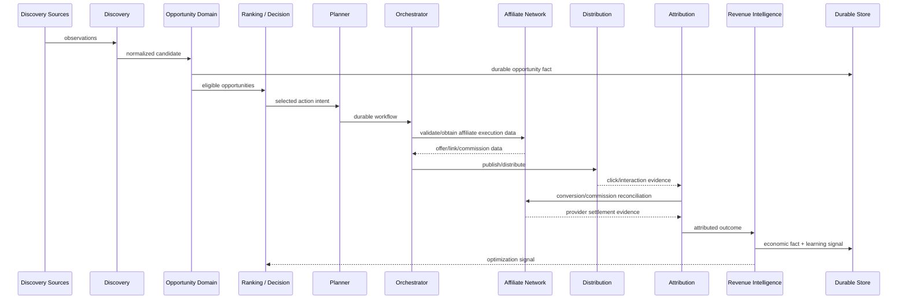

# A10 — Affiliate Economic Flow Sequence

**Status:** TARGET end-to-end economic sequence.



## Economic chain

```text
Source Observation
 → Opportunity
 → Eligibility
 → Decision
 → Affiliate Execution
 → Distribution
 → Click
 → Conversion
 → Commission
 → Settlement
 → Profitability
 → Learning
```

## Correctness requirements

1. Discovery evidence retains provenance.
2. Opportunity identity is deterministic.
3. Ranking is explainable and reproducible.
4. Affiliate links/executions are idempotent or reconciliable.
5. Clicks and conversions are attributed using explicit identifiers and time windows.
6. Revenue facts are never inferred solely from model output.
7. Provider settlement is reconciled against internal attribution.
8. Optimization signals are derived from durable outcomes, not speculative reasoning.

## Economic safety boundary

The agent may recommend an opportunity or campaign. Budget allocation, publishing, paid advertising and other material side effects remain capability-controlled operations with policy and audit requirements.
