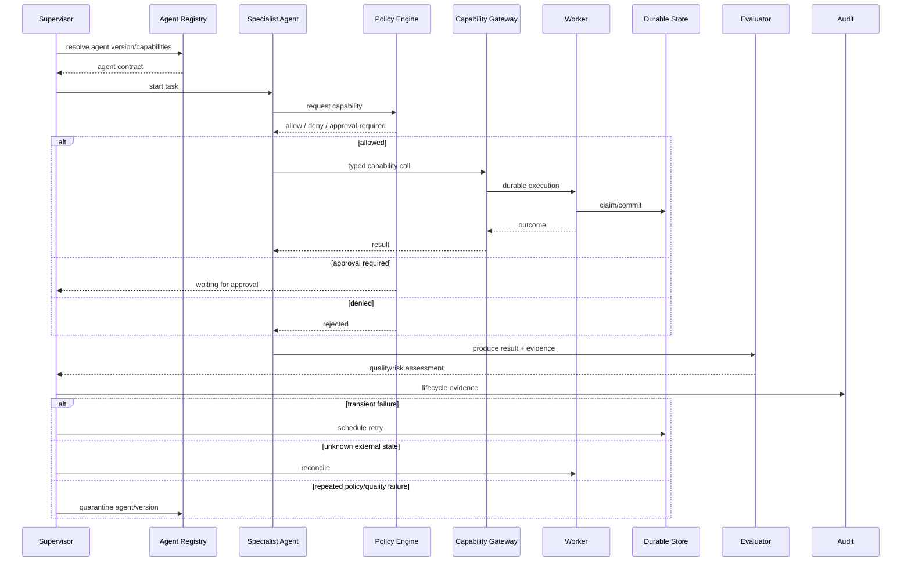

# A11 — Agent Execution and Recovery Sequence

**Status:** TARGET agent lifecycle sequence.



## Agent state machine

```text
REGISTERED
    ↓
VALIDATING → REJECTED
    ↓
READY → RUNNING → EVALUATING
                    ├→ READY
                    ├→ RETRY_WAIT → RUNNING
                    ├→ APPROVAL_WAIT
                    └→ QUARANTINED
```

## Recovery rules

- State transitions are durable.
- Worker restart must not erase ownership information.
- Retries are bounded and policy-aware.
- Side-effecting operations reconcile unknown remote state.
- Quarantine prevents a failing agent version from continuing autonomous side effects.
- Evaluation does not itself grant new authority.
