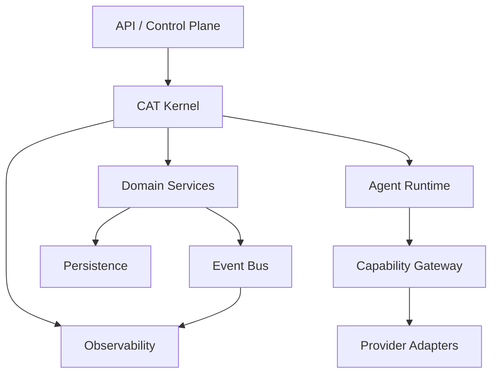

# CAT Technical Architecture Pack

**Status:** Architecture baseline / target specification
**Parent:** `docs/architecture/`

This pack translates CAT's system architecture into implementation-oriented technical boundaries. It is deliberately explicit about the difference between **implemented**, **contracted**, and **target** capabilities.

## Documents

| ID | Document | Scope |
|---|---|---|
| T01 | Runtime Architecture | processes, runtimes, execution boundaries |
| T02 | Rust Workspace Architecture | crates, dependency direction, module ownership |
| T03 | Kernel Architecture | CAT core orchestration and invariants |
| T04 | Event Bus Architecture | commands, events, delivery, durability |
| T05 | Database Architecture | PostgreSQL, projections, facts, indexes |
| T06 | API Architecture | external/internal API boundaries |
| T07 | Agent Runtime Internals | agent lifecycle, context, capabilities |
| T08 | Memory and Knowledge Architecture | memory, retrieval, provenance, evaluation |
| T09 | Provider Adapter Architecture | models, affiliate providers, external services |
| T10 | Observability Architecture | logs, metrics, traces, audit |
| T11 | Dependency Map | architectural dependency graph |
| T12 | Reliability and Recovery | retries, idempotency, reconciliation |

## Global rules

1. Domain contracts do not depend on provider SDKs.
2. Side effects cross explicit ports/adapters.
3. Facts are persisted; derived state is recomputed when practical.
4. Durable work has an execution identity and idempotency strategy.
5. Agents propose; capabilities authorize and execute.
6. Secrets remain outside model-visible state unless explicitly required by a narrowly scoped capability.
7. Observability must not become a hidden business dependency.
8. Every target component requires a later implementation-status update before being described as production-ready.

## Architectural notation

