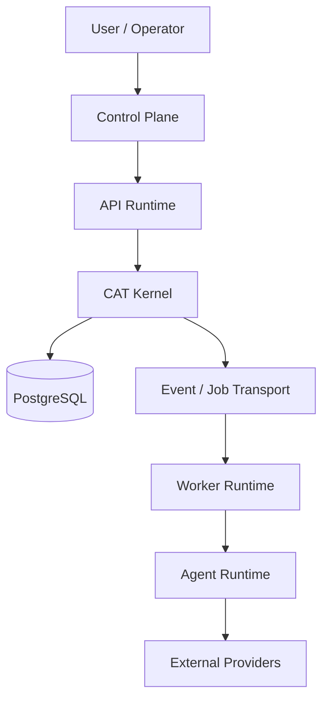

# T01 — Runtime Architecture

## Purpose

CAT is designed as a modular system that can begin on a single server and evolve toward multiple independently scalable workers without changing domain contracts.



## Runtime classes

| Runtime | Responsibility | Scaling unit |
|---|---|---|
| Control/API | authentication, commands, read APIs | replica |
| Kernel | deterministic domain coordination | process / worker |
| Worker | asynchronous durable work | worker |
| Agent runtime | bounded reasoning/execution | agent task |
| Scheduler | time-based dispatch | scheduler replica with lease |
| Projection worker | read-model construction | consumer group |

## Execution model

Synchronous requests should remain short. Work that can exceed request lifetime, call external systems, or require retry/reconciliation becomes durable work.

```text
Request → Validate → Authorize → Command → Persist intent → Enqueue
                                              ↓
                                         Worker claims
                                              ↓
                                      Execute capability
                                              ↓
                                      Persist outcome
                                              ↓
                                      Emit domain event
```

## Scaling invariants

- No in-memory singleton may be the source of truth for durable state.
- Workers must tolerate duplicate delivery.
- Leadership is leased, not assumed from process identity.
- External calls require timeouts and reconciliation paths.
- Horizontal scaling must not alter domain semantics.
