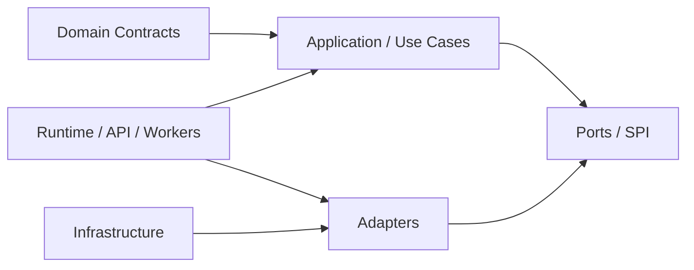

# T02 — Rust Workspace Architecture

## Dependency direction



## Rules

1. Domain crates must not import provider SDKs.
2. Persistence implementations depend on domain ports, never the reverse.
3. API handlers translate transport DTOs into application commands.
4. Provider-specific types stop at adapter boundaries.
5. Shared utility crates must remain dependency-light; they must not become a dumping ground.

## Package ownership model

| Layer | Owns |
|---|---|
| Domain | entities, value objects, invariants, domain events |
| Application | orchestration, commands, queries, policies |
| Ports | interfaces required by application/domain |
| Adapters | PostgreSQL, HTTP, provider SDK translation |
| Runtime | process startup, dependency wiring, graceful shutdown |
| Tests | contract, integration and end-to-end verification |

## Forbidden dependency patterns

```text
Domain → PostgreSQL SDK             FORBIDDEN
Domain → OpenAI/Anthropic SDK       FORBIDDEN
Domain → HTTP framework             FORBIDDEN
Agent → raw database connection     FORBIDDEN
Provider SDK → domain model leakage  FORBIDDEN
```

The workspace may evolve into multiple crates, but the architectural rule is more important than a particular crate count.
