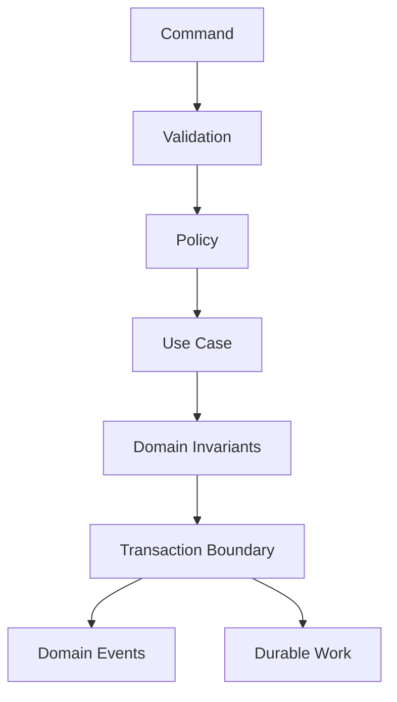

# T03 — CAT Kernel Architecture

The Kernel is the deterministic coordination core. It owns neither provider credentials nor model-specific reasoning.

## Kernel responsibilities

- command validation and normalization
- authorization context propagation
- deterministic domain orchestration
- transaction coordination
- durable work creation
- event publication at real domain boundaries
- correlation and causation propagation
- invariant enforcement

## Kernel non-responsibilities

- choosing an LLM because it is fashionable
- constructing provider-specific requests
- embedding secrets into prompts
- directly rendering UI
- silently mutating data outside domain APIs

## Failure semantics

A kernel operation should produce one of three explicit outcomes:

| Outcome | Meaning |
|---|---|
| Accepted | durable intent exists |
| Rejected | policy/invariant prevented execution |
| Failed | execution could not complete and requires retry/reconciliation |

The kernel must never represent an unknown external side effect as successful merely because an HTTP request returned without an exception.
