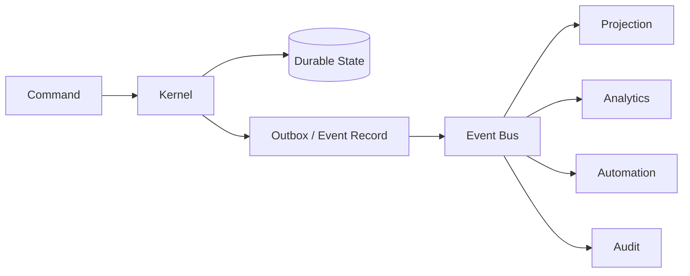

# T04 — Event Bus Architecture

## Model

CAT distinguishes commands, domain events and integration messages.

## Message rules

| Type | Direction | Durable | Purpose |
|---|---|---:|---|
| Command | caller → CAT | when async | request an action |
| Domain event | CAT → subscribers | yes | announce a fact |
| Integration message | CAT ↔ external system | yes when side-effecting | interoperability |

## Required metadata

Every durable message should support: `message_id`, `event_type`, `schema_version`, `occurred_at`, `correlation_id`, `causation_id`, `producer`, and payload.

## Delivery semantics

The baseline is **at-least-once delivery**. Consumers must be idempotent. Exactly-once business effects are achieved through transactional state transitions and idempotency keys, not by assuming exactly-once transport.

## Ordering

Ordering is guaranteed only where the domain explicitly defines an ordering key. Global ordering is not an architectural requirement.

## Evolution

Schemas are versioned. Consumers should tolerate additive fields and explicitly handle unknown event types. Breaking changes require a new version and migration plan.
