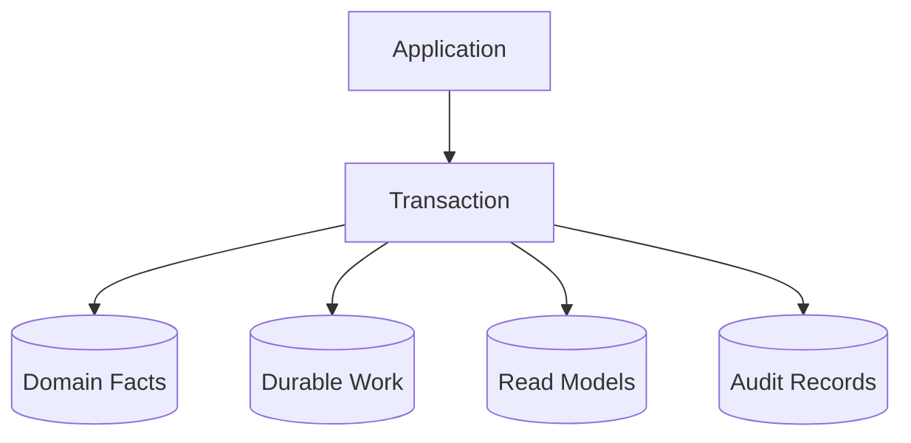

# T05 — Database Architecture

## Principle

PostgreSQL is the durable source of truth for transactional CAT state. Derived read models may be rebuilt.



## Data categories

| Category | Characteristics |
|---|---|
| Domain facts | authoritative business state |
| Work records | durable commands/attempts/claims |
| Projections | derived and rebuildable |
| Audit | immutable evidence of sensitive actions |
| Operational metadata | leases, retries, health and execution bookkeeping |

## Persistence rules

- parameterized SQL only
- explicit transaction boundaries for multi-row invariants
- optimistic revision checks where concurrent writers are possible
- row locking only for a clearly defined critical section
- additive migrations by default
- indexes justified by access patterns
- no lifecycle state persisted when it can safely be derived from facts

## Concurrency

```text
read revision
     ↓
validate expected revision
     ↓
UPDATE ... WHERE id = ? AND revision = ?
     ↓
if affected_rows = 0 → stale writer
else → revision + 1
```

## Backup and recovery target

Production deployment must define RPO/RTO, backup encryption, restore drills, migration rollback strategy, retention and deletion requirements before being considered operationally complete.
