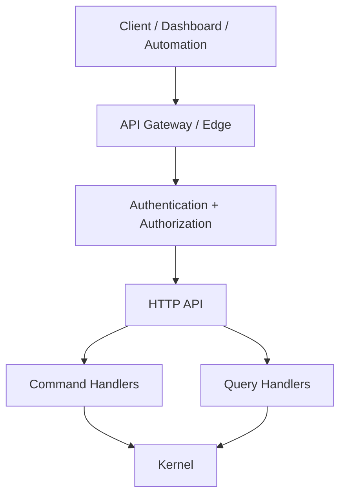

# T06 — API Architecture

## API layers

## Endpoint classes

| Class | Characteristics |
|---|---|
| Command | changes state; idempotency required for retryable operations |
| Query | read-only; pagination and filtering explicit |
| Streaming | event/status updates; reconnect-safe |
| Internal | service-to-service; stronger trust assumptions but still authenticated |
| Webhook | externally initiated event; signature verification and replay protection |

## Contract rules

1. Transport DTOs are not domain entities.
2. API versions are explicit for externally consumed breaking contracts.
3. Errors use stable machine-readable codes plus safe human-readable messages.
4. Sensitive fields are excluded by construction from logs and error responses.
5. Pagination contracts define maximum page size.
6. Mutating endpoints accept idempotency keys where duplicate execution could create economic or external side effects.

## API security

Authentication, authorization, rate limiting, schema validation, request-size limits, origin/session controls and audit logging are separate concerns and must not be hidden inside individual handlers.
