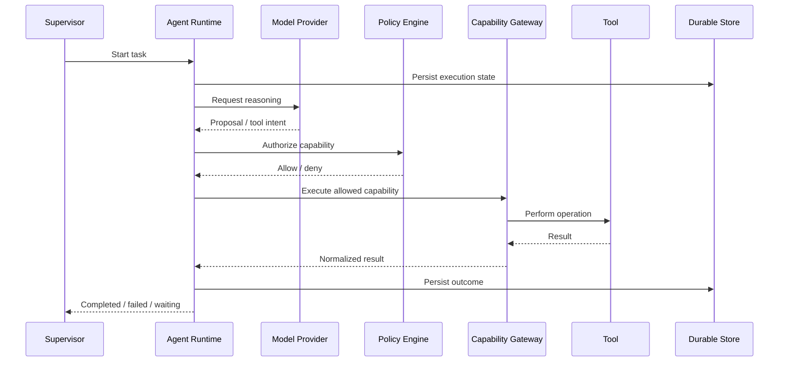

# T07 — Agent Runtime Internals

## Agent execution pipeline



## Agent state machine

```text
CREATED → RUNNING → WAITING_FOR_TOOL → RUNNING → SUCCEEDED
                         │
                         ├────────────→ FAILED
                         └────────────→ CANCELLED
```

## Context layers

1. System policy context
2. Task context
3. Retrieved knowledge
4. Tool results
5. Short-lived reasoning state
6. Durable execution metadata

Secrets, unrestricted credentials and unrelated tenant data do not belong in the default model context.

## Resource controls

Each execution should have explicit limits for wall-clock time, tool calls, tokens/cost, concurrency, retry count and memory/context size. Limits are enforced outside model reasoning.

## Human approval

When policy requires approval, the agent enters a durable waiting state. Re-running the model is not a substitute for approval.
