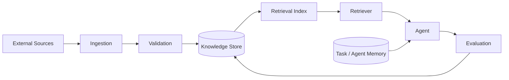

# T08 — Memory and Knowledge Architecture

CAT separates memory from knowledge. Memory describes execution/user/task context; knowledge describes reusable evidence and information with provenance.

## Knowledge object requirements

A durable knowledge item should carry identity, source/provenance, observed time, ingestion time, confidence/evidence metadata, content hash where applicable, lifecycle status and access scope.

## Retrieval rules

- retrieval is evidence acquisition, not authorization
- untrusted source text remains untrusted after retrieval
- ranking must be explainable enough for debugging
- stale knowledge can be revalidated rather than silently treated as current
- tenant/user scope is enforced before content reaches model context

## Memory classes

| Class | Lifetime | Example |
|---|---|---|
| Request | request | current API intent |
| Task | execution | plan, intermediate results |
| Agent | bounded session | working state |
| User | durable | preferences, approved settings |
| System | durable | policies, architecture, configuration |

Deletion, retention and export requirements must be defined before user memory is considered production-complete.
