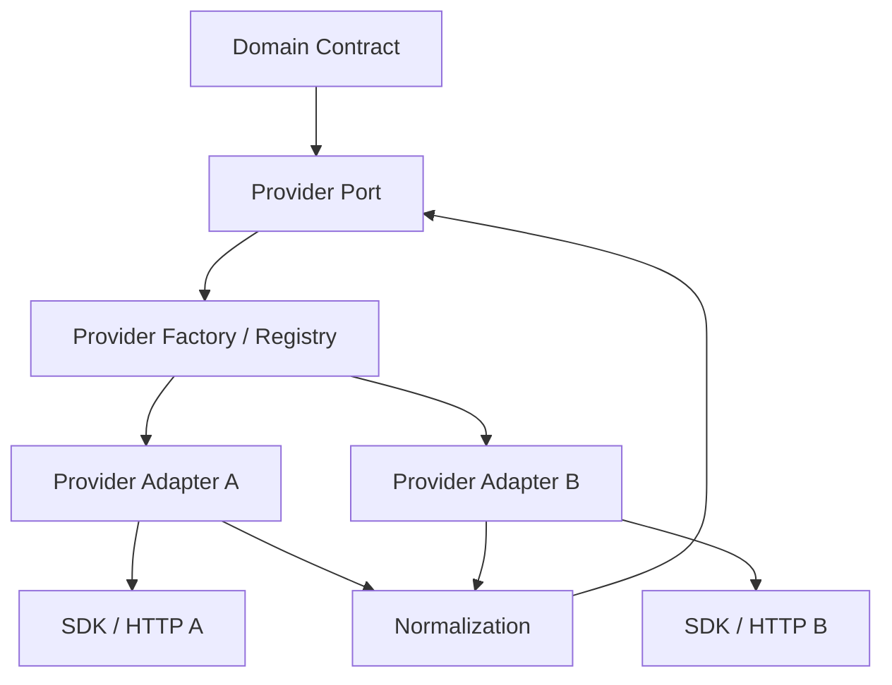

# T09 — Provider Adapter Architecture

CAT must be able to replace an AI model, affiliate network, search provider, analytics provider or communication provider without rewriting domain logic.



## Adapter responsibilities

- authentication through secret references
- request translation
- timeout and retry policy integration
- provider error classification
- response normalization
- rate-limit interpretation
- idempotency/reconciliation support
- provider-specific observability

## Adapter non-responsibilities

- domain policy decisions
- business scoring hidden inside SDK wrappers
- persistence of arbitrary provider objects as authoritative domain state
- exposing raw provider credentials to agents/models

## Provider registry

Provider selection should be configuration-driven but policy constrained. A model cannot select an arbitrary provider merely by emitting a provider name.

## Failure taxonomy

```text
TRANSIENT → retry / backoff
RATE_LIMITED → schedule later
AUTH_FAILURE → quarantine / operator action
INVALID_REQUEST → deterministic failure
PROVIDER_UNAVAILABLE → revalidation / fallback policy
UNKNOWN → preserve evidence + safe failure
```
