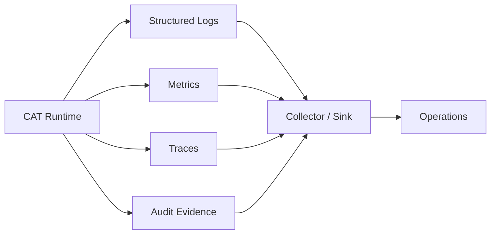

# T10 — Observability Architecture

## Three signals + audit

## Correlation

A durable execution should propagate at least:

`request_id → correlation_id → causation_id → execution_id → attempt_id`

This permits a single affiliate opportunity, agent task or external call to be reconstructed across asynchronous boundaries.

## Metrics categories

| Category | Examples |
|---|---|
| Availability | success/failure, provider availability |
| Latency | API, queue, tool, provider |
| Throughput | commands, events, executions |
| Economics | cost, revenue, conversion, margin |
| Reliability | retries, stale work, reconciliation |
| Security | denials, suspicious tool calls, auth failures |

## Logging rules

Structured logs only. Secrets, tokens, raw credentials, authentication headers and unnecessary personal data are never logged. Payload logging is allow-listed rather than deny-listed.

Observability failures should degrade telemetry, not silently change business semantics.
