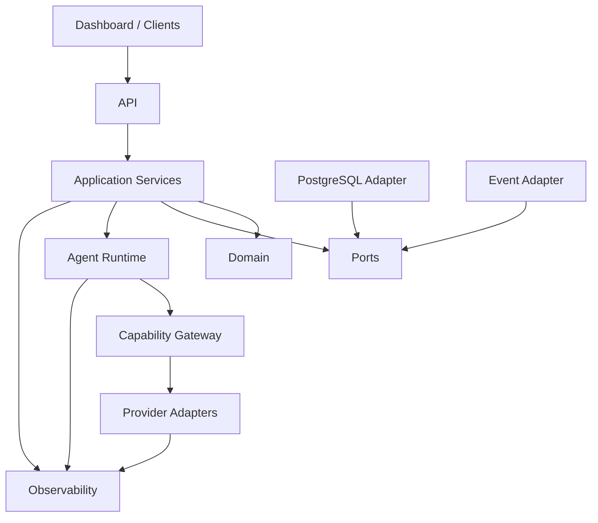

# T11 — Dependency Map

## High-level graph



## Allowed dependency direction

```text
Presentation
    ↓
Application
    ↓
Domain ← Ports
    ↑       ↑
Adapters ──┘
```

Infrastructure may depend inward. Core domain code must not depend outward on infrastructure.

## Cycle policy

A dependency cycle between packages is a design defect unless it is eliminated by an explicit port/interface boundary. Cycles must never be solved by moving shared mutable state into a generic global utility crate.

## Change impact heuristic

| Change | Expected blast radius |
|---|---|
| Provider SDK replacement | adapter only |
| Database driver replacement | persistence adapter |
| API transport replacement | presentation adapter |
| Model replacement | provider adapter/config |
| Domain invariant change | domain + affected use cases/tests |
| Event schema breaking change | producer + all consumers |

This map is a target governance artifact and must be updated whenever package boundaries materially change.
