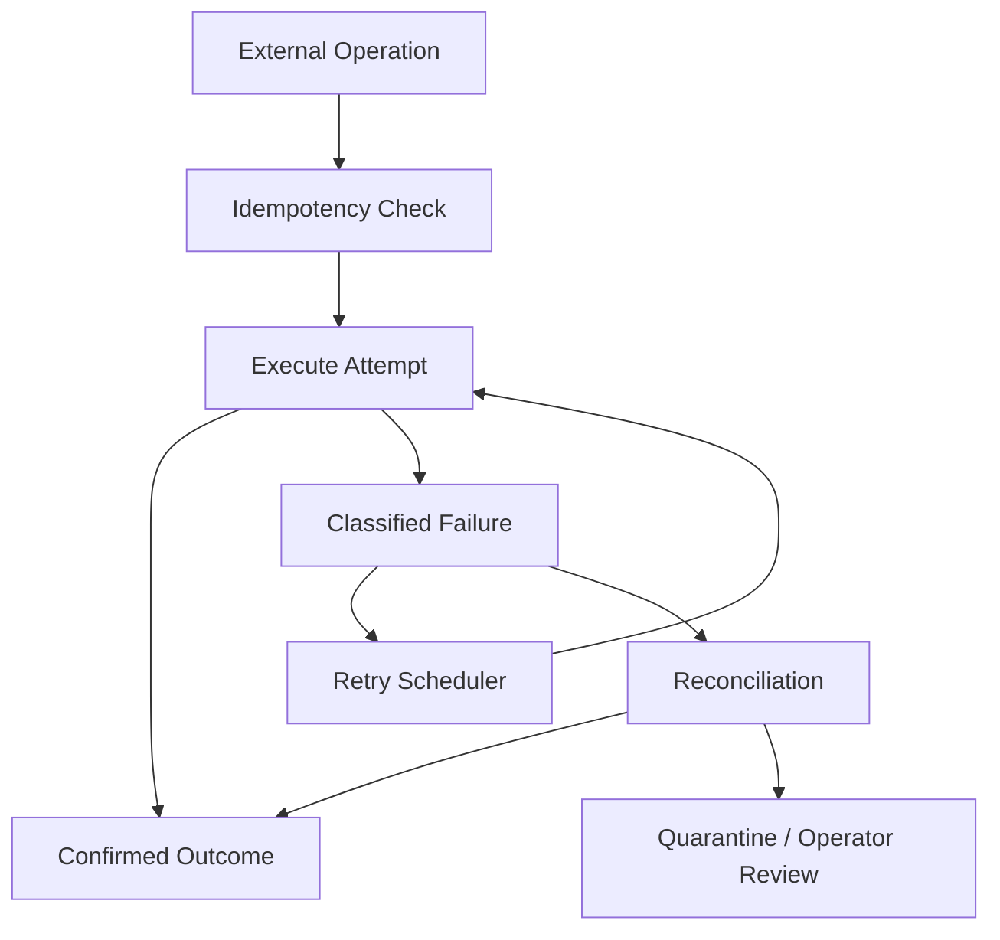

# T12 — Reliability and Recovery Architecture

## Failure-oriented design

## Reliability mechanisms

| Mechanism | Purpose |
|---|---|
| Idempotency key | prevent duplicate business effect |
| Revision/CAS | protect concurrent writers |
| Lease | prevent multiple active claimants |
| Retry budget | prevent infinite amplification |
| Backoff | reduce provider/system pressure |
| Reconciliation | resolve ambiguous external outcomes |
| Dead-letter/quarantine | isolate permanently problematic work |
| Audit trail | reconstruct what happened |

## Ambiguous outcomes

The hardest class is `UNKNOWN`: the external system may have accepted a request while CAT lost the response. The system must not blindly repeat a non-idempotent operation. Instead it should reconcile using provider identifiers, idempotency keys or a provider-specific query.

## Recovery invariant

A process crash must lose at most ephemeral computation. Durable intent, ownership, attempt identity and evidence required for recovery must already be persisted.

## Retry policy

Retries are policy-controlled. Authentication failures, invalid requests and authorization denials should not be treated as ordinary transient errors.
