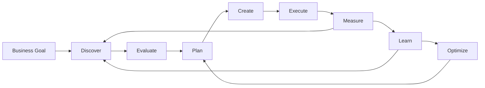

# 00 — CAT Vision & Identity

> The north star of CAT OMNISYSTEM.

## 1. What CAT is

**CAT — Commerce AI Trinity** is an AI-native **commerce and affiliate operating system** designed to automate and continuously improve the complete economic lifecycle around affiliate commerce.

CAT is not intended to be a single scraper, content generator, affiliate-link rotator, or chatbot. It is a coordinated software organism whose capabilities span:

- market and product discovery;
- opportunity evaluation;
- affiliate-network and merchant integration;
- strategic planning;
- agent orchestration;
- content generation and transformation;
- distribution;
- advertising operations;
- tracking and attribution;
- revenue and commission intelligence;
- experimentation;
- learning from measured outcomes;
- operational governance and human approval;
- continuous system improvement.

The original research describes the desired product as an **Affiliate Business OS**, with a long-term objective of moving from discovery and content creation through distribution, advertising, analytics and revenue optimization rather than behaving like a simple affiliate bot. fileciteturn1047file0L1-L1

---

## 2. Why CAT exists

The central problem is not lack of affiliate APIs or lack of AI text generation. The problem is that profitable commerce requires many connected decisions over time.

A useful system must repeatedly answer:

> **What should CAT do next, why should it do it, how should it do it safely, and what evidence proves that the decision was good?**

CAT therefore treats every meaningful business action as part of a measurable closed loop.



The loop is deliberately closed: outcomes become evidence for future decisions instead of disappearing into logs.

---

## 3. Long-range vision

The ten-year direction is a highly autonomous commerce intelligence platform that can operate a portfolio of affiliate businesses and, if eventually desired, provide the same operating capabilities as a SaaS platform for other users.

The research package describes the initial economic principle as **self-funding growth**: early CAT revenue should cover development and operating costs before the system is optimized for larger profit. Exact revenue targets remain intentionally unspecified until market evidence justifies them. fileciteturn1047file0L1-L1

### Strategic evolution

| Horizon | CAT role | Primary emphasis |
|---|---|---|
| Foundation | Trustworthy automation kernel | contracts, durability, security, observability |
| Early operation | Affiliate intelligence operator | discovery, evaluation, content, tracking |
| Growth | Autonomous commerce organization | closed-loop optimization and portfolio management |
| Scale | Multi-agent commerce platform | parallel agents, provider independence, distributed execution |
| Long term | Commerce AI operating system | reusable capabilities, multi-tenant/SaaS potential, continuous evolution |

These are **directional stages**, not promises of delivery dates.

---

## 4. Core principles

### 4.1 AI-first, not AI-only

AI should own tasks where reasoning, synthesis, classification, prediction, planning or adaptation provides value. Deterministic software must own correctness-critical behavior such as identity, persistence, authorization, accounting invariants, idempotency, state transitions and protocol validation.

### 4.2 Human authority at critical boundaries

CAT may automate aggressively, but irreversible, financially material, legally sensitive, or reputation-sensitive operations should support explicit human approval gates.

The research foundation explicitly identifies human-in-the-loop control as part of CAT's knowledge-update and technology-adoption strategy. fileciteturn1047file4L1-L1

### 4.3 Evidence over intuition

Agents may propose hypotheses. Production decisions should be traceable to data, policies, historical outcomes, experiments, or explicit human instructions.

### 4.4 Provider independence

No business-critical capability should be architecturally trapped inside one LLM, image model, affiliate network, advertising platform, cloud provider, vector database, or messaging system.

The research explicitly calls for platform independence so CAT can adapt when APIs and platforms change. fileciteturn1047file10L1-L1

### 4.5 Durable by default

If CAT starts an important operation, the system must be able to answer after a crash:

- what was requested;
- what attempt was made;
- whether an external provider accepted it;
- what state CAT believed existed;
- what evidence supports that belief;
- what must happen next.

### 4.6 Learn without corrupting history

Learning systems may update strategies and models, but historical observations and financial facts must remain auditable. New knowledge is additive; historical truth is not rewritten to make a model look better.

### 4.7 Modular growth

CAT must be able to evolve from one VPS to a distributed fleet of workers without replacing the conceptual kernel. Modules should be independently replaceable where scale or specialization requires it.

---

## 5. The CAT mental model

Think of CAT as five cooperating layers:

```text
┌──────────────────────────────────────────────────────────────┐
│                    BUSINESS PURPOSE                          │
│ Goals • Constraints • Policies • Risk • Human Authority     │
├──────────────────────────────────────────────────────────────┤
│                    INTELLIGENCE                              │
│ Knowledge • Memory • LLMs • Reasoning • Evaluation           │
├──────────────────────────────────────────────────────────────┤
│                    DECISION & EXECUTION                      │
│ Decision • Planning • Orchestration • Durable Workflows      │
├──────────────────────────────────────────────────────────────┤
│                    COMMERCE CAPABILITIES                     │
│ Affiliate • Content • Ads • Distribution • Tracking          │
├──────────────────────────────────────────────────────────────┤
│                    PLATFORM FOUNDATION                       │
│ Events • Persistence • Security • Observability • Runtime    │
└──────────────────────────────────────────────────────────────┘
```

The current repository already provides the Rust workspace substrate for kernel, event bus, event storage, runtime, knowledge, memory, LLM, reasoning, decision, planning, orchestration, platform, RAG, affiliate and content domains. fileciteturn1045file0L2-L2

---

## 6. What CAT should optimize

CAT should not optimize a single metric such as clicks. It should optimize a constrained economic objective.

Conceptually:

```text
Value = Revenue
        - Advertising Cost
        - Content/Infrastructure Cost
        - Provider Cost
        - Operational Risk Cost
        - Compliance / Reputation Risk
```

The exact objective function will evolve as real data becomes available. The Bible intentionally defines the **decision philosophy**, not a fictional fixed formula.

### Multi-objective optimization dimensions

| Dimension | Example question |
|---|---|
| Revenue | Which opportunity can produce sustainable commission? |
| Conversion | Which audience/channel/content combination converts? |
| Margin | Does additional revenue justify its acquisition cost? |
| Reliability | Can the provider or integration be trusted? |
| Compliance | Is the action permitted under network/platform rules? |
| Latency | Is the information still useful when the decision executes? |
| Learning value | Will this experiment produce valuable evidence? |
| Risk | What is the worst credible failure and can it be contained? |

---

## 7. Autonomy model

CAT autonomy is graduated rather than binary.

| Level | Behavior |
|---|---|
| A0 — Observe | Collect and report; no action |
| A1 — Recommend | Produce proposals for human approval |
| A2 — Execute bounded | Execute predefined low-risk actions |
| A3 — Optimize | Adjust parameters within explicit policy bounds |
| A4 — Coordinate | Decompose goals and coordinate multiple agents |
| A5 — Governed autonomy | Operate continuously within policies, budgets and approval boundaries |

A higher autonomy level never overrides security, policy, authorization, financial controls or human-defined hard limits.

---

## 8. Continuous evolution

CAT should be capable of learning about new technologies, providers and methods. The research foundation proposes monitoring open-source projects, research feeds, Reddit/Product Hunt and academic sources, followed by human review before adopting important new technology. fileciteturn1047file4L1-L1

The architectural rule is therefore:

> **CAT may discover and recommend its own improvements; CAT must not silently redefine its own trust boundaries.**

Technology evolution should pass through evidence, compatibility analysis, security review and an explicit decision record.

---

## 9. Identity statement for AI agents

Every AI agent working on CAT should internalize the following:

> CAT is a durable, evidence-driven, security-conscious commerce operating system. Your task is not merely to produce an answer. Your task is to produce a correct, traceable, policy-compliant contribution that fits the architecture, preserves contracts, and improves the system's measurable ability to achieve its goals.

This statement is a behavioral principle, not a prompt injection mechanism or a substitute for executable authorization.
