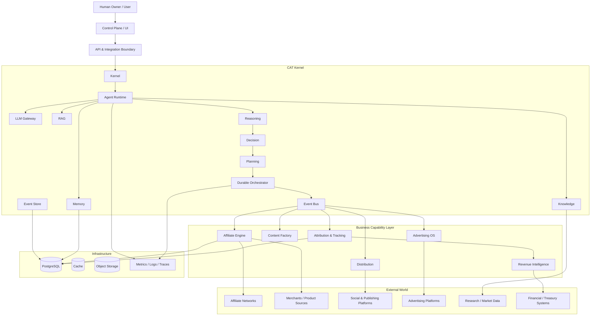
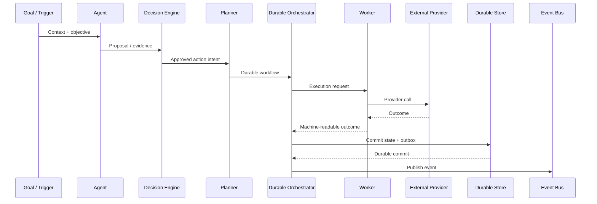
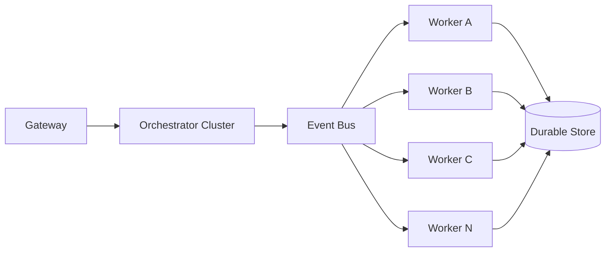
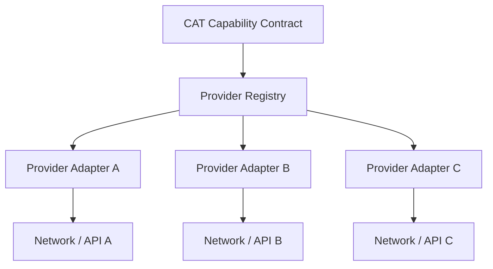

# 01 — CAT System Architecture

> Architectural map of the CAT organism, from user intent to durable execution and measurable commerce outcomes.

## 1. Architectural thesis

CAT is designed as a **modular, event-driven, contract-driven and provider-independent AI operating system**.

The key architectural distinction is between:

- **intelligence** — models, reasoning, knowledge and agents;
- **control** — decisions, policies, planning and orchestration;
- **execution** — workers and external providers;
- **truth** — durable state, event history and financial records;
- **capabilities** — affiliate, content, advertising and distribution domains;
- **operations** — security, observability and infrastructure.

The current implementation substrate is a Rust workspace with fifteen core packages covering kernel, event bus, PostgreSQL event storage, runtime, knowledge, memory, LLM, reasoning, decision, planning, orchestrator, platform, RAG, affiliate and content. fileciteturn1045file0L2-L2

The earlier research proposed a similar central kernel surrounded by agent runtime, memory/knowledge, tools/connectors, workflow, evaluation and observability. fileciteturn1047file11L1-L1

---

## 2. High-level architecture



This diagram is a **target system view**. A box is not evidence that the corresponding production capability is already implemented.

---

## 3. Layer model

| Layer | Responsibility | Must not own |
|---|---|---|
| Interface / Control Plane | User interaction, configuration, approval | Core business truth |
| API Boundary | Authentication, request validation, transport contracts | Long-running orchestration state |
| Kernel | System primitives and stable boundaries | Domain-specific UI concerns |
| Intelligence | Knowledge, memory, models, reasoning | Unauthorized external side effects |
| Decision | Policy-aware selection and action decisions | Raw provider transport |
| Planning | Goal decomposition and scheduling | Provider-specific business logic |
| Orchestration | Durable workflow execution and recovery | Agent persona logic |
| Eventing | Decoupled communication and integration | Hidden mutable business state |
| Business capabilities | Affiliate/content/ads/distribution/tracking | Kernel internals |
| Persistence | Durable truth and audit history | Ephemeral UI state |
| Infrastructure | Runtime, deployment, monitoring | Business decisions |

---

## 4. Kernel boundary

The kernel is the protected center of CAT. It should remain relatively small, stable and deterministic.

### Kernel responsibilities

- lifecycle primitives;
- identifiers and contracts;
- event envelopes and event transport boundaries;
- durable workflow execution;
- retries and recovery;
- state transition validation;
- persistence boundaries;
- authorization primitives;
- observability hooks;
- provider-independent execution interfaces.

### Kernel non-responsibilities

The kernel should not become a dumping ground for:

- merchant-specific rules;
- social-media-specific formatting;
- LLM prompt templates;
- UI presentation logic;
- affiliate-network credentials;
- ad campaign creative;
- one provider's proprietary response format.

Those concerns belong behind stable capability boundaries.

---

## 5. Intelligence plane

The research foundation describes CAT's intelligence as a combination of multi-layer memory, knowledge graph, tools, workflow, evaluation and observability. fileciteturn1047file11L1-L1

CAT's intelligence plane is therefore conceptualized as:

```text
                 ┌──────────────────────┐
                 │      Goal / Context  │
                 └──────────┬───────────┘
                            │
                ┌───────────▼───────────┐
                │       Knowledge       │
                └───────────┬───────────┘
                            │
                ┌───────────▼───────────┐
                │        Memory         │
                └───────────┬───────────┘
                            │
                ┌───────────▼───────────┐
                │      Retrieval/RAG    │
                └───────────┬───────────┘
                            │
                ┌───────────▼───────────┐
                │       LLM Layer       │
                └───────────┬───────────┘
                            │
                ┌───────────▼───────────┐
                │       Reasoning       │
                └───────────┬───────────┘
                            │
                ┌───────────▼───────────┐
                │       Decision        │
                └───────────────────────┘
```

No single model is the CAT brain. Models are replaceable reasoning components.

---

## 6. Decision and execution separation

A critical invariant is that **deciding to perform an action is different from performing the action**.



This separation prevents an LLM from becoming an implicit transaction manager.

---

## 7. Event-driven architecture

Events provide loose coupling and an audit-friendly record of meaningful state changes.

The event layer should support:

- stable event type names;
- explicit event versions;
- event IDs;
- correlation and causation identifiers;
- producer identity;
- subject identity;
- durable publication;
- idempotent consumers;
- retry and dead-letter handling;
- observability.

The earlier CAT implementation already established an event envelope and durable outbox/inbox concepts in the event bus and orchestration work. Those implementation contracts remain authoritative for actual behavior.

### Event philosophy

```text
Command → State Change → Event → Consumers → New Work
```

not:

```text
Random Agent → direct database mutation → hidden side effect
```

---

## 8. Persistence philosophy

CAT separates different classes of truth:

| Data class | Examples | Durability requirement |
|---|---|---|
| Business facts | commission, transaction, opportunity | Very high |
| Execution facts | attempt, provider execution ID, outcome | Very high |
| Workflow state | state, revision, lease/fencing | Very high |
| Knowledge | documents, relationships, embeddings | High |
| Memory | experiences, summaries, context | High; tier-dependent |
| Cache | derived lookup | Disposable |
| Telemetry | metrics, traces, logs | Retention-policy dependent |

Business and execution facts must never depend on an ephemeral cache for correctness.

---

## 9. Scaling model

CAT should scale by adding workers and capability instances rather than rewriting the conceptual core.



At small scale this can be a small number of processes on one machine. At larger scale the same contracts can be distributed across nodes.

---

## 10. Failure philosophy

Failures are expected architectural events, not exceptional surprises.

CAT should distinguish at least:

1. transient local failure;
2. provider unavailable;
3. provider accepted request but response was lost;
4. timeout with unknown remote state;
5. stale workflow state;
6. duplicate delivery;
7. policy rejection;
8. authorization failure;
9. permanent validation failure;
10. human approval pending.

The most dangerous case is **unknown remote state**. CAT must reconcile before blindly replaying a potentially side-effecting operation.

---

## 11. Provider independence

External providers are adapters, not architectural authorities.



A provider adapter must expose the minimum capability CAT requires and preserve idempotency, reconciliation and error semantics at the boundary.

---

## 12. Current versus target architecture

### Current implementation substrate

- Rust 2024 workspace;
- fifteen declared core packages;
- event bus and event-store foundations;
- runtime, knowledge, memory and LLM domains;
- reasoning, decision, planning and orchestration domains;
- platform, RAG, affiliate and content domains. fileciteturn1045file0L2-L2

### Target expansion

- complete autonomous agent platform;
- production-grade affiliate intelligence;
- content production and distribution factory;
- advertising operating system;
- attribution and revenue intelligence;
- unified control plane;
- mature knowledge graph and memory;
- continuous evaluation and optimization;
- self-improvement governance;
- horizontally scalable infrastructure.

The target list is intentionally marked as future scope unless supported by implementation evidence.

---

## 13. Architectural invariants

1. **No LLM directly owns durable business truth.**
2. **No side-effecting action without an explicit execution boundary.**
3. **Every important external operation must be idempotent or reconciliable.**
4. **Events are versioned contracts.**
5. **Historical facts are not rewritten for convenience.**
6. **Providers remain replaceable.**
7. **Security boundaries are explicit.**
8. **Critical state transitions are deterministic.**
9. **Observability is part of the architecture, not an afterthought.**
10. **Scale is achieved by composition and replication, not by coupling everything together.**

---

## 14. Architecture review checklist

Before adding a major subsystem, an architect should answer:

- What invariant does this subsystem protect?
- What is its durable state?
- What is its event contract?
- What is its failure model?
- Can it be replayed safely?
- Can it be replaced?
- What does it expose to agents?
- What can agents *not* do through it?
- What data does it own?
- What data does it merely read?
- How is it observed?
- How is it tested?
- What is the migration path if the technology is replaced?
