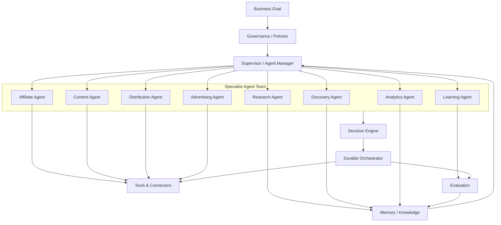
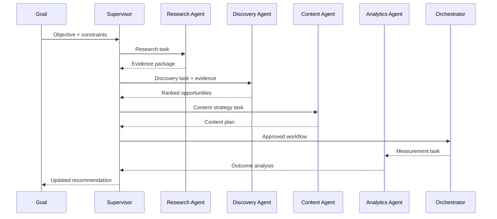
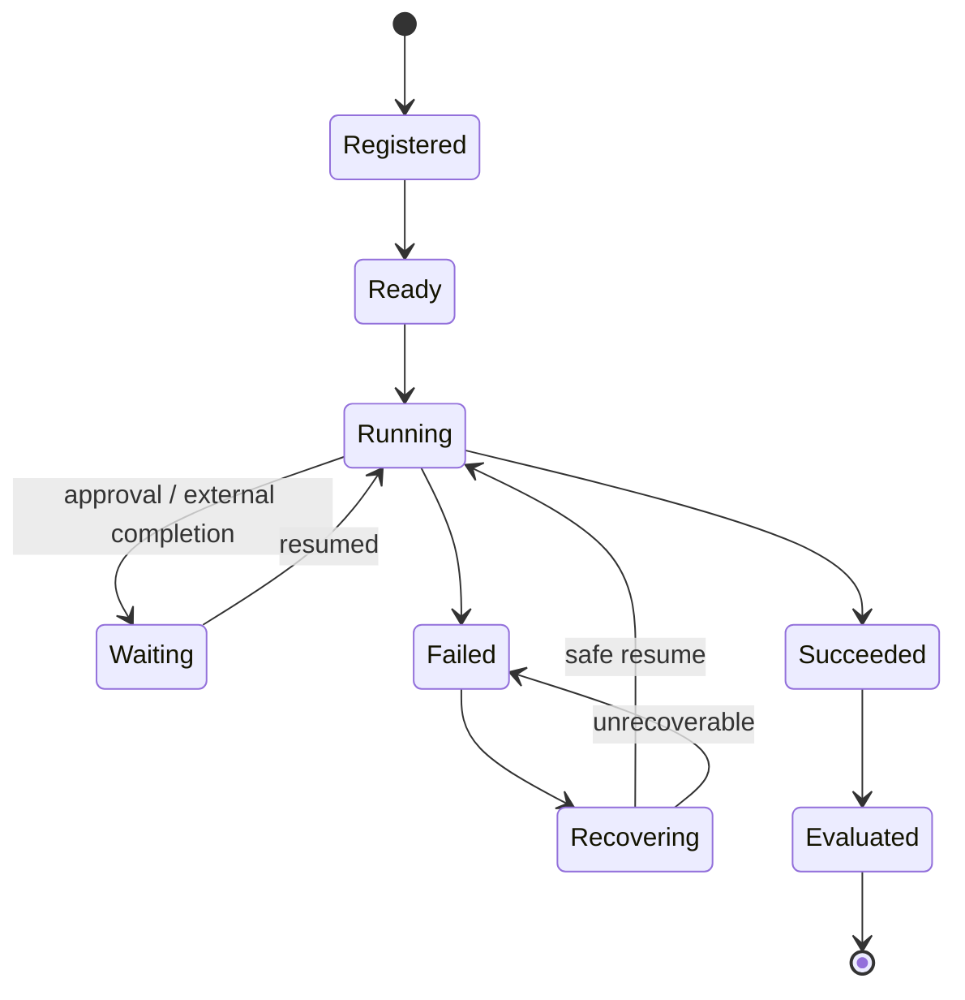

# 02 — CAT Agent Operating System

> The conceptual operating model for autonomous and semi-autonomous AI agents inside CAT.

## 1. Agent is a first-class system actor

An agent in CAT is not simply a prompt wrapped around an LLM. An agent is a governed computational actor with:

- a role;
- a mission or task;
- explicit capabilities;
- authorized tools;
- bounded memory access;
- model/provider configuration;
- policies and constraints;
- input and output contracts;
- execution identity;
- observability;
- evaluation criteria;
- failure and recovery behavior.

The research foundation proposes a hierarchical model in which an Agent Manager supervises specialist agents, while agents cooperate through orchestration and shared knowledge. fileciteturn1047file10L1-L1

CAT adopts the idea while keeping **authorization and durable control outside the LLM itself**.

---

## 2. Agent operating model



This is the **target agent ecosystem**, not a claim that every named specialist already exists in production.

---

## 3. Agent taxonomy

### 3.1 Governance agents

These agents reason about priorities, policies and coordination.

| Agent class | Primary responsibility |
|---|---|
| Executive / Strategy Agent | Translate business goals into strategic objectives |
| Agent Manager / Supervisor | Coordinate specialist agents |
| Policy Analyst | Interpret operational policies and constraints |
| Risk Agent | Assess financial, compliance and operational risk |
| Approval Coordinator | Prepare human approval packages |

### 3.2 Intelligence agents

| Agent class | Primary responsibility |
|---|---|
| Research Agent | Research markets, products, technologies and audiences |
| Trend Agent | Detect emerging demand and behavioral trends |
| Competitor Intelligence Agent | Analyze competitive positioning |
| Knowledge Curator | Ingest, classify and maintain trusted knowledge |
| Forecasting Agent | Produce bounded predictions and scenarios |

### 3.3 Affiliate agents

| Agent class | Primary responsibility |
|---|---|
| Discovery Agent | Find candidate products/programs/opportunities |
| Opportunity Analyst | Score economic attractiveness |
| Network Agent | Manage affiliate-network interactions |
| Merchant Intelligence Agent | Analyze merchant/product quality |
| Commission Agent | Monitor commission structures |
| Link / Offer Agent | Manage affiliate offer representations |

### 3.4 Content agents

| Agent class | Primary responsibility |
|---|---|
| Content Strategist | Decide what content should exist |
| Research Writer | Produce evidence-backed source material |
| Long-form Writer | Produce articles/guides |
| Short-form Writer | Produce social and short-form content |
| Creative Agent | Develop visual/creative concepts |
| SEO Agent | Optimize discoverability without violating platform rules |
| Editor / Fact Checker | Validate quality and claims |

### 3.5 Distribution and advertising agents

| Agent class | Primary responsibility |
|---|---|
| Distribution Planner | Select channels and schedules |
| Publisher Agent | Execute approved publishing actions |
| Ads Strategist | Plan advertising experiments |
| Campaign Operator | Execute bounded ad operations |
| Budget Agent | Monitor spend limits and allocation |
| Attribution Analyst | Connect traffic and conversion outcomes |

### 3.6 Learning agents

| Agent class | Primary responsibility |
|---|---|
| Experiment Designer | Formulate controlled experiments |
| Evaluator | Compare expected versus actual results |
| Optimization Agent | Propose parameter changes |
| Knowledge Update Agent | Incorporate validated new evidence |
| System Improvement Agent | Propose architectural/tooling improvements |

---

## 4. Agent anatomy

Every mature CAT agent should conceptually expose:

```text
Agent
├── Identity
│   ├── agent_id
│   ├── role
│   └── version
├── Mission
│   ├── objective
│   ├── success criteria
│   └── constraints
├── Model Policy
│   ├── preferred model
│   ├── fallback models
│   ├── temperature / reasoning policy
│   └── budget limits
├── Capabilities
│   ├── read capabilities
│   ├── write capabilities
│   ├── external side effects
│   └── prohibited actions
├── Context
│   ├── working memory
│   ├── retrieved knowledge
│   └── task state
├── Execution
│   ├── plan
│   ├── tool calls
│   ├── observations
│   └── result
├── Governance
│   ├── policy checks
│   ├── approval gates
│   └── risk classification
└── Evaluation
    ├── quality
    ├── cost
    ├── latency
    └── outcome
```

---

## 5. Capabilities versus tools

A crucial distinction:

**Capability** = what the agent is authorized and designed to accomplish.

**Tool** = a mechanism through which the agent may perform part of that capability.

Example:

```text
Capability: discover affiliate opportunities
        │
        ├── Tool: network API
        ├── Tool: product search
        ├── Tool: market-data query
        ├── Tool: web retrieval
        └── Tool: internal opportunity store
```

This abstraction allows the underlying tool to change without redefining the agent's mission.

---

## 6. Tool authorization

An agent should never receive an unrestricted tool box.

Authorization should be expressed as a capability policy:

| Permission | Example |
|---|---|
| Read | Read approved opportunity data |
| Search | Query an external catalog |
| Analyze | Run a scoring/evaluation operation |
| Propose | Produce an action plan |
| Write | Update non-critical derived state |
| Execute | Trigger a bounded side effect |
| Approve | **Normally human/governance-only** |
| Admin | System configuration changes |

The existence of a connector does not imply that every agent may use it.

---

## 7. Supervisor model

Supervisors coordinate agents but should not become an unbounded super-agent.



The supervisor coordinates; the durable orchestrator executes; deterministic services enforce state and authorization.

---

## 8. Agent lifecycle



An agent lifecycle must be observable and correlated with its work. A model response alone is not a reliable lifecycle record.

---

## 9. Multi-agent collaboration patterns

CAT should support multiple coordination patterns where justified:

### Sequential

```text
Research → Discovery → Evaluation → Content → Distribution
```

Useful when each stage depends strongly on the previous stage.

### Parallel

```text
             ┌→ Market Research
Goal → Split ├→ Product Discovery
             ├→ Competitor Analysis
             └→ Audience Research
```

Useful when independent evidence can be gathered simultaneously.

### Hierarchical

```text
Executive Agent
      │
 Supervisor
 ┌────┼────┐
Research Content Analytics
```

Useful for complex missions requiring coordination.

### Event-driven

```text
new_opportunity → discovery event → evaluator → planner → workflow
```

Useful for continuous operation.

The research package explicitly identified sequential, concurrent, graph-oriented and group-chat orchestration as patterns worth supporting. fileciteturn1047file11L1-L1

---

## 10. Agent memory

Agents should retrieve only the context required for the current task.

The research foundation proposes short-term session memory, long-term memory and vector-based retrieval, with a structured knowledge graph for relationships. fileciteturn1047file18L1-L1

CAT's target memory model is:

```text
                 ┌─────────────────┐
                 │ Current Task    │
                 └────────┬────────┘
                          │
                ┌─────────▼─────────┐
                │ Working Memory     │
                └─────────┬─────────┘
                          │ retrieval
             ┌────────────┼────────────┐
             ▼            ▼            ▼
        Episodic       Semantic     Procedural
         Memory        Knowledge     Knowledge
             │            │            │
             └────────────┼────────────┘
                          ▼
                    Long-term Store
```

Memory is not an unrestricted transcript archive. It is governed data with retention, provenance, sensitivity and retrieval policies.

---

## 11. Agent output contract

A production agent result should conceptually include:

- task identity;
- agent identity/version;
- model identity/version where relevant;
- inputs or input references;
- evidence references;
- reasoning/result summary appropriate to the logging policy;
- proposed action;
- confidence or uncertainty where meaningful;
- policy checks;
- tool calls;
- execution references;
- cost/latency metrics;
- final disposition.

Sensitive chain-of-thought should not be treated as an application data contract. CAT needs **auditable decisions and evidence**, not unrestricted storage of private model reasoning.

---

## 12. Agent failure policy

When an agent fails:

1. classify the failure;
2. determine whether retry is safe;
3. preserve the failed attempt;
4. avoid duplicating side effects;
5. escalate if policy requires human intervention;
6. resume or compensate through the durable workflow system.

An agent must not decide by itself to bypass a policy because a task is difficult.

---

## 13. Agent economics

Every agent consumes resources. CAT should eventually measure:

```text
Agent ROI = attributable economic value / total agent cost
```

Cost includes:

- model inference;
- external API calls;
- compute;
- storage;
- bandwidth;
- human review;
- opportunity cost.

Agent selection should therefore be dynamic: a cheaper deterministic function may be preferable to an LLM when the task does not require reasoning.

---

## 14. Agent governance rules

1. Agents do not grant themselves permissions.
2. Agents do not modify immutable financial history.
3. Agents do not bypass approval gates.
4. Agents do not silently change system policies.
5. Agents do not assume provider success from a timeout.
6. Agents must emit observable outcomes.
7. Agents must remain replaceable by another implementation.
8. Agent prompts are not security boundaries.
9. External side effects require explicit capability authorization.
10. Autonomous optimization remains bounded by measurable policies.

---

## 15. Agent maturity levels

| Level | Agent behavior |
|---|---|
| L0 | Prompt prototype |
| L1 | Deterministic tool-using worker |
| L2 | Stateful task agent |
| L3 | Event-driven autonomous agent |
| L4 | Multi-agent participant |
| L5 | Self-evaluating optimizer |
| L6 | Governed continuously operating agent |

The goal is not to maximize the number of agents. The goal is to maximize **reliable useful work per unit of complexity and cost**.
