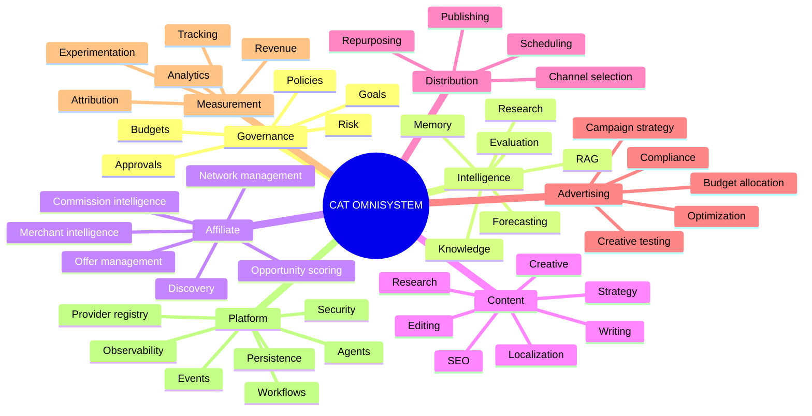
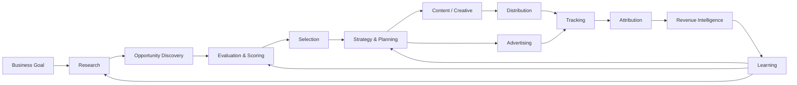
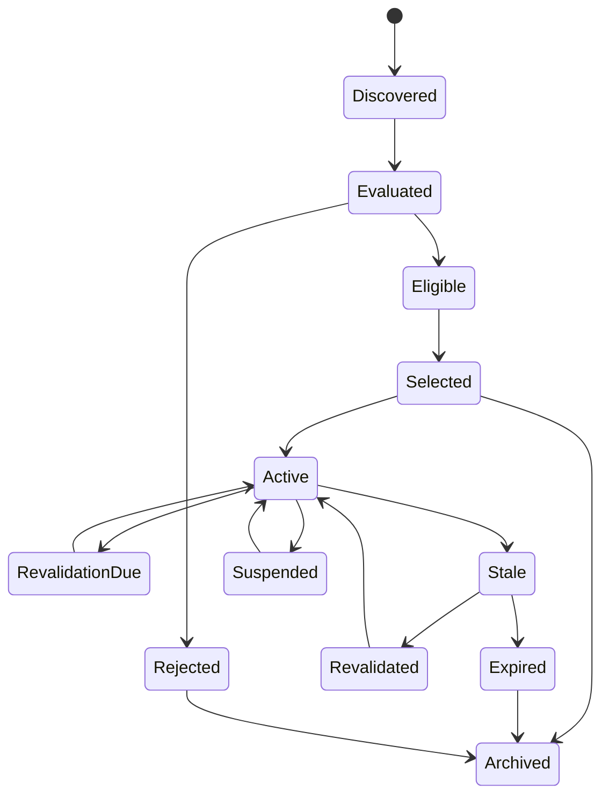

# 03 — CAT Capability Map

> A complete conceptual map of what CAT is intended to be able to do, who performs each responsibility, and how capabilities connect.

## 1. Capability model

CAT capabilities are organized into domains rather than one giant agent. Each domain owns a coherent business or platform responsibility.



---

## 2. Capability status vocabulary

Every capability in future documentation should carry one of these labels:

| Status | Meaning |
|---|---|
| `VISION` | Long-range concept; not yet architecturally committed |
| `PLANNED` | Accepted target capability |
| `SPECIFIED` | Contract/architecture documented |
| `IMPLEMENTED` | Production code exists |
| `VERIFIED` | Implementation passes applicable tests/verification |
| `OPERATIONAL` | Deployed and observable in a real environment |
| `OPTIMIZING` | Actively improving from measured outcomes |
| `DEPRECATED` | Being replaced |

This prevents documentation from confusing desired functionality with current functionality.

---

## 3. Master capability matrix

| Domain | Capability | Primary actor | Supporting actors | Typical output |
|---|---|---|---|---|
| Governance | Goal management | Strategy Agent | Human, Analytics | Goal definition |
| Governance | Policy management | Policy Agent | Human | Policy decision |
| Governance | Approval | Human / Approval Coordinator | Risk Agent | Approval decision |
| Intelligence | Market research | Research Agent | Knowledge Agent | Evidence package |
| Intelligence | Trend detection | Trend Agent | Research Agent | Trend signal |
| Intelligence | Knowledge curation | Knowledge Agent | Research Agent | Trusted knowledge |
| Intelligence | Retrieval | RAG/Knowledge services | All agents | Context package |
| Intelligence | Forecasting | Forecast Agent | Analytics | Prediction/scenario |
| Affiliate | Product discovery | Discovery Agent | Network adapters | Candidate opportunities |
| Affiliate | Opportunity scoring | Opportunity Analyst | Discovery, Analytics | Ranked opportunities |
| Affiliate | Network integration | Network Agent | Provider adapters | Network data/actions |
| Affiliate | Merchant analysis | Merchant Agent | Research | Merchant profile |
| Affiliate | Offer management | Offer Agent | Network Agent | Offer representation |
| Content | Content planning | Content Strategist | Research, Analytics | Content brief |
| Content | Content production | Writer/Creative Agents | Knowledge | Draft asset |
| Content | Quality control | Editor/Fact Checker | Knowledge | Approved asset |
| Content | SEO optimization | SEO Agent | Content Agent | Optimized content |
| Distribution | Channel planning | Distribution Planner | Analytics | Distribution plan |
| Distribution | Publishing | Publisher Agent | Connectors | Published artifact |
| Distribution | Scheduling | Scheduler | Orchestrator | Scheduled execution |
| Advertising | Campaign planning | Ads Strategist | Analytics | Campaign plan |
| Advertising | Campaign execution | Campaign Operator | Ad connectors | Provider campaign |
| Advertising | Budget control | Budget Agent | Governance | Allocation decision |
| Measurement | Tracking | Tracking services | Publishers | Event stream |
| Measurement | Attribution | Attribution Agent | Tracking | Conversion mapping |
| Measurement | Revenue analysis | Revenue Agent | Finance data | Revenue intelligence |
| Measurement | Experimentation | Experiment Agent | Analytics | Experiment result |
| Platform | Agent execution | Agent Runtime | Orchestrator | Agent result |
| Platform | Workflow execution | Durable Orchestrator | Workers | Durable outcome |
| Platform | Event transport | Event Bus | Producers/consumers | Event delivery |
| Platform | Persistence | Data services | Domain modules | Durable state |
| Platform | Observability | Observability services | All modules | Metrics/logs/traces |

---

## 4. End-to-end business capability graph



The original research explicitly frames CAT as a closed-loop system that can discover products, create and distribute content, observe campaign outcomes, and use those outcomes for continuous optimization. fileciteturn1047file5L1-L1

---

## 5. Opportunity lifecycle capability

Affiliate opportunity management is a particularly important domain because it connects external market data to downstream content and revenue decisions.



The exact implemented lifecycle and persistence semantics must follow the affiliate implementation contracts in `/core/affiliate/rust` and associated documentation. The diagram above is the capability-level model.

---

## 6. Capability dependency matrix

A capability may depend on another domain without owning it.

| Capability | Knowledge | Memory | Events | Workflow | External tools | Human gate |
|---|:---:|:---:|:---:|:---:|:---:|:---:|
| Research | ✓ | ✓ | ✓ | optional | ✓ | optional |
| Discovery | ✓ | ✓ | ✓ | ✓ | ✓ | optional |
| Opportunity scoring | ✓ | ✓ | ✓ | optional | optional | optional |
| Content generation | ✓ | ✓ | ✓ | ✓ | ✓ | often |
| Publishing | optional | optional | ✓ | ✓ | ✓ | policy-dependent |
| Advertising | ✓ | ✓ | ✓ | ✓ | ✓ | usually for material changes |
| Revenue analysis | ✓ | ✓ | ✓ | optional | ✓ | optional |
| System improvement | ✓ | ✓ | ✓ | ✓ | ✓ | required for trust-boundary changes |

---

## 7. Capability composition

Complex missions should be composed from smaller capabilities.

Example:

```text
Mission: launch a profitable affiliate campaign

├── Research market
├── Discover offers
├── Evaluate opportunities
├── Select target audience
├── Build content strategy
├── Generate content
├── Verify claims/compliance
├── Publish
├── Measure traffic
├── Measure conversions
├── Attribute commissions
├── Evaluate profitability
└── Optimize next iteration
```

Each child task can be implemented by a deterministic service, specialist agent, external provider, or human approval step.

---

## 8. Capability boundary rule

A capability owns **intent and contract**, not necessarily implementation.

For example:

```text
Affiliate Discovery Capability
        │
        ├── Network Source Adapter
        ├── Merchant API Adapter
        ├── Product Feed Adapter
        ├── Research/Web Source
        └── Manual Import
```

This allows CAT to add providers without changing the conceptual business capability.

---

## 9. Agent responsibility boundaries

Agents should specialize around decisions and transformations, while deterministic services enforce facts.

| Concern | Prefer |
|---|---|
| Product ranking hypothesis | Agent |
| Currency conversion | Deterministic service |
| URL validation | Deterministic service |
| Compliance interpretation | Agent + deterministic policy checks |
| Workflow state transition | Deterministic orchestrator |
| Creative ideation | Agent |
| Financial ledger mutation | Deterministic transactional service |
| External side effect | Authorized worker/provider adapter |
| Experiment interpretation | Agent + statistical service |
| Historical event preservation | Event store |

---

## 10. Capability quality dimensions

Every major capability should eventually be evaluated across:

- **correctness** — does it produce valid results?
- **coverage** — how much of the intended domain does it cover?
- **freshness** — how current is the information?
- **reliability** — does it operate consistently?
- **cost** — what resources does it consume?
- **latency** — how quickly does it respond?
- **economic value** — does it improve business outcomes?
- **compliance** — does it remain within policy?
- **explainability** — can decisions be audited?
- **replaceability** — can the implementation be swapped?

---

## 11. Capability roadmap principle

CAT should grow horizontally across capabilities while deepening reliability vertically.

```text
Breadth
  ↑
  │        ┌─────────────────────────────┐
  │        │ More business capabilities  │
  │        └─────────────────────────────┘
  │
  │   ┌──────────────────────────────────────┐
  │   │ More reliable existing capabilities  │
  │   └──────────────────────────────────────┘
  └──────────────────────────────────────────────→ Maturity
```

Adding ten new agents is not progress if the existing workflow cannot be trusted.

---

## 12. Capability acceptance checklist

Before declaring a capability complete:

- [ ] Purpose is documented.
- [ ] Owner/domain is defined.
- [ ] Inputs and outputs are explicit.
- [ ] Authorization boundary exists.
- [ ] Failure modes are defined.
- [ ] Idempotency is defined where relevant.
- [ ] Persistence requirements are defined.
- [ ] Events are versioned where required.
- [ ] Metrics exist.
- [ ] Tests exist.
- [ ] Security review exists.
- [ ] Provider dependencies are isolated.
- [ ] Human approval requirements are explicit.
- [ ] Current status is accurately labeled.
