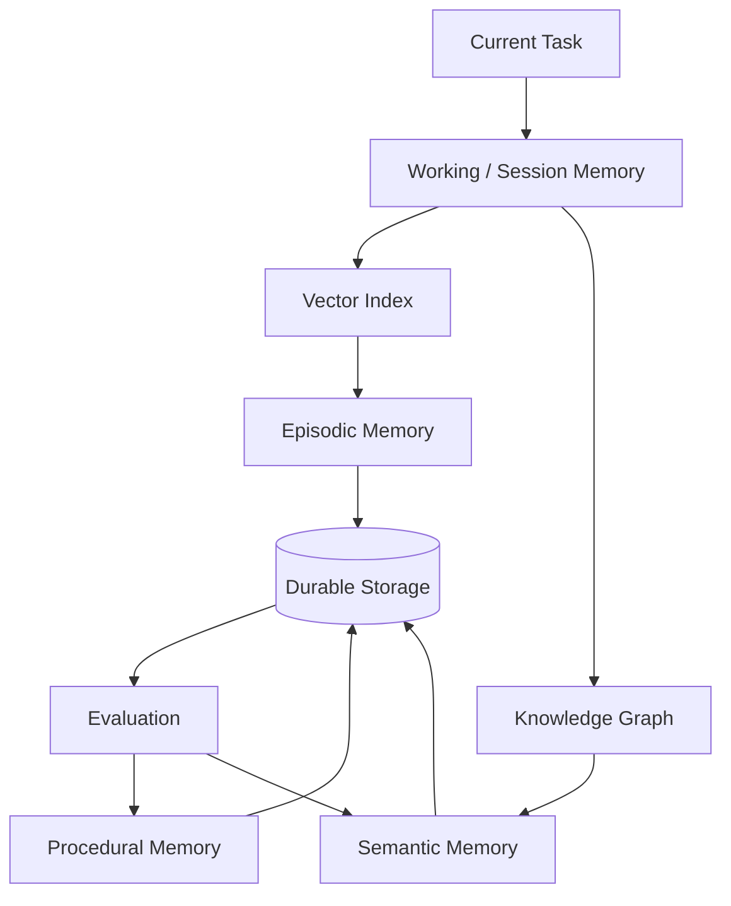
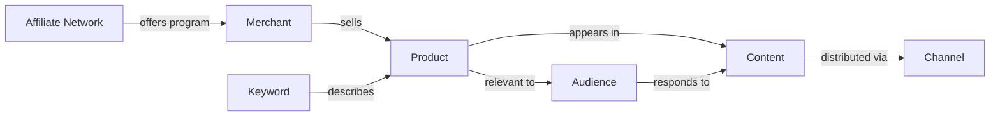
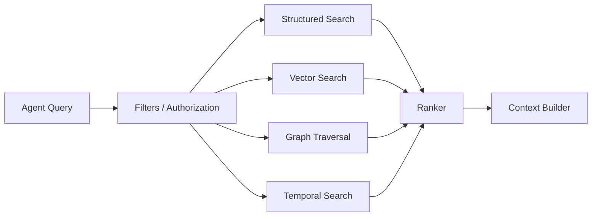
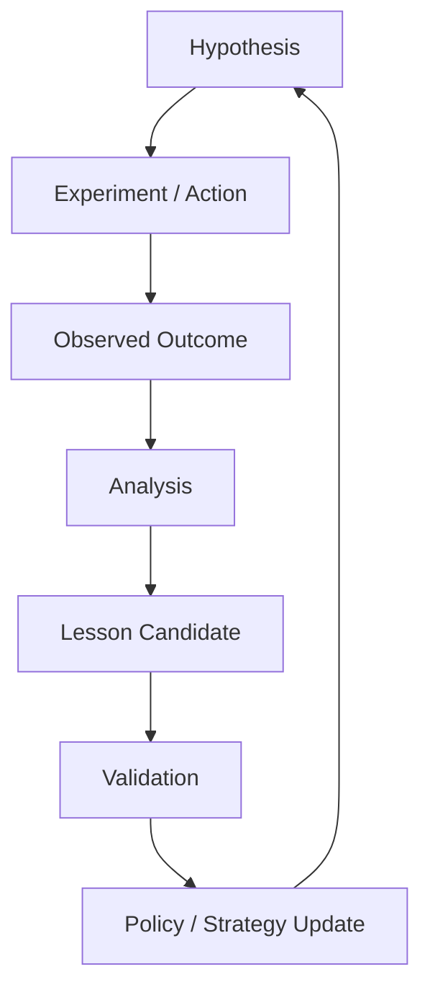

# 04 — CAT Knowledge, Memory & Learning

> The information architecture that turns CAT from a collection of agents into a system that accumulates institutional intelligence.

## 1. The central idea

A capable AI commerce system must remember more than conversations. It must preserve **facts, evidence, relationships, experiences, decisions, outcomes and validated lessons**.

The research foundation proposes a multi-layer memory model including session memory, long-term memory, vector retrieval and a structured knowledge graph. fileciteturn1047file18L1-L1

CAT therefore separates three concepts:

- **Knowledge** — what the system believes is true and why.
- **Memory** — what the system experienced or decided over time.
- **Learning** — the controlled process of turning evidence into improved behavior.

---

## 2. Knowledge versus memory

| Dimension | Knowledge | Memory |
|---|---|---|
| Main question | What do we know? | What happened to us? |
| Typical content | facts, rules, relationships | experiences, decisions, outcomes |
| Example | merchant has a 7% commission | campaign X produced 3.2% conversion |
| Provenance | source/document/provider | workflow/agent/event |
| Update style | versioned evidence | append experience; derive summaries |
| Retrieval | semantic + structured | contextual + temporal |
| Trust | source-dependent | evidence-dependent |

Neither should be treated as infallible.

---

## 3. Memory architecture



The storage technology is an implementation choice. The semantic boundaries are architectural requirements.

---

## 4. Working memory

Working memory contains only information needed for the active task/session.

Examples:

- current mission;
- current workflow state;
- recent tool outputs;
- relevant retrieved knowledge;
- unresolved questions;
- current hypotheses.

Working memory should have explicit size and retention limits. It must not become an unlimited transcript sink.

---

## 5. Episodic memory

Episodic memory stores meaningful experiences:

```text
Campaign 184
├── Goal
├── Hypothesis
├── Actions
├── Provider responses
├── Audience
├── Content versions
├── Traffic
├── Conversion
├── Revenue
├── Costs
├── Outcome
└── Lessons
```

The important property is traceability: a lesson should be connectable to the experience that generated it.

---

## 6. Semantic knowledge

Semantic knowledge represents stable or semi-stable concepts and relationships.

Example:



A graph allows CAT to reason over relationships rather than treating every document as an isolated text blob.

---

## 7. Procedural memory

Procedural memory describes **how** CAT performs recurring work.

Examples:

- a validated discovery procedure;
- an approved content quality checklist;
- a provider integration protocol;
- an experiment template;
- a recovery procedure.

Procedural memory must be versioned and governed because a change to a procedure can change real-world behavior.

---

## 8. Retrieval architecture

The target retrieval system combines multiple retrieval modes:



The retrieval layer should prefer **relevant, authorized and fresh context** over maximum context volume.

---

## 9. Provenance

Every high-value knowledge item should answer:

- Where did this come from?
- When was it observed?
- Who/what produced it?
- What version was used?
- Is it directly observed or inferred?
- What evidence supports it?
- When should it be revalidated?

A useful conceptual record is:

```text
KnowledgeItem
├── identity
├── statement
├── source
├── observed_at
├── valid_from / valid_until
├── confidence
├── provenance
├── sensitivity
├── version
└── supporting_evidence[]
```

---

## 10. Trust levels

CAT should distinguish evidence quality.

| Level | Meaning |
|---|---|
| T0 | Unverified model hypothesis |
| T1 | Single weak/indirect source |
| T2 | Corroborated external evidence |
| T3 | Direct provider/system observation |
| T4 | Repeated operational evidence |
| T5 | Human-validated policy/fact |

A low-trust hypothesis may guide research. It should not automatically drive a high-risk external action.

---

## 11. Learning loop



Learning is deliberately separated from immediate execution. This prevents one surprising outcome from instantly rewriting production behavior.

---

## 12. Learning from outcomes

The research foundation specifically emphasizes learning from complete campaign history rather than isolated examples and proposes simulation before real execution where useful. fileciteturn1047file10L1-L1

CAT should therefore eventually support:

- cohort analysis;
- experiment comparison;
- counterfactual analysis where statistically defensible;
- scenario simulation;
- policy evaluation;
- model evaluation;
- strategy versioning;
- rollback.

---

## 13. Knowledge update pipeline

The research material proposes monitoring open-source repositories, research feeds, Reddit/Product Hunt and academic sources, followed by human review before important technology adoption. fileciteturn1047file4L1-L1

CAT's target pipeline:

```text
External Signal
      ↓
Collector
      ↓
Normalizer
      ↓
Classifier
      ↓
Evidence / Provenance
      ↓
Candidate Knowledge
      ↓
Validation
      ↓
Knowledge Store
      ↓
Retrieval
      ↓
Agent / Decision
```

The collector should not directly modify critical policy.

---

## 14. Memory safety

Memory can contain sensitive information, proprietary provider data and potentially malicious instructions embedded in external content.

Therefore:

1. Retrieved text is **data**, not authority.
2. External documents cannot override system policy.
3. Secrets must not be stored in ordinary semantic memory.
4. Sensitive memories require access controls and retention policies.
5. Memory entries need provenance.
6. Deletion/retention requirements must be explicit.
7. Retrieval must enforce authorization before ranking content.

---

## 15. Knowledge conflict resolution

Conflicting evidence is expected.

CAT should not silently overwrite one source with another. Instead:

```text
Claim A
 ├── Source 1: supports
 ├── Source 2: contradicts
 ├── Source 3: stale
 └── Current assessment: unresolved / weighted
```

The resolution mechanism may consider source authority, recency, direct observation, corroboration and domain-specific rules.

---

## 16. Model independence

Knowledge and memory must not be encoded in one model's hidden state.

If CAT changes from Model A to Model B, the system should retain its:

- structured facts;
- embeddings where reusable;
- source documents;
- graph relationships;
- event history;
- procedural records;
- evaluation history.

Models are consumers and producers of governed information, not the sole storage medium.

---

## 17. Learning governance

A proposed learning update should include:

| Field | Purpose |
|---|---|
| Change ID | Traceability |
| Evidence | Why the change is proposed |
| Expected effect | What should improve |
| Risk | What could get worse |
| Scope | Which agents/workflows are affected |
| Validation | How success will be measured |
| Rollback | How to revert |
| Approval | Whether human approval is required |

This makes self-improvement an engineering process rather than uncontrolled self-modification.

---

## 18. Knowledge and memory acceptance checklist

- [ ] Every high-value item has provenance.
- [ ] Authorization is enforced before retrieval.
- [ ] Sensitive data has a defined retention policy.
- [ ] Facts and hypotheses are distinguished.
- [ ] Historical operational facts remain immutable where required.
- [ ] Knowledge versions can be identified.
- [ ] Learning changes are measurable.
- [ ] Strategy updates are reversible.
- [ ] External content cannot override system policy.
- [ ] Model replacement does not destroy institutional memory.
