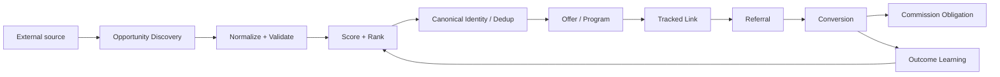
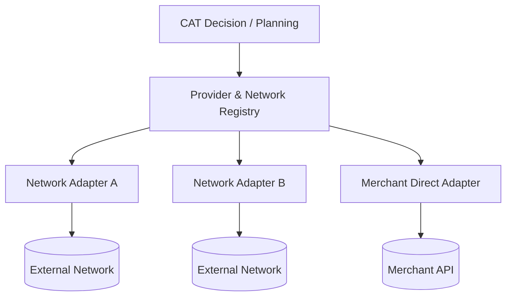
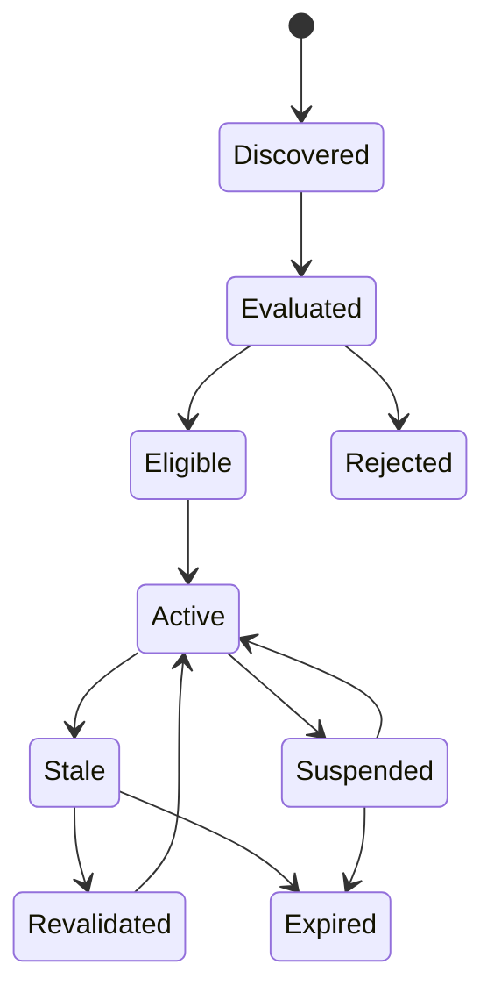

# 05 — Affiliate Intelligence Engine

**Status:** Architecture specification / implementation-aware  
**Audience:** AI agents, architects, developers, operators, future maintainers

> This chapter defines CAT's affiliate domain as an intelligence system, not merely a link-management database. Implemented behavior must always be verified against executable code, tests, migrations, and explicit contracts.

## 1. Mission

The Affiliate Intelligence Engine discovers, evaluates, routes, tracks, attributes, and learns from commercial opportunities. Its job is to convert uncertain market signals into measurable economic actions while preserving provenance, idempotency, compliance, and auditability.

The current Rust affiliate substrate already contains domain models for merchants, programs, products, offers, affiliates, referrals, conversions, and commission obligations, plus attribution, commission rules, network adapters, scoring, tracking, smart routing, and monitoring modules. These are implementation facts; broader autonomous behavior remains staged according to implementation maturity.

## 2. Domain model

| Entity | Meaning | Primary responsibility |
|---|---|---|
| Merchant | Commercial seller | Owns products/programs |
| Affiliate Program | Commercial partnership | Defines participation and status |
| Product | Canonical commercial item | Stable identity across sources |
| Offer | Actionable promotion | Connects program to product |
| Affiliate | Revenue-producing actor | Human, agent, or organization |
| Referral | Outbound attributable interaction | Carries attribution window/state |
| Conversion | Economic outcome | Records gross/net/commissionable value |
| Commission Obligation | Amount owed | Durable, idempotent financial obligation |
| Opportunity | Candidate economic opportunity | Discovery/ranking/dedup layer |

## 3. Intelligence loop

CAT should continuously execute this loop:

1. Discover products, merchants, programs, offers, and market signals.
2. Normalize heterogeneous sources into stable domain objects.
3. Validate economic, technical, and compliance constraints.
4. Rank opportunities using deterministic and later learned scoring.
5. Deduplicate across networks without losing source provenance.
6. Select the best eligible provider/network/offer.
7. Generate a trackable route.
8. Publish content or distribution actions through authorized channels.
9. Observe clicks, conversions, commissions, refunds, and failures.
10. Attribute outcomes to the correct causal chain.
11. Feed evidence back into ranking, routing, content, and budget decisions.

## 4. Scoring philosophy

A score is a decision aid, not a claim of truth. Every score must be explainable through its inputs, weighting/version, timestamp, and evidence set. Candidate scores should be bounded, deterministic when inputs are deterministic, and versioned whenever the formula changes.

Recommended dimensions:

| Dimension | Question |
|---|---|
| Economic potential | Is expected contribution attractive after costs? |
| Demand | Is there evidence of buyer intent? |
| Competition | Can CAT acquire attention economically? |
| Freshness | Is the opportunity current? |
| Compliance | Can CAT promote it lawfully and under network rules? |
| Reliability | Is the source/provider dependable? |
| Conversion | Does historical evidence support purchase behavior? |

## 5. Provider and network independence

No business decision should be hard-coded to one affiliate network. CAT uses adapters and registries so that a network can be replaced, added, paused, or downgraded without rewriting domain logic.

## 6. Attribution

Attribution is a causal accounting problem. CAT must preserve the chain:

`campaign → content → placement → tracked link → identity/session → referral → conversion → commission`.

The system must support configurable attribution models while retaining raw touchpoints so that the model can be recalculated later. No derived attribution result should destroy the underlying evidence.

## 7. Tracking and anti-fraud

Tracked links should carry stable identifiers and UTM metadata without exposing secrets. Click processing should be idempotent. Velocity and anomaly checks should flag suspicious traffic rather than silently corrupting analytics.

Fraud controls should be advisory or blocking according to explicit policy. Every blocking decision requires a reason code and audit event.

## 8. Lifecycle state

The state machine is conceptual. The exact implemented state set is governed by the relevant domain contract and source code.

## 9. Economic safety

CAT must distinguish:

- expected commission;
- gross merchandise value;
- net revenue;
- acquisition cost;
- platform fees;
- refunds/chargebacks;
- realized commission;
- cash actually received.

A high nominal commission is not necessarily a high-value opportunity. Decisions should optimize expected contribution and risk-adjusted return rather than vanity metrics.

## 10. Acceptance invariants

1. External identifiers are never treated as globally unique without source context.
2. Canonical product identity must be deterministic and versionable.
3. Duplicate ingestion must be idempotent.
4. Provenance must survive deduplication.
5. Provider failures must not mutate unrelated domain state.
6. Financial obligations require idempotency keys.
7. Raw observations remain auditable.
8. Network credentials never enter content, events, logs, or client payloads.
9. Ranking changes require versioned logic/evidence.
10. Compliance failures fail closed.

## 11. Agent responsibilities

| Agent | Role | Typical inputs | Outputs |
|---|---|---|---|
| Market Scout | Find demand signals | trends, search, feeds | market signals |
| Product Hunter | Find candidate products | catalogs, networks | opportunities |
| Program Analyst | Evaluate partnerships | commission/rules | program score |
| Offer Analyst | Compare offers | price, discount, terms | offer ranking |
| Compliance Analyst | Check promotion rules | policies, geography | eligibility decision |
| Attribution Analyst | Explain revenue paths | touchpoints/conversions | attribution |
| Link Health Agent | Monitor destinations | HTTP/redirect data | route health |
| Revenue Analyst | Measure economics | conversions/commission | economic insight |
| Opportunity Revalidator | Refresh stale data | source APIs | revalidation result |

Agents do not directly bypass domain contracts. They request capabilities through authorized tools and workflows.

## 12. Future intelligence

The target system can evolve from deterministic scoring toward contextual bandits, causal experimentation, Bayesian updating, and portfolio optimization. Such methods must remain bounded by policy, reproducibility requirements, and human approval for high-impact actions.
