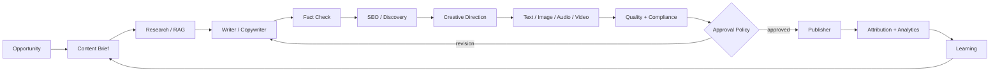
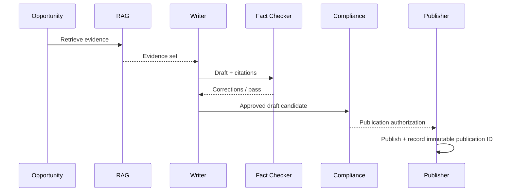

# 06 — Content Factory

**Status:** Target architecture with research-derived design; implementation maturity must be checked per module.

## 1. Purpose

The Content Factory turns verified commercial intelligence into useful, compliant, measurable media. Content is not an isolated generation task: every asset has a business objective, audience, evidence set, channel, lifecycle, and measurable outcome.

## 2. Factory pipeline

## 3. Content object

Every asset should have:

- immutable content ID;
- content type and schema version;
- source/evidence references;
- target audience;
- target channel;
- language/locale;
- product/offer associations;
- affiliate disclosures where required;
- generation model/provider metadata;
- prompt/template version;
- approval status;
- publication records;
- performance metrics;
- revision lineage.

## 4. Specialist agents

| Agent | Responsibility |
|---|---|
| Trend Hunter | Detect topics and demand |
| Research Agent | Gather and synthesize evidence |
| Product Reviewer | Produce product-specific analysis |
| Copywriter | Draft persuasive but accurate copy |
| SEO Agent | Optimize discoverability |
| Fact Checker | Validate claims against evidence |
| Editor | Improve clarity and consistency |
| Creative Director | Define visual/audio direction |
| Image Director | Generate/select imagery |
| Video Director | Plan video sequences |
| Voice Director | Create voice assets |
| Localization Agent | Adapt language and cultural context |
| Compliance Reviewer | Check disclosure and platform constraints |
| Publisher | Execute authorized publication |
| Content Analyst | Attribute and evaluate results |

Agents are interchangeable workers around shared contracts. CAT should never depend on one model vendor for a specific role.

## 5. RAG and evidence

The factory should prefer evidence-backed generation. Retrieval results are attached to the content production record, allowing later audits to answer: what did CAT know, what sources were used, which model generated the claim, and which reviewer approved it?

## 6. Quality gates

Content should pass gates for factual accuracy, policy compliance, affiliate disclosure, destination validity, language quality, brand/design consistency, accessibility, and measurement instrumentation.

A failed gate blocks publication unless an explicit override policy exists. Overrides are auditable and attributable.

## 7. Content portfolio

CAT should manage content as a portfolio rather than individual posts. It can compare topics, formats, channels, audiences, production cost, conversion contribution, and decay over time. The optimization objective is economic contribution and durable audience value, not raw publishing volume.

## 8. Model routing

Model selection should be capability-based:

`task → required capabilities → eligible providers → quality/cost/latency score → execution`.

Prompts and model choices are versioned. A provider outage should trigger fallback only when the fallback satisfies the same contract and policy requirements.

## 9. Safety

CAT must not manufacture reviews, ratings, testimonials, expert credentials, or factual claims. Synthetic media must follow applicable platform rules and internal disclosure policy. Generated content remains subject to human approval whenever policy classifies the action as high impact.

## 10. Learning loop

Performance is joined back to content lineage:

`asset → placement → impression → click → referral → conversion → commission → cost → contribution`.

This permits CAT to learn which combinations of topic, format, claim structure, audience, channel, timing, and offer produce reliable economic outcomes.
