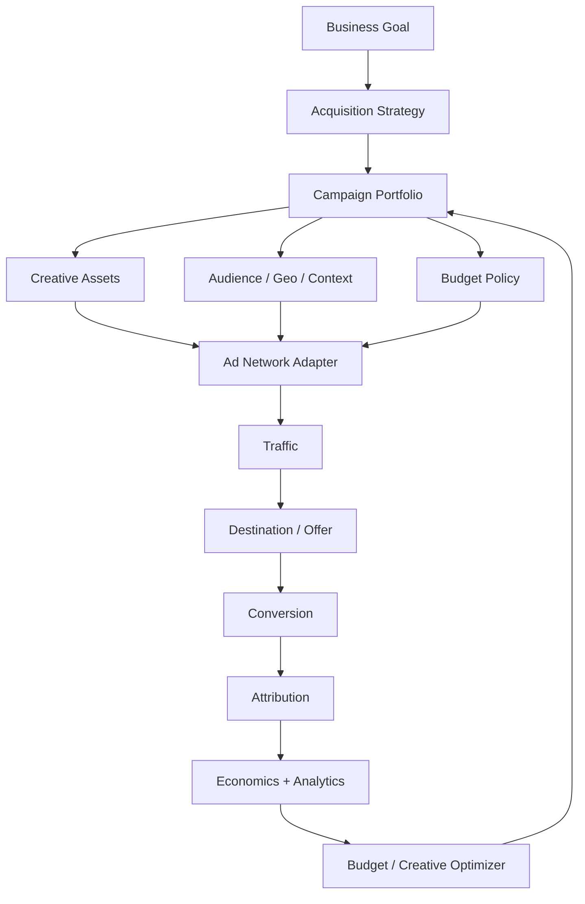

# 07 — Advertising Operating System

**Status:** Target architecture; provider integrations require individual contracts.

## 1. Mission

CAT's Advertising OS manages paid acquisition as a controlled economic system. It connects audience intelligence, content assets, affiliate offers, budgets, experiments, attribution, and outcome learning.

## 2. Provider abstraction

Google, Meta, TikTok, Reddit, LinkedIn, and future networks are external providers, not CAT business logic. Each integration implements an explicit adapter contract for campaign creation, mutation, pause/resume, reporting, limits, and error mapping.

## 3. Budget governance

No autonomous agent should be allowed to spend arbitrary funds. Budget policies define:

| Control | Purpose |
|---|---|
| Daily cap | Bound short-term loss |
| Campaign cap | Bound campaign exposure |
| Provider cap | Prevent provider concentration |
| Experiment cap | Bound exploration cost |
| Approval threshold | Require human approval above risk level |
| Kill switch | Stop spending immediately |
| Cooldown | Prevent rapid oscillation |

## 4. Optimization

The optimizer can consider CAC, EPC, ROAS, contribution margin, conversion rate, click quality, creative fatigue, and confidence intervals. Decisions should be based on statistically meaningful evidence where possible.

A simple policy is:

`candidate action → simulate/estimate → policy check → approval check → execute → observe → reconcile → learn`.

## 5. Experimentation

CAT should support controlled A/B and multivariate experiments with explicit hypotheses, allocation rules, success metrics, minimum sample criteria, and rollback conditions. Experiment results must retain exposure and cohort information so that conclusions are not confused by selection bias.

## 6. Failure handling

Advertising APIs can timeout, rate-limit, reject policy-sensitive creatives, or report delayed conversions. CAT must distinguish provider acknowledgment from successful economic outcome. Durable execution and reconciliation govern retries; no blind duplicate campaign creation is permitted.

## 7. Compliance

The system must honor provider advertising policies, affiliate disclosure obligations, geographic restrictions, consent requirements, and internal spend policies. A compliance rejection is a first-class outcome and should not be retried indefinitely.

## 8. Agents

- Acquisition Strategist
- Audience Analyst
- Campaign Builder
- Creative Selector
- Bid/Budget Optimizer
- Experiment Manager
- Ad Compliance Agent
- Provider Health Agent
- Attribution Analyst
- Growth Analyst

These agents collaborate through workflows and events rather than mutating shared state arbitrarily.
