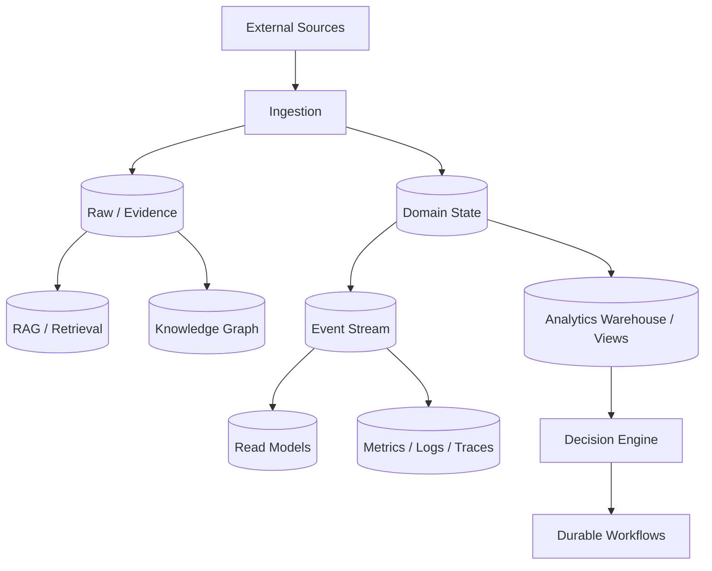
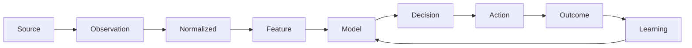
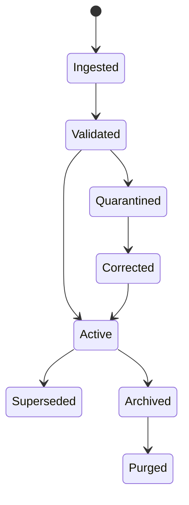

# 08 — Data Architecture

**Status:** Architecture specification, aligned with current Rust persistence boundaries.

## 1. Data philosophy

CAT treats data as an economic and operational asset. Every important record needs identity, provenance, timestamps, lifecycle, versioning, and an explicit owner. Derived data must remain distinguishable from raw evidence.

## 2. Logical data planes

## 3. Storage responsibilities

| Store | Responsibility | Rule |
|---|---|---|
| PostgreSQL | authoritative transactional state | migrations + constraints |
| Event store | durable domain history | append-oriented |
| Outbox | reliable publication boundary | transactionally coupled |
| Cache | acceleration | never sole authority |
| Vector index | semantic retrieval | rebuildable derived data |
| Knowledge graph | relationships | provenance required |
| Object storage | media/artifacts | immutable IDs + metadata |
| Metrics backend | operational telemetry | not business truth |

The exact deployed technologies may evolve. Contracts should describe capabilities and invariants rather than vendor-specific assumptions wherever practical.

## 4. Identity

Distributed CAT components should prefer globally unique IDs and explicit domain identity types. A database primary key and an external provider identifier are different identities and must never be conflated.

## 5. Event sourcing boundaries

CAT does not require every table to become event-sourced. Event sourcing is appropriate where durable history, replay, auditability, or distributed coordination materially benefits the domain. Projections must be rebuildable from authoritative events or source records.

## 6. Data lineage

For every economically important decision, CAT should be able to answer:

- What source produced the evidence?
- When was it observed?
- Which transformation changed it?
- Which model/version interpreted it?
- Which policy permitted the action?
- Which agent/workflow made the decision?
- What external action occurred?
- What outcome followed?

## 7. Data quality

Validation belongs at boundaries. Invalid external data should be rejected, quarantined, or marked according to domain policy rather than silently normalized into false facts. Numeric quantities require explicit units and currency. Time requires explicit timezone/epoch conventions.

## 8. Privacy

Personal data is minimized. CAT should collect only what is required for an explicit capability, enforce retention rules, encrypt sensitive material at rest/in transit, and prevent secrets or personal identifiers from leaking into logs, prompts, analytics, or generated content.

## 9. Analytics

Operational and analytical models are separate concerns. Analytics may denormalize data for speed, but the lineage back to authoritative domain state must remain available. Attribution reports must distinguish observed facts from modeled estimates.

## 10. Data lifecycle

Retention and deletion policies are domain-specific and must be explicit.
