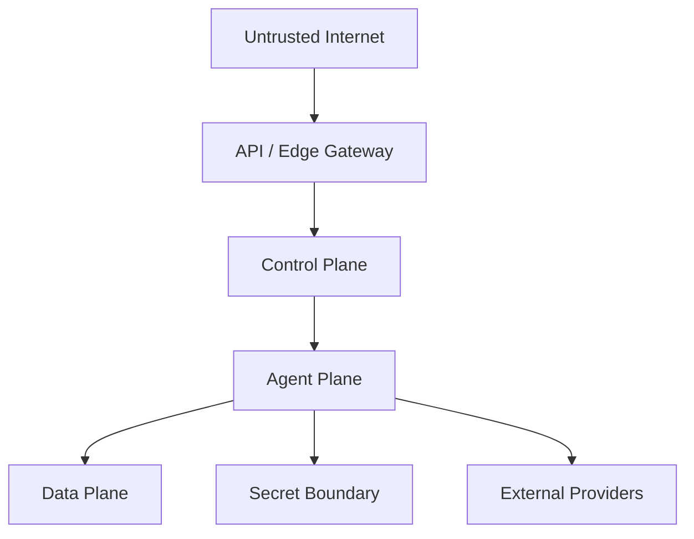
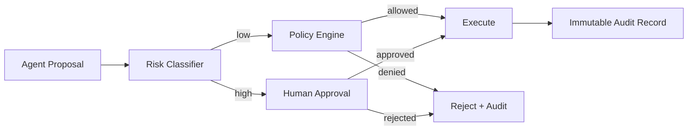

# 09 — Security, Trust & Governance

**Status:** Target architecture aligned with security-by-design principles.

## 1. Security objective

CAT is an autonomous economic system. Security therefore protects not only confidentiality but also money, reputation, affiliate relationships, provider accounts, content integrity, and decision integrity.

## 2. Trust zones

Every crossing requires authentication, authorization, validation, observability, and appropriate rate limits.

## 3. Agent permissions

An agent receives the minimum capabilities required for its task. Permissions are capability-oriented rather than blanket database access.

| Risk class | Example | Default |
|---|---|---|
| Read | market research | allow with scope |
| Generate | draft content | allow |
| Publish | social post | approval/policy dependent |
| Spend | ad budget | restricted |
| Financial | commission/treasury mutation | strongly restricted |
| Security | credential rotation | privileged human/system |
| Destructive | delete/disable production resource | human approval |

## 4. Human-in-the-loop

Autonomy is graduated. Low-risk reversible actions can be automatic. Irreversible, expensive, legally sensitive, or reputation-sensitive actions require explicit approval unless an approved policy says otherwise.

## 5. Secrets

API keys, OAuth credentials, signing keys, database passwords, and provider tokens never belong in source code, prompts, events, client bundles, or ordinary logs. Secret access must be scoped, observable, rotatable, and revocable.

## 6. Prompt and model security

External content is untrusted input. Retrieval documents, product descriptions, web pages, and provider responses must not gain authority merely because an LLM sees them. Prompt injection defenses include trust labeling, tool allowlists, structured outputs, policy evaluation, and isolation of privileged instructions.

## 7. Auditability

Every high-impact action should record actor identity, agent identity, workflow/execution identity, policy version, input references, decision, authorization, external request identity, outcome, and timestamps.

## 8. Threat model

CAT should continuously model threats including credential theft, prompt injection, malicious provider data, supply-chain compromise, replay/double execution, data poisoning, account takeover, SSRF, unauthorized spending, attribution fraud, and insider misuse.

## 9. Security invariants

1. Default deny for privileged capabilities.
2. Validate at trust boundaries.
3. Never trust model output as authorization.
4. Never retry financial operations blindly.
5. Preserve immutable execution identity.
6. Log security-relevant decisions without leaking secrets.
7. Encrypt sensitive data in transit and at rest.
8. Keep dependencies and containers reproducible and reviewable.
9. Provide emergency kill switches.
10. Treat external instructions as data, not policy.
