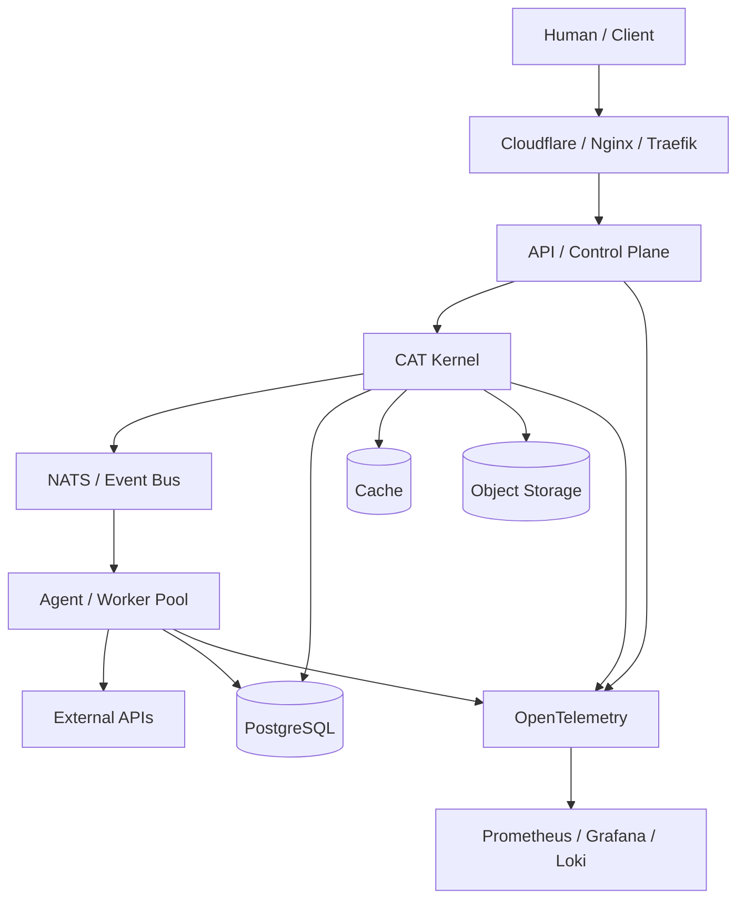
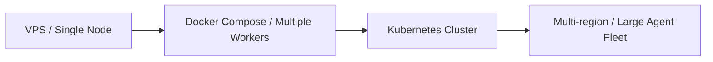

# 10 — Infrastructure, DevOps & Scaling

**Status:** Architecture target; deployment details remain environment-specific.

## 1. Infrastructure philosophy

CAT starts economically on a small server but must be able to grow to many workers and agents without rewriting domain logic. Stateless services scale horizontally; durable state is isolated behind explicit persistence contracts.

## 2. Deployment topology

## 3. Current technology direction

The repository's Rust workspace is the current core implementation substrate. The architecture remains polyglot: Rust is preferred for correctness-sensitive/high-performance core services; Python/FastAPI and Go may serve specialized workloads and integrations; TypeScript/React is the planned control-plane/UI layer. Language choice follows workload, not organizational fashion.

## 4. Runtime layers

| Layer | Responsibility |
|---|---|
| Edge | TLS, routing, rate limiting |
| API | external control/data interface |
| Kernel | durable domain coordination |
| Event Bus | asynchronous decoupling |
| Worker | computation/external work |
| Persistence | authoritative durable state |
| Observability | logs, metrics, traces |
| Deployment | reproducible lifecycle |

## 5. CI/CD

The desired pipeline is:

`commit → formatting → static analysis → unit tests → integration tests → migration tests → security checks → artifact build → deployment gate`.

GitHub Actions remains a useful control-plane mechanism, but CAT should not architect its business correctness around a specific hosted-runner quota. Self-hosted execution is an optional infrastructure evolution when economically or operationally appropriate.

## 6. Scaling model

Scaling dimensions include API replicas, worker concurrency, event consumers, provider adapters, retrieval nodes, and analytical workloads. Each can scale independently when contracts permit.

## 7. Reliability

Durable workflows use explicit execution identity, leases/fencing, retry policy, reconciliation, and outbox semantics. External side effects are never assumed successful solely because a network request returned without an exception. Remote state is reconciled where supported.

## 8. Disaster recovery

Critical PostgreSQL state requires backups, restore verification, migration discipline, and recovery objectives. Event history and audit records require retention policies. Recovery procedures must be executable, documented, and periodically tested.

## 9. Observability

Every request/workflow/agent execution should have correlation and causation identifiers where applicable. Metrics must expose latency, throughput, error rate, queue depth, retries, stale executions, provider health, and economic outcomes. Logs should be structured; traces should cross service boundaries.

## 10. Cost engineering

CAT optimizes for economic contribution, not infrastructure maximalism. Expensive model calls, crawling, storage, and paid APIs require budgets and quotas. Caching, batching, asynchronous execution, model routing, and result reuse should reduce avoidable cost.

## 11. Operational safety

Deployments must support rollback. Feature flags and kill switches should permit rapid containment. Production migrations should be backward compatible whenever possible. Secrets and configuration are injected at runtime, never committed.
