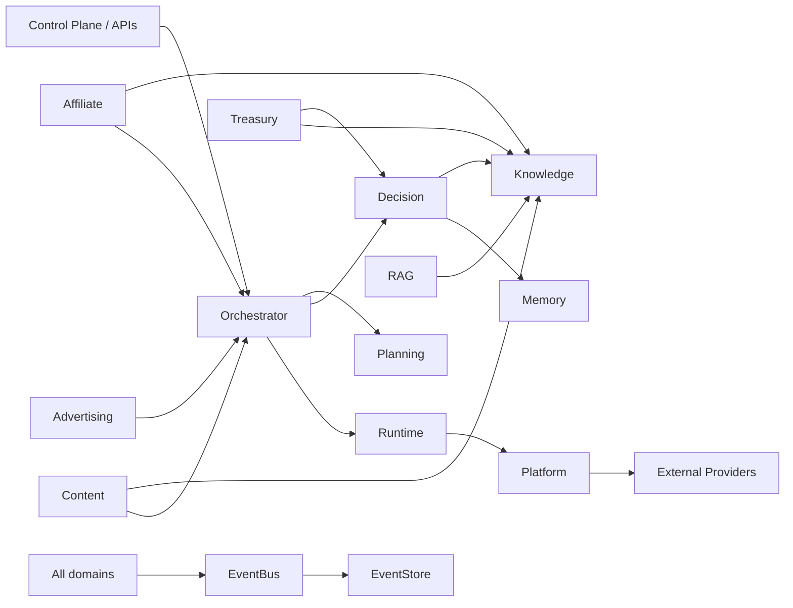

# CAT OMNISYSTEM — Master Domain Map & Boundaries

**Status:** Canonical target architecture / implementation-aware
**Audience:** architects, developers, AI coding agents, research agents, operators
**Depends on:** Bible 00–54, repository `/context`, implementation contracts, executable code

## 1. Purpose

This document is the cross-domain map for CAT OMNISYSTEM. It exists to prevent an AI agent from treating CAT as a collection of unrelated packages. CAT is a coordinated economic and intelligence system whose domains exchange durable facts, commands, events, decisions, evidence and projections.

The source-of-truth hierarchy remains unchanged: executable code/tests/migrations describe current reality; contracts define enforceable behavior; the Bible describes system intent and target architecture.

## 2. Domain landscape

| Domain | Primary responsibility | Typical outputs | Runtime maturity |
|---|---|---|---|
| Kernel | universal execution primitives, IDs, envelopes, validation, projection primitives | commands, envelopes, identities, execution context | IMPLEMENTED substrate |
| EventBus | event delivery, routing, inbox/outbox, retries | delivered events, delivery receipts | IMPLEMENTED substrate |
| EventStore/Postgres | durable event and delivery persistence | stored events, checkpoints, receipts | IMPLEMENTED substrate |
| Runtime | task execution lifecycle, cancellation, leases | task state, execution results | IMPLEMENTED substrate |
| Knowledge | graph facts, provenance, temporal knowledge and queries | evidence, graph snapshots | IMPLEMENTED substrate |
| Memory | durable/operational memory policies and retrieval | memory records, recall candidates | IMPLEMENTED substrate |
| LLM | provider-independent model invocation | model responses, usage/evaluation data | IMPLEMENTED substrate |
| Reasoning | structured reasoning and traces | reasoning results, traces | IMPLEMENTED substrate |
| Decision | policy-aware decision records and approvals | decisions, approval gates, traces | IMPLEMENTED substrate |
| Planning | schedules and executable plans | plan steps, schedules | IMPLEMENTED substrate |
| Orchestrator | durable workflow/execution coordination | execution attempts, provider results, reconciliation | IMPLEMENTED substrate |
| Platform | external provider/adaptor boundary | provider calls, health, telemetry | IMPLEMENTED substrate |
| RAG | retrieval services over knowledge sources | ranked retrieval results | IMPLEMENTED substrate |
| Affiliate | discovery, opportunity lifecycle, ranking, health, revalidation | opportunities, requests, observations, metrics | IMPLEMENTED P0 domain |
| Content | content generation, provenance, policy and publication | content revisions, publication receipts | IMPLEMENTED foundation |
| Advertising | paid distribution and campaign operations | campaigns, actions, measurements | TARGET / expanding |
| Treasury | revenue, costs, reserves and economic controls | ledger facts, budgets, allocation decisions | TARGET / expanding |
| Control Plane | human operations, configuration, audit and visualization | commands, approvals, dashboards | TARGET / expanding |

## 3. Dependency rule

Dependencies must flow toward stable contracts. Domain code must not reach directly into provider-specific implementation details when a canonical port exists.



## 4. Boundary rules

1. **No domain owns another domain's persistence model.** It may consume a published contract or event.
2. **No provider becomes a domain dependency.** Providers implement ports.
3. **Derived state stays derived.** Persist durable facts; calculate projections when practical.
4. **Every externally consequential action is attributable.** Identity, intent, policy context and execution evidence must be recoverable.
5. **AI-generated output is not automatically trusted.** Validation, policy and provenance precede publication or economic action.
6. **Human authority remains explicit.** Autonomous operation may be policy-bounded; approval gates remain available for high-impact actions.
7. **Events are facts, not instructions disguised as facts.** Commands request work; events report completed or observed facts.

## 5. Cross-domain transaction pattern

```text
Intent
  -> Decision / Policy evaluation
  -> Durable command
  -> Orchestrator execution
  -> Provider/tool invocation
  -> Attempt ledger
  -> Result / evidence
  -> Reconciliation
  -> Domain event
  -> Projection / Knowledge / Memory
  -> Measurement
  -> Learning / policy update
```

The pattern is intentionally compatible with retries, worker crashes and provider failure. Exactly-once external side effects must never be assumed; idempotency and reconciliation are the safety mechanisms.

## 6. AI implementation protocol

When adding a feature, an AI agent must first identify its owning domain, inbound contracts, outbound contracts, persistence facts, events, observability, security boundary and recovery behavior. If the feature crosses more than two domains, create or update the relevant architecture document before implementation.

## 7. Forbidden architectural shortcuts

- Direct SQL from UI code.
- Provider SDK types crossing domain boundaries.
- Hidden global mutable state.
- Network calls from pure domain logic.
- Sleeping/realtime clocks in deterministic domain tests.
- Float-based economic decisions where integer or decimal accounting is required.
- Publishing an event merely because a projection changed.
- Treating a Markdown specification as evidence that code exists.

## 8. Definition of done for a new domain capability

A capability is architecturally complete only when its conceptual model, contract, implementation boundary, persistence strategy, event behavior, observability, security model, failure/recovery model and tests are documented or explicitly marked as pending.
