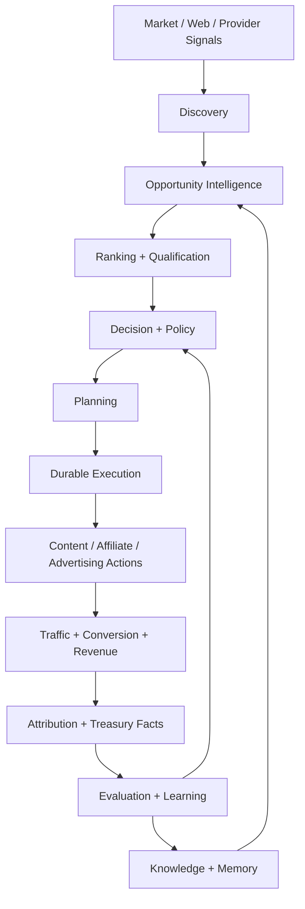

# CAT OMNISYSTEM — End-to-End Economic Flywheel

**Status:** Canonical target operating model
**Maturity:** Architecture specified; implementation varies by domain

## 1. Mission

CAT exists to turn information and computation into measurable economic outcomes while preserving evidence, policy, safety and operational control. The economic flywheel is the system-level loop connecting discovery, intelligence, action, measurement and learning.

## 2. Flywheel



## 3. Stage contracts

| Stage | Question | Durable evidence |
|---|---|---|
| Discovery | What changed? | source observations and provenance |
| Intelligence | Why might it matter? | normalized entities, signals, scores, explanations |
| Qualification | Is it actionable? | eligibility and confidence facts |
| Decision | What should CAT do? | decision record, policy evaluation, approval state |
| Planning | How should it be done? | plan, dependencies, schedule |
| Execution | What actually happened? | attempt ledger and provider result |
| Attribution | What economic effect occurred? | clicks, conversions, commissions, costs |
| Treasury | What value was created/consumed? | ledger facts, balances, reserves |
| Learning | What should change? | evaluation evidence, model/policy updates |

## 4. Economic invariants

1. Revenue is never inferred from intent alone.
2. A click is not a conversion; a conversion is not necessarily settled revenue.
3. Commission estimates remain distinct from confirmed amounts.
4. Costs include both explicit provider costs and internally measurable resource costs when available.
5. Allocation decisions must be explainable through policy and evidence.
6. Historical facts are immutable; corrections are new facts or compensating records.
7. Model confidence must never be confused with financial settlement.

## 5. Opportunity-to-revenue path

```text
Signal
 -> Candidate
 -> Normalized Opportunity
 -> Freshness / Health
 -> Rank
 -> Revalidation
 -> Decision
 -> Plan
 -> Execution
 -> Observation
 -> Attribution
 -> Settlement
 -> Treasury
 -> Learning
```

The Affiliate P0 implementation already establishes important lifecycle, freshness, revalidation, ranking, health, persistence and observability boundaries. Future revenue systems should reuse these contracts rather than create parallel definitions.

## 6. Feedback loops

### Fast loop
Execution result -> retry/reconciliation -> operational correction.

### Medium loop
Performance measurement -> ranking/policy adjustment -> changed allocation.

### Slow loop
Historical outcomes -> knowledge/memory -> strategy evolution -> architecture changes.

### Governance loop
Incident/economic anomaly -> human review -> policy change -> constrained future behavior.

## 7. Agent roles

Agents should specialize around decisions, not merely around CRUD tables. Typical roles include discovery agents, research agents, affiliate intelligence agents, content agents, distribution agents, analytics agents, treasury agents, security agents and supervisor agents. Their exact registry membership is governed by the agent catalog and capability registry.

## 8. Failure containment

A broken provider must not corrupt the economic model. A failed content publication must not erase the underlying opportunity. A duplicate webhook must not create duplicate revenue. A model outage must degrade to a defined policy rather than silently bypassing safety or accounting controls.

## 9. Flywheel health indicators

The control plane should eventually expose:

- opportunity freshness and coverage;
- discovery source health;
- decision latency;
- plan-to-execution conversion;
- provider success/retry rates;
- content publication success;
- click/conversion attribution coverage;
- revenue reconciliation lag;
- cost-to-revenue ratio;
- agent reliability and policy violations;
- learning/evaluation drift.

These are measurement dimensions, not promises that every metric is currently implemented.

## 10. Strategic rule

CAT should optimize the **system**, not an isolated metric. Local optimization that increases clicks while damaging trust, margin, policy compliance or long-term opportunity quality is not considered a successful flywheel outcome.
