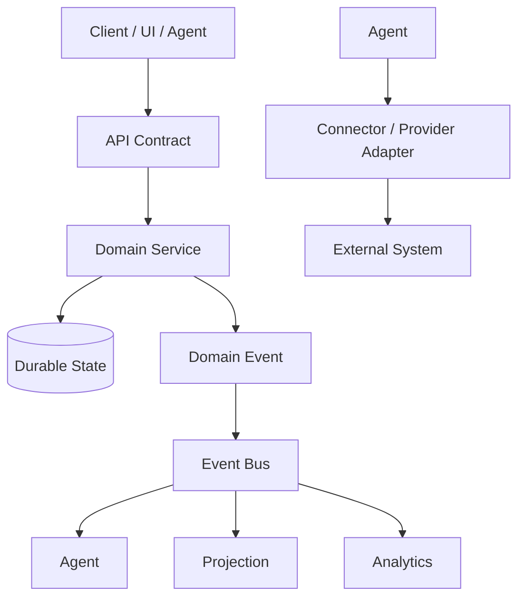
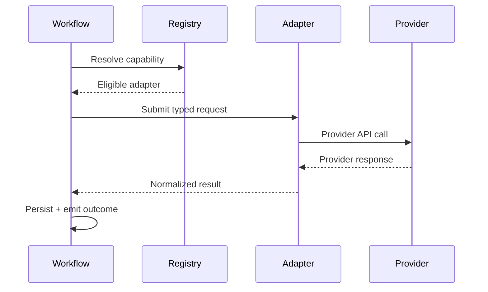

# 11 — APIs, Events & Integrations

**Status:** Architecture specification.

## 1. Contract-first integration

CAT communicates through explicit contracts. APIs are for request/response interactions; events are for durable asynchronous facts and state transitions; workflows coordinate multi-step business processes.

## 2. Event envelope

A canonical event should carry a stable event ID, event type, version, kind, occurrence time, producer, correlation ID, causation ID, subject ID, and structured payload. Consumers must be idempotent.

## 3. Delivery semantics

CAT prefers at-least-once delivery with idempotent consumers over pretending that distributed exactly-once execution is universally available. Inbox/outbox patterns establish durable boundaries between state changes and publication.

## 4. API principles

- Explicit versioning.
- Schema validation at boundaries.
- Stable error taxonomy.
- Idempotency for mutating operations where retries are possible.
- Pagination for collections.
- Timeouts and bounded retries.
- Authentication and authorization on every privileged operation.
- No provider-specific details leaking into domain contracts unless explicitly modeled.

## 5. Connector architecture

A connector translates an external protocol into a CAT contract. It owns authentication mechanics, provider-specific error mapping, rate limits, pagination, and remote identifiers. It does not own CAT's business policy.

## 6. MCP and tool interfaces

Model Context Protocol or equivalent tool protocols may expose controlled capabilities to agents. Protocol choice does not bypass CAT authorization. Tools remain scoped resources with explicit schemas and audit requirements.

## 7. Webhooks and inbound events

Inbound webhooks are untrusted until authenticated and validated. Deduplication uses provider event IDs plus source context. Processing should persist the receipt before acknowledging where durable delivery is required.

## 8. Provider independence

A provider can be unavailable, deprecated, rate-limited, or commercially unsuitable. CAT should select among eligible providers based on capability and policy rather than embedding one vendor into core domain logic.

## 9. Integration testing

Every connector requires contract tests, malformed-input tests, timeout/error tests, idempotency tests, and sandbox/integration tests where a provider supports them. Secrets and live accounts are never required for deterministic unit tests.
