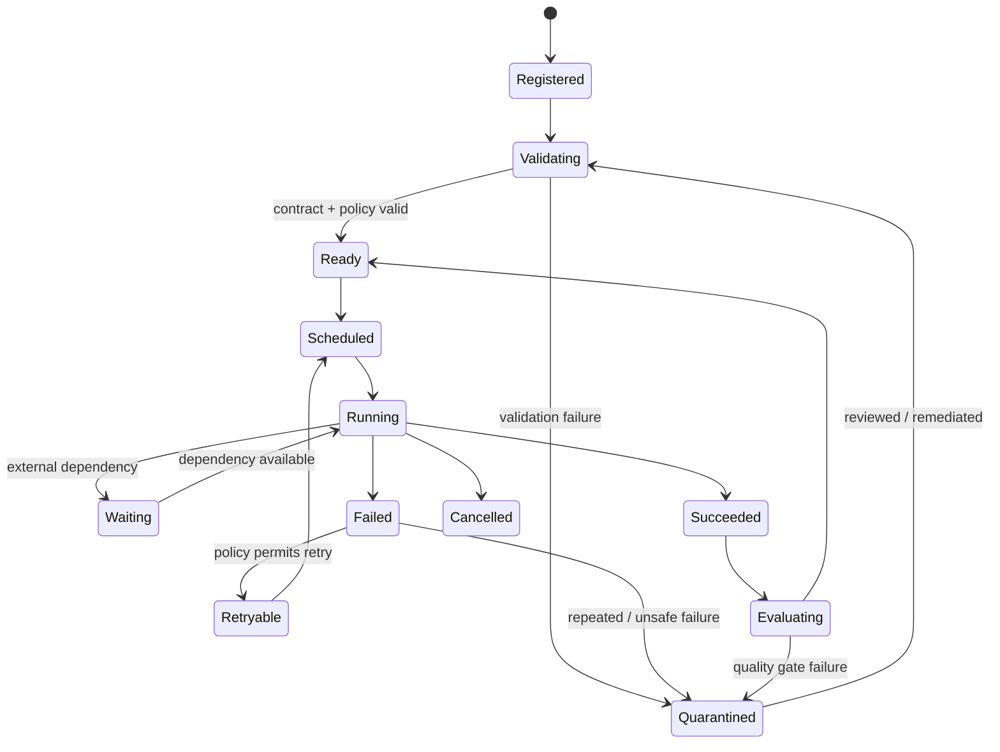
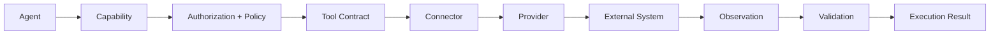

# CAT OMNISYSTEM — Agent Execution Lifecycle

**Status:** Canonical target behavior
**Audience:** agent developers, orchestrator developers, evaluators and operators

## 1. Agent is a governed runtime participant

A CAT agent is not simply a prompt attached to an LLM. It is a governed software participant with identity, capabilities, policy constraints, resource limits, input/output contracts, observability and lifecycle state.

## 2. Lifecycle state machine

## 3. Lifecycle phases

### Registration
The agent receives a stable identity and specification reference. Registration does not grant unrestricted authority.

### Validation
The runtime verifies schema compatibility, declared capabilities, policy references, provider requirements, security posture and version compatibility.

### Scheduling
Work is represented as a durable execution request. Scheduling must be recoverable after process failure.

### Running
The agent receives a bounded execution context. Tool calls and provider calls occur through declared capabilities.

### Waiting
External latency is represented explicitly. Workers should not confuse a temporary provider wait with logical failure.

### Completion
The result is validated against the output contract, recorded with provenance and made available to downstream consumers.

### Evaluation
Outcome quality, policy compliance, cost, latency and reliability may be evaluated. Evaluation is distinct from execution success.

## 4. Execution envelope

A canonical execution context should carry, as applicable:

| Field | Purpose |
|---|---|
| agent identity/version | identify executable policy |
| invocation identity | correlate one execution |
| tenant/owner scope | authorization boundary |
| capability grant | restrict available actions |
| policy context | explain allowed behavior |
| correlation/causation IDs | trace event chains |
| deadline/budget | resource governance |
| input references | avoid copying uncontrolled large data |
| output contract | validate result |

The exact wire schema belongs to the kernel and contracts; this document describes semantics.

## 5. Tool execution boundary

Agents must not bypass this path for convenience.

## 6. Failure taxonomy

- **Validation failure:** input/output/schema invalid.
- **Policy denial:** action is not permitted.
- **Transient provider failure:** retry may be possible.
- **Permanent provider failure:** alternate provider or strategy may be needed.
- **Budget exhaustion:** execution stops without bypassing limits.
- **Timeout:** bounded failure; recovery policy decides next step.
- **Concurrency conflict:** retry only through the domain's concurrency contract.
- **Unknown failure:** preserve evidence and fail closed when authority is uncertain.

## 7. Idempotency

Every externally consequential operation should define an idempotency strategy. The agent may retry; the external effect must not be duplicated merely because the worker crashed after the provider accepted the request.

## 8. Evaluation model

Execution success answers: **did the operation complete?**
Evaluation answers: **was the result useful, correct, compliant and economically justified?**

These must remain separate so agents cannot improve their apparent success rate by weakening quality gates.

## 9. Human escalation

The runtime should escalate when:

- policy authority is ambiguous;
- an action exceeds configured economic risk;
- a security boundary is crossed;
- evidence is insufficient for a high-impact decision;
- repeated failures suggest systemic drift;
- a new capability/provider is introduced without an approved contract.

## 10. AI implementation rule

When implementing a new agent, do not start with the prompt. Start with the contract: identity, capabilities, state machine, input/output schema, policy, failure modes, observability, persistence and tests. The prompt is one implementation artifact inside that governed boundary.
