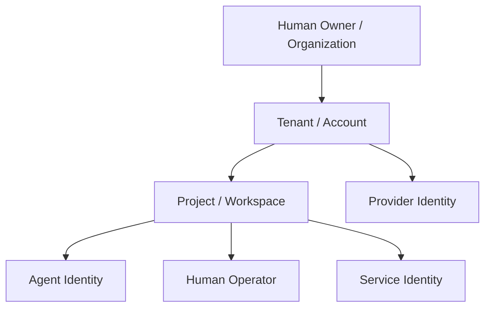
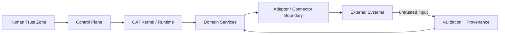

# CAT OMNISYSTEM — Tenancy, Identity & Access Model

**Status:** Canonical target architecture
**Maturity:** Architecture specified; implementation is incremental

## 1. Why identity is foundational

CAT may begin as a personal-use system but is intentionally designed so that future tenants, projects, agents, operators, providers and economic accounts can coexist without redesigning the core authorization model.

Identity therefore belongs below business features. A feature may depend on identity and authorization; identity must not depend on a particular feature such as affiliate marketing.

## 2. Principal hierarchy

The exact tenancy implementation is a target architecture unless represented by an existing contract or executable module.

## 3. Identity classes

| Principal | Represents | Typical authority |
|---|---|---|
| Human owner | accountable system owner | unrestricted administrative authority subject to platform controls |
| Operator | human performing bounded operations | role-based operational authority |
| Agent | autonomous software participant | capability-scoped authority |
| Service | internal runtime component | service-to-service authority |
| Provider | external dependency | no CAT internal authority; only connector-scoped access |
| External subject | merchant, network, audience or resource | data subject/resource identity, not CAT authority |

## 4. Authorization layers

Authorization is multi-dimensional:

1. **Identity:** who is acting?
2. **Scope:** which tenant/project/resource?
3. **Capability:** what operation is being requested?
4. **Policy:** under what conditions is it permitted?
5. **Risk:** what is the potential consequence?
6. **Approval:** is human approval required?
7. **Budget:** is sufficient resource/economic authority available?

A valid identity alone is never sufficient for a high-impact action.

## 5. Least authority

Agents receive capabilities, not broad database or network privileges. Capabilities should be narrow, auditable and revocable. A capability grant should specify the allowed operation, scope, resource constraints and expiry/version where appropriate.

## 6. Trust boundaries

External data is untrusted regardless of source reputation. Provider responses, web content, model output and uploaded data must pass validation before becoming trusted internal facts.

## 7. Tenant isolation

Target invariants:

- tenant-scoped records carry explicit ownership context where required;
- cross-tenant queries are impossible by default;
- background workers preserve tenant context;
- events preserve authorization context sufficient for downstream validation;
- caches cannot leak tenant-specific results;
- observability avoids exposing sensitive tenant data;
- administrative overrides are explicit and auditable.

## 8. Human-in-the-loop levels

| Level | Description |
|---|---|
| H0 | fully automatic, low-risk and policy-bounded |
| H1 | automatic with post-action review |
| H2 | automatic planning, human approval before side effect |
| H3 | human executes; CAT assists |
| H4 | prohibited without explicit owner intervention |

Risk classification should be configurable by domain and action type.

## 9. Credential boundary

Credentials belong to infrastructure/security management, never to agent prompts, source code or documentation. Agents receive references or scoped secret handles rather than raw long-lived credentials whenever the platform supports it.

## 10. Revocation and incident response

Access must be revocable without redeploying every agent. A compromised provider credential, agent identity or connector must be disable-able while preserving historical evidence.

## 11. Implementation rule

Every new externally consequential capability must document: principal, scope, authorization rule, capability grant, audit record, secret boundary, revocation behavior and human-approval requirement before it is considered production-ready.
