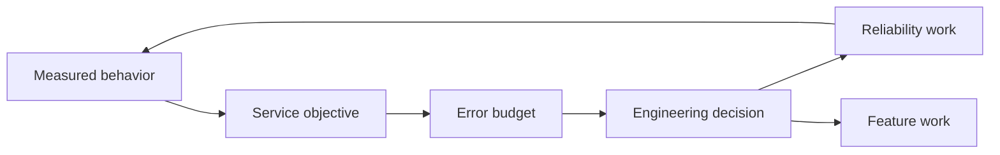

# CAT OMNISYSTEM — Non-Functional Requirements & SLO Model

**Status:** Canonical engineering target
**Purpose:** turn quality attributes into measurable engineering constraints

## 1. Quality dimensions

CAT quality is multidimensional. A system that is fast but loses economic evidence is not healthy; a system that is secure but cannot recover durable work is not complete.

| Dimension | Target property |
|---|---|
| Correctness | deterministic domain rules and validated contracts |
| Durability | accepted work survives process/node failure |
| Availability | healthy components remain usable within defined service objectives |
| Recoverability | failures have bounded, testable recovery paths |
| Security | least privilege, isolation and auditable authority |
| Observability | actions and failures can be reconstructed from evidence |
| Performance | predictable latency and throughput under declared load |
| Cost efficiency | resource use is bounded and measurable |
| Evolvability | contracts and providers can change without system-wide rewrites |
| Explainability | consequential decisions expose evidence and policy context |

## 2. SLO vocabulary

- **SLI:** measured indicator.
- **SLO:** target level for an SLI.
- **SLA:** external commitment, only applicable when explicitly adopted.
- **Error budget:** tolerated SLO failure budget.

CAT documentation must not invent contractual SLAs. Initial values are engineering targets until production measurements establish realistic thresholds.

## 3. Recommended SLI families

### Execution
- accepted command durability;
- execution completion latency;
- retry rate;
- stuck execution age;
- reconciliation lag.

### Eventing
- publish latency;
- delivery latency;
- redelivery count;
- dead-letter volume;
- consumer lag.

### Data
- persistence success rate;
- projection lag;
- query latency;
- stale-data rate;
- provenance coverage.

### Affiliate
- discovery source success;
- candidate rejection rate;
- opportunity freshness;
- revalidation completion;
- ranking determinism.

### AI
- provider success;
- structured-output validation rate;
- policy-denial rate;
- evaluation score distribution;
- cost per successful task.

## 4. SLO design principle

SLOs must be attached to user-visible or system-critical behavior, not vanity metrics. For example, measuring raw model token throughput is less important than measuring successful, policy-valid task completion per unit cost.

## 5. Reliability budget

When reliability budget is exhausted, new feature velocity should be constrained until the underlying failure mode is addressed.

## 6. Performance budgets

Every production service should eventually define budgets for:

- CPU;
- memory;
- network egress;
- database connections;
- queue depth;
- execution concurrency;
- model/provider spend;
- storage growth.

Budgets are controls, not suggestions. Resource exhaustion must degrade through defined policy rather than uncontrolled failure.

## 7. Determinism requirements

Pure decision/ranking/planning functions should be deterministic for identical inputs and policy versions. System clocks, randomness and network access belong at boundaries. Tests must inject clocks and deterministic dependencies where possible.

## 8. Availability versus correctness

When correctness and availability conflict, CAT should fail closed for security, authorization and financial integrity. For low-risk informational features, graceful degradation may preserve partial availability.

## 9. Operational maturity

A component progresses through:

`specified -> implemented -> tested -> observable -> load-tested -> failure-tested -> production-observed -> optimized`

The control plane should expose maturity rather than hiding uncertainty behind a single health percentage.

## 10. Definition of production-ready

A subsystem is production-ready only when its critical SLOs have named SLIs, collection paths, thresholds, alerting/response ownership and documented failure behavior. Values may evolve as real workload data becomes available.
