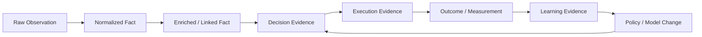

# CAT OMNISYSTEM — Data Lifecycle, Retention & Provenance

**Status:** Canonical target architecture

## 1. Data is an evidence lifecycle

CAT must distinguish raw observations, normalized facts, derived projections, decisions, execution evidence and financial settlements. These artifacts have different trust levels and retention requirements.

## 2. Lifecycle



## 3. Evidence classes

| Class | Meaning | Mutability |
|---|---|---|
| Observation | what an external/internal source reported | append-only or versioned |
| Fact | validated normalized representation | versioned / correction by new fact |
| Projection | derived read model | rebuildable |
| Command | request to perform work | immutable after acceptance |
| Attempt | one execution try | append-only |
| Result | provider/system outcome | append-only / reconciled |
| Decision | policy-governed choice | immutable record with superseding decisions |
| Settlement | confirmed economic fact | append-only with compensations |
| Metric | measurement | append-only/time-series |

## 4. Provenance requirements

A consequential fact should be traceable to:

- source identity;
- observation time;
- ingestion time;
- normalization/version;
- source reference or content hash when applicable;
- transformation or agent identity;
- policy/model version when generated;
- confidence or validation status;
- causal/correlation identifiers.

Not every field is mandatory for every record; the domain contract determines the minimum provenance set.

## 5. Retention tiers

### Hot
Operational state required for active workflows, queries and recovery.

### Warm
Historical evidence used frequently for analytics, evaluation and investigations.

### Cold
Long-term audit/economic history retained at lower cost.

### Ephemeral
Temporary data whose retention is intentionally short and documented.

Retention must never be used to silently destroy information required for legal, security, financial or operational obligations.

## 6. Deletion versus correction

Immutable evidence should not be edited to make history look correct. Corrections are represented through compensating facts, supersession or versioning. Deletion requirements, where applicable, must be handled through a documented privacy/data-governance process that preserves required audit semantics.

## 7. Projection rule

```text
Durable facts -> deterministic projection -> read model
```

A projection can be discarded and rebuilt if the underlying facts remain available. This is why derived lifecycle state should not become the sole source of truth.

## 8. Data classification

CAT should classify data as public, internal, confidential, sensitive or restricted according to its actual impact. Credentials, payment secrets, personal data and security material receive stronger handling than ordinary product metadata.

## 9. AI-generated data

AI output begins as an untrusted generated artifact. It becomes a trusted internal fact only after the applicable validation, provenance and policy gates succeed.

## 10. Retention decision matrix

| Question | If yes | Action |
|---|---|---|
| Needed for active recovery? | yes | hot retention |
| Needed for audit/evaluation? | yes | warm/cold retention |
| Contains sensitive data? | yes | minimize, classify, protect |
| Rebuildable projection? | yes | shorter retention acceptable |
| Financial settlement evidence? | yes | durable audit retention |
| Temporary provider payload? | yes | minimize and expire |

## 11. Implementation rule

Every new persisted entity must document its owner, lifecycle, mutability, provenance, retention class, privacy classification, deletion/correction behavior and rebuildability before it is considered complete.
